# PythonとColabで作る - RAW現像ソフト作成入門


注: この一連の記事は現時点で未完成です（2/3/2019時点）

## 目次

1. [はじめに](https://colab.research.google.com/github/moizumi99/camera_raw_processing/blob/master/camera_raw_chapter_1.ipynb)


2. [カメラ画像処理について](https://colab.research.google.com/github/moizumi99/camera_raw_processing/blob/master/camera_raw_chapter_2.ipynb)


3. [基本的な処理](https://colab.research.google.com/github/moizumi99/camera_raw_processing/blob/master/camera_raw_chapter_3.ipynb)

  3.1 [準備](https://colab.research.google.com/github/moizumi99/camera_raw_processing/blob/master/camera_raw_chapter_3.ipynb#scrollTo=xamnD5Vtx0vL&line=5&uniqifier=1)

  3.2 [簡易デモザイク処理](https://colab.research.google.com/github/moizumi99/camera_raw_processing/blob/master/camera_raw_chapter_3.ipynb#scrollTo=4QCA4GP7QpFU)

  3.3 [ホワイトバランス調整](https://colab.research.google.com/github/moizumi99/camera_raw_processing/blob/master/camera_raw_chapter_3.ipynb#scrollTo=IZoaCYmxSm8a)

  3.4 [ブラックレベル調整](https://colab.research.google.com/github/moizumi99/camera_raw_processing/blob/master/camera_raw_chapter_3.ipynb#scrollTo=CI321RybT12c)

  3.5 [ガンマ補正](https://colab.research.google.com/github/moizumi99/camera_raw_processing/blob/master/camera_raw_chapter_3.ipynb#scrollTo=tqGZesmEVCkP)

4. [重要な処理](https://colab.research.google.com/github/moizumi99/camera_raw_processing/blob/master/camera_raw_chapter_4.ipynb)

  4.1 [この章について](https://colab.research.google.com/github/moizumi99/camera_raw_processing/blob/master/camera_raw_chapter_4.ipynb)

  4.2 [線形補間デモザイク](https://colab.research.google.com/github/moizumi99/camera_raw_processing/blob/master/camera_raw_chapter_4_2.ipynb)

  4.3 [欠陥画素補正](https://colab.research.google.com/github/moizumi99/camera_raw_processing/blob/master/camera_raw_chapter_4_3.ipynb)

  4.4 [カラーマトリクス補正](https://colab.research.google.com/github/moizumi99/camera_raw_processing/blob/master/camera_raw_chapter_4_4.ipynb)

  4.5 [レンズシェーディング補正](https://colab.research.google.com/github/moizumi99/camera_raw_processing/blob/master/camera_raw_chapter_4_5.ipynb)
  

5. [画質を良くする処理](https://colab.research.google.com/github/moizumi99/camera_raw_processing/blob/master/camera_raw_chapter_5.ipynb)

  5.1 [この章について](https://colab.research.google.com/github/moizumi99/camera_raw_processing/blob/master/camera_raw_chapter_5.ipynb)

  5.2 [ノイズフィルター](https://colab.research.google.com/github/moizumi99/camera_raw_processing/blob/master/camera_raw_chapter_5_2.ipynb)

  5.3 [エッジ強調](https://colab.research.google.com/github/moizumi99/camera_raw_processing/blob/master/camera_raw_chapter_5_3.ipynb)

  5.4 [トーンカーブ補正](https://colab.research.google.com/github/moizumi99/camera_raw_processing/blob/master/camera_raw_chapter_5_4.ipynb)


6. [応用編](https://colab.research.google.com/github/moizumi99/camera_raw_processing/blob/master/camera_raw_chapter_6_1.ipynb)

  6.1 [線形補間デモザイクの周波数特性](https://colab.research.google.com/github/moizumi99/camera_raw_processing/blob/master/camera_raw_chapter_6_1.ipynb)

  6.2 [高度なデモザイク処理](https://colab.research.google.com/github/moizumi99/camera_raw_processing/blob/master/camera_raw_chapter_6_2.ipynb)


7. まとめ


8. Appendix

  8.1. Google Colabの使い方
  
  8.2. RAW画像の撮影方法
  

# 1. はじめに

## 1.1 はじめに

### この本について

この本では、カメラ画像処理・RAW画像現像の内容を実際の動作レベルで解説し、なるべくスクラッチからPython上で実行してみる事を目的としています。

そのために、解説する処理は最重要なものにしぼり、使用するアルゴリズムは一部の例外（デモザイク）を除き、もっとも簡単なものを選びました<sup name="footnote1">[1]</sup>。

記事の最後ではラズベリーパイのカメラで撮影したRAW画像からこんなRGB画像が作れるようになります。

(TODO: 画像を入れる)

またすべての処理はGoogle Colab上で行うことができ、読者の皆さんはパワフルなPCや特殊なソフトウェアをよういせずとも、ブラウザ上で全ての処理を試してみることができます。
  
全てのコードへのリンクはこちらの[目次ページ](https://colab.research.google.com/github/moizumi99/camera_raw_processing/blob/master/camera_raw_toc.ipynb)からたどることができます。

### 対象読者

この本は以下のような読者を対象としています。
- カメラ内部の画像処理またはRAW現像の内容に興味がある。

また次のような知識があれば、内容を深く理解する助けになります。
- Pythonプログラミングの基本的な内容について知っている。
- 高校で学ぶ程度の数学の知識がある。

### Colabについて


Google Colab (グーグル・コラボ)とはGoogleが提供するサービスの一つで、ブラウザ上で実行可能なPythonのインタラクティブ環境です。

Google Colabを利用することにより、Pythonの環境を無料でブラウザ上で利用することができます。

詳しくは[Google自身によるColabの解説](https://colab.research.google.com/notebooks/welcome.ipynb?hl=ja)をご覧ください。

### この本で扱うもの


この本で扱う内容は基本的に以下のとおりです。

- 基本的なRAW現像処理・カメラ画像処理の流れ
- Bayer画像からRGB画像出力までの各アルゴリズムのうち、基本的な最低限のものの解説
- 解説した基本的なアルゴリズムのPythonによる実装と処理例

一部例外はありますが、そういったものは関連した話題として触れられるだけにとどまります。

### この記事で扱わないもの


この本で基本的に扱わない物は以下のとおりです。ただし、記事の解説上最低限必要なものについては触れることがあります。

- ３A（オートフォーカス、オートホワイトバランス、オート露出）などを始めとするカメラコントロールアルゴリズム
- 高度なカメラ画像処理アルゴリズム
- 画像評価、カリブレーション、及びチューニング
- 画像圧縮


### 環境について

この記事で解説する内容は一般的なものですが、使用した画像ファイルは特定のカメラに依存しています。
他のカメラでもわずかな変更で同等の処理ができるとは予想されますが、検証はしていません。

#### 使用カメラ


この本で扱う画像を撮影するのに使ったカメラは以下の２つです。

- Raspberry Pi Camera v2.1
- Sony Alpha 7 III

なお、使用したファイルはGithubからダウンロードできるので、これらのカメラをお持ちでなくても、紹介した処理の内容を実行することは可能です。

#### 実行環境

この内容を再現するには通常のPC環境に加えて以下の環境等が必用です。

- Google Colabにアクセスできるブラウザ
 - 多くのブラウザが対応できると思われます。なお、本書の内容はChromeによって確かめられています。

- ColabにアクセスできるGoogleアカウント

### 次の章

次は[カメラ画像処理について](https://colab.research.google.com/github/moizumi99/camera_raw_processing/blob/master/camera_raw_chapter_2.ipynb)簡単に解説します。

## 2. カメラ画像処理について

## カメラ画像処理について
### この章について

この章ではカメラのしくみやRAW画像からはじめて、カメラ画像処理やRAW現像ソフトの中でどのような処理が行われているのかを説明します。

この章を含む全ての内容はColabノートブックとして公開してあります。この章のノートブックを見るには[目次ページ](https://colab.research.google.com/github/moizumi99/camera_raw_processing/blob/master/camera_raw_toc.ipynb)から参照するか、以下のリンクを使ってアクセスしてください。

https://colab.research.google.com/github/moizumi99/camera_raw_processing/blob/master/camera_raw_chapter_2.ipynb

### カメラのしくみ

(TODO: 追加)

### RAW画像、RAWファイルとは？

RAWファイルやRAWデータというのは厳密な定義はないのですが、カメラ処理でRAWというとBayerフォーマットの画像データを指すことが多いようです。したがって多くの場合、RAWデータはBayerフォーマットの画像データ、RAWファイルはそのRAWデータを含んだファイルということになります。

まず前提として、今使われているカメラの画像センサーの殆どはBayer配列というものを使ってフルカラーを実現しています。

画像センサーは、碁盤の目状にならんだ小さな光センサーの集まりでできています。一つ一つの光センサーはそのままでは色の違いを認識できません。そこで色を認識するためには、3原色のうち一色を選択して光センサーにあてて、その光の強度を測定する必要があります。 方法としてはまず、分光器を使って光を赤、青、緑に分解して、３つの画像センサーにあてて、それぞれの色の画像を認識し、その後その３枚をあわせることでフルカラーの画像を合成するという方法がありました。これは３板方式などとよばれることがあります。この方法は手法的にもわかりやすく、また、余計な処理が含まれないためフルカラーの画像がきれい、といった特徴があり高級ビデオカメラなどで採用されていました。欠点としては分光器と３つの画像センサーを搭載するためにサイズが大きくなるという点があります。

これに対して、画像センサー上の一つ一つの光センサーの上に、一部の波長の光だけを通す色フィルターを載せ、各画素が異なる色を取り込むという方法もあります。この方法では１枚の画像センサーでフルカラー画像を取り込めるため、３板方式に対して単板方式とよばれることもあります。３版方式とくらべた利点としては分光器が不要で１枚のセンサーで済むのでサイズが小さい。逆に欠点としては、１画素につき１色の情報しか無いので、フルカラーの画像を再現するには画像処理が必要になる、という点があります。

単版方式の画像センサーの上に載る色フィルターの種類としては、３原色を通す原色フィルターと、３原色の補色（シアン・マゼンダ・イエロー）を通す補色フィルター[^1]というものがあります。補色フィルターは光の透過率が高いためより明るい画像を得ることができます。それに対して原色フィルターは色の再現度にすぐれています。Bayer配列はこの単版原色フィルター方式のうち最もポピュラーなものです。

[^1]: 実際にはこの他に緑色の画素もあり、2x2の４画素のパターンになっているのが普通

こういうわけでBayer配列の画像センサーの出力では１画素につき一色しか情報をもちません。Bayer配列のカラーフィルターはこの図左のように、2x2ブロックの中に、赤が1画素、青が1画素、緑が2画素ならぶようになっています。緑は対角線上にならびます。緑が2画素あるのは、可視光の中でも最も強い光の緑色を使うことで解像度を稼ぐため、という解釈がなされています。Bayerというのはこの配列の発明者の名前です。


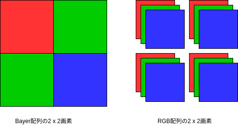

カメラ用センサーでは2000年代初頭までは、補色フィルターや３板方式もそれなりの割合で使われていたのですが、センサーの性能向上やカメラの小型化と高画質化の流れの中でほとんどがBayer方式にかわりました。今では、SigmaのFoveonのような意欲的な例外を除くと、DSLRやスマートフォンで使われているカラー画像センサーの殆どがBayer方式を採用しています。したがって、ほとんどのカメラの中ではBayerフォーマットの画像データをセンサーから受取り、フルカラーの画像に変換するという処理が行われている、ということになります。

こういったBayerフォーマットの画像ファイルは、すなわちセンサーの出力に近いところで出力されたことになり、カメラが処理したJPEGに比べて以下のような利点があります。

* ビット数が多い（RGBは通常８ビット。Bayerは10ビットから12ビットが普通。さらに多いものもある）
* 信号が線形（ガンマ補正などがされていない）
* 余計な画像処理がされていない
* 非可逆圧縮がかけられていない（情報のロスがない）

したがって、優秀なソフトウェアを使うことで、カメラが出力するJPEGよりもすぐれた画像を手に入れる事ができる「可能性」があります。

逆に欠点としては

* データ量が多い（ビット数が多い。通常非可逆圧縮がされていない）
* 手を加えないと画像が見れない
* 画像フォーマットの情報があまりシェアされていない
* 実際にはどんな処理がすでに行われているのか不透明

などがあります。最後の点に関して言うと、RAWデータといってもセンサー出力をそのままファイルに書き出すことはまずなく、欠陥画素除去など最低限の前処理が行われいるのが普通です。
しかし、実際にどんな前処理がおこなわれているのかは必ずしも公開されていません。

### カメラ画像処理のあらまし

Bayerからフルカラーの画像を作り出すRAW現像処理・カメラ画像処理のうち、メインになる部分の例はこんな感じになります。[^2]

[^2]: これはあくまで一例です。実際のカメラやRAW現像ソフト内で行われる処理はメーカーや機種ごとに異なります。

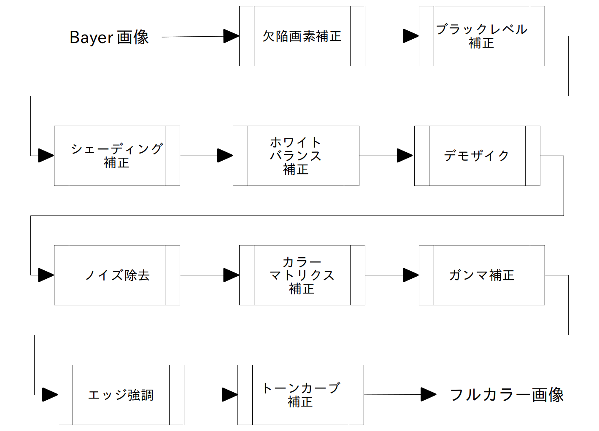

このうち、最低限必要な処理は、以下のものです。

* ブラックレベル補正
* ホワイトバランス補正（デジタルゲイン補正も含む）
* デモザイク（Bayerからフルカラー画像への変換）
* ガンマ補正

これらがないと、まともに見ることのできる画像を作ることができません。

さらに、最低限の画質を維持するには、通常は、

* 線形性補正
* 欠陥画素補正
* 周辺減光補正
* カラーマトリクス

が必要です。ただし、線形性補正や欠陥画素補正は、カメラがRAWデータを出力する前に処理されていることが多いようです。また、センサーの特性がよければ線形性補正やカラーマトリクスの影響は小さいかもしれません。

次に、より良い画質を実現するものとして、

* ノイズ除去
* エッジ強調・テクスチャ補正

があります。RGB->YUV変換はJPEGやMPEGの画像を作るのには必要ですが、RGB画像を出力する分にはなくてもかまいません。

この他に、最近のカメラでは更に画質を向上させるために

* レンズ収差補正
* レンズ歪補正
* 偽色補正
* グローバル・トーン補正
* ローカル・トーン補正
* 高度なノイズ処理
* 高度な色補正
* ズーム
* マルチフレーム処理

などの処理が行われるのが普通です。今回はベーシックな処理のみとりあげるので、こういった高度な処理は行いません。

今回、まず最初の**基本的な処理**では次の部分の処理を行います。

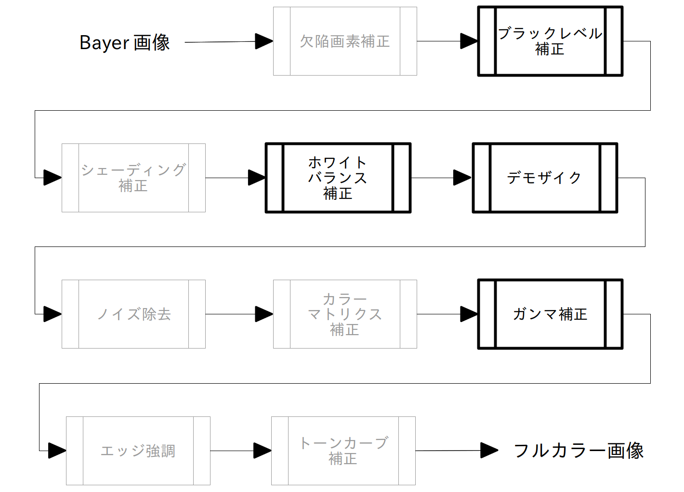


次の章以降で残りの処理を行います。

### この章のまとめ

カメラ内部の仕組みとRAW現像処理・カメラ画像処理を、画像処理の観点から説明しました。

### 次の章

次は[RAW画像の準備](https://colab.research.google.com/github/moizumi99/camera_raw_processing/blob/master/camera_raw_chapter_3_1.ipynb)を行います。

# 3 基本的な処理

## 3.1 準備

### この節について

この節ではまずRAW画像を準備し、簡易的なデモザイクを行ってみます。

この節のの内容はColabノートブックとして公開してあります。ノートブックを見るには[目次ページ](https://colab.research.google.com/github/moizumi99/camera_raw_processing/blob/master/camera_raw_toc.ipynb)から参照するか、以下のリンクを使ってアクセスしてください。

https://colab.research.google.com/github/moizumi99/camera_raw_processing/blob/master/camera_raw_chapter_3.ipynb

### RAW画像の準備

まずRAW画像を用意します。今回はラズベリーパイで撮影したこの画像を使います[^1]。

[^1]: 撮影方法は付録１で解説します。

  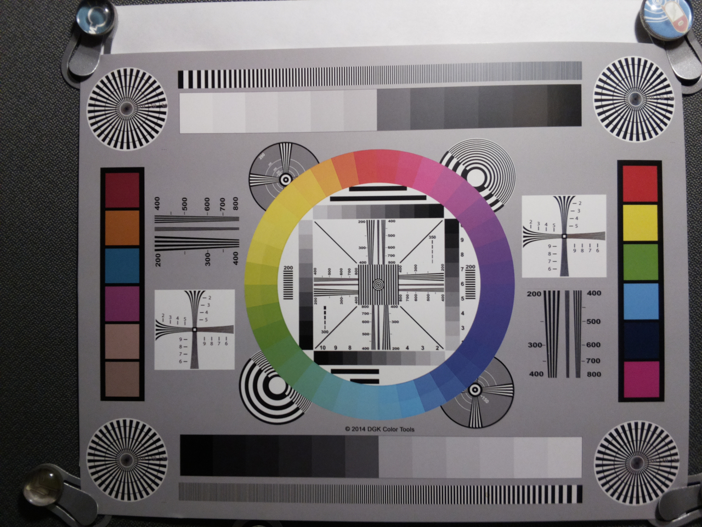

元になるRAWファイルはこのURLにあります。

Figures/chart.jpg

拡張子はJPGになっていて実際にJPEG画像としても表示できますが、データ中にRAW画像が埋め込まれています。

では、colab上にダウンロードしてみましょう。colabでは行の最初に!をつけることでLinuxのコマンドが実行できます。


```python
!if [ ! -f chart.jpg ]; then wget chart.jpg; fi
```

自分で撮影したRAWデータを使用する場合は次のコマンド利用してください。


```python
# from google.colab import files
# uploaded = files.upload()
```

使いやすいようにRAWファイル名を変数に保存しておきます。

自分でアップロードしたファイルを使用する場合は、ファイル名を対象のファイルに書き換えてください。


```python
raw_file  = "chart.jpg"
```

### RAW画像の読み込み

まず必用なモジュールをインストールします。

まずインストールするのはrawpyです。

rawpyはpythonでRAW画像を操作するためのモジュールです[^2]。

[^2]: https://pypi.org/project/rawpy/

rawpyを使うとRAW画像からRAW画像データを取り出したり、画像サイズなどのパラメータを読み出したり、また簡易現像をすることができます。

rawpyの使用法については実際に使う時に説明します。


```python
!pip install rawpy
```

pipはpythonのモジュール管理用のコマンドです。

次にimageioをインストールします。

imageioは画像の表示やロード・セーブなどを行うモジュールです。


```python
!pip install imageio
```

次にこれらのモジュールをインポートします。


```python
import rawpy, imageio
```

他に必用なモジュールがある場合はその都度importすることにします。

では先程ダウンロードしたRAWファイルをrawpyを使って読み出してみましょう。

`imread()`はrawデータをファイルから読み込むrawpyのメソッドです。


```python
raw = rawpy.imread(raw_file)
```

読み込みがうまくいったか確認を兼ねてRAWデータの情報を見てみましょう。

まず、画像サイズを確認します。読み込んだRAWデータは、sizesというアトリビュートでサイズ確認ができます。


```python
print(raw.sizes)
```

    ImageSizes(raw_height=2464, raw_width=3280, height=2464, width=3280, top_margin=0, left_margin=0, iheight=2464, iwidth=3280, pixel_aspect=1.0, flip=0)


raw_heightとraw_widthはRAWデータのサイズです。この画像のサイズは縦2464ライン、横3280画素、ということになります。

heightとwidthは、画像処理後の出力画像のサイズです。

他の値についてはrawpyのページで解説されています。

https://letmaik.github.io/rawpy/api/rawpy.RawPy.html#rawpy.RawPy.sizes

この画像を処理しやすくするために、numpyを使用します。

numpyはpython用の数値計算ライブラリーです。行列処理の機能が豊富なので画像処理にも向いています。

まず、numpyをnpという名前でインポートします。


```python
import numpy as np
```

次にraw画像データから数値データのみをnumpyの配列に読み込みます。


```python
# raw_imageはrawpyのアトリビュート。numpyの配列を返す。
raw_array = raw.raw_image
```

raw_imageはRAW画像データをnumpyの配列して渡すアトリビュートです。

縦横の大きさを取得しておきます。


```python
h, w = raw_array.shape
print(h, w)
```

    2464 3280


これでraw_arrayは2464 x 3280の２次元配列になりました。
画像データを表示するコマンドimshowを使って、画像として確認してみましょう。

まずキャプション用に日本語フォントを用意します。


```python
# 日本語フォントをインストール
!apt -y install fonts-ipafont-gothic

# 画像表示用ライブラリpyplotのインポート。
import matplotlib.pyplot as plt
# 日本語フォントを設定
plt.rcParams['font.family'] = 'IPAPGothic'
```

    Reading package lists... Done
    Building dependency tree       
    Reading state information... Done
    fonts-ipafont-gothic is already the newest version (00303-18ubuntu1).
    0 upgraded, 0 newly installed, 0 to remove and 8 not upgraded.


実際に画像を表示します。


```python
# 画像表示サイズを設定。figsizeの中身は横サイズ、縦サイズ。
# 単位はインチだが実際の表示サイズはディスプレイ解像度によって異なる。
plt.figure(figsize=(8, 6))
# raw_arrayの中のデータをグレースケールで表示します。
plt.imshow(raw_array, cmap='gray')
# 軸を非表示にします。
plt.axis('off')
# 画像タイトルの設定
plt.title(u"Bayer画像をそのまま表示")
# 実際に表示します。
plt.show()
```


ここでmatplotlibはnumpy用描画ライブラリーです。その中でpyplotは各種グラフを表示するモジュールです。ここではpltという名前でインポートしています。

もし日本語のタイトルが文字化けしている場合は、

```bash
import matplotlib
target_dir = matplotlib.get_cachedir()
! rm {target_dir}/*.json
```

を実行して
Runtime->Restart Runtimeで再実行してみてください。


```python
# もし日本語が文字化けしている場合次の3行の#を削除して実行。
# import matplotlib
# target_dir = matplotlib.get_cachedir()
# ! rm {target_dir}/*.json
# その後、Runtime->Restart and run allで再実行
```

### この節のまとめ

必用なモジュールをインポートしてRAW画像をcolab上に読み込みました。
次は簡易デモザイク処理を行います。

## 3.2 簡易デモザイク処理

### この節について

この節では、RAWデータの簡易でモザイク処理を行い、画像をフルカラーで表示してみます。

この節のの内容はColabノートブックとして公開してあります。ノートブックを見るには[目次ページ](https://colab.research.google.com/github/moizumi99/camera_raw_processing/blob/master/camera_raw_toc.ipynb)から参照するか、以下のリンクを使ってアクセスしてください。

https://colab.research.google.com/github/moizumi99/camera_raw_processing/blob/master/camera_raw_chapter_3_2.ipynb

### RAW画像の確認

先程読み込んだRAW画像を拡大して見てみましょう。。


```python
# pyplotのコマンドfigure()を使って表示サイズを調整.
# ここではfigsize=(8, 8)で、8inch x 8inchを指定（ただし実際の表示サイズはディスプレイ解像度に依存） 
plt.figure(figsize=(8, 8))

# RAW画像の中から(1310, 2620)から60x60の領域を表示。
plt.imshow(raw_array[1340:1400, 2640:2700], cmap='gray')
plt.axis('off')
plt.title(u"RAW画像の拡大表示")
plt.show()
```


明るいところが緑、暗いところが赤や青の画素のはずです

Bayerの画素と色の関係を直感的に理解するために、Bayerの赤の部分を赤、青を青、緑を緑で表示してみましょう。

まず、RAW画像の配列を確認しておきます。


```python
print(raw.raw_pattern)
```

    [[2 3]
     [1 0]]


raw_patternはrawpyのアトリビュートで、Bayer配列の2x2行列を示します。

ここで、各番号と色の関係は以下のようになっています。カッコ内は略称です

| 番号 | 色 |
|--------|-----|
| 0 | 赤 (R) |
| 1 | 緑 (Gr) |
| 2 | 青 (B) |
| 3 | 緑 (Gb) |

ここで緑にGrとGbがあるのは、赤の行の緑と青の行の緑を区別するためです。カメラ画像処理では両者を区別することが多々あり、両者をGrとGbと表す事があります。

両者を区別する必要が無い場合はどちらもGであらわします。


この対応関係を考えると、この画像の各画素の色は、左上から

赤　緑

緑　青

のように並んでいることがわかります。これを図示するとこうなります。


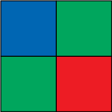

では、これに対応するRGB画像を作ってみましょう。


```python
# raw_arrayと同じ大きさで、３色のデータを持つnumpyの行列を作る。
# zerosは指定された大きさの０行列を作るコマンド。
raw_color = np.zeros((h, w, 3))

# 偶数列、偶数行の画素は青なので、青チャンネル（2）にコピー。
raw_color[0::2, 0::2, 2] = raw_array[0::2, 0::2]
# 奇数列、偶数行の画素は緑なので、緑チャンネル（1）にコピー。
raw_color[0::2, 1::2, 1] = raw_array[0::2, 1::2]
# 偶数列、奇数行の画素は緑なので、緑チャンネル（1）にコピー。
raw_color[1::2, 0::2, 1] = raw_array[1::2, 0::2]
# 奇数列、奇数行の画素は赤なので、赤チャンネル(0）にコピー。
raw_color[1::2, 1::2, 0] = raw_array[1::2, 1::2]

# 0から1の範囲にノーマライズ
raw_color[raw_color < 0] = 0
raw_color = raw_color / 1024
```

最後に1024で割ったのはラズベリーパイのRAW画像は１０ビットだからです。１０ビットで表せる範囲の最大値は1023ですが、ここでは1024で正規化しています。

これでBayerに対応するRGB画像ができたはずです。表示してみましょう。


```python
# RAW画像に色を割り振ったものを表示。
plt.figure(figsize=(8, 8))
plt.imshow(raw_color)
plt.axis('off')
plt.title(u"RAW画像の各画素に色を割り当てたもの")
plt.show()
```


さらに拡大してみます。


```python
plt.figure(figsize=(8, 8))
# RAW画像の中から(1310, 2620)から32x32の領域を表示。
plt.imshow(raw_color[1340:1400, 2640:2700])
plt.axis('off')
plt.title(u"RAW画像の各画素に色を割り当てたものを拡大表示")
plt.show()
```


これではなんだかよくわかりません。そういうわけでBayerをフルカラーのRGBに変換する処理が必用になるわけです。

### 簡易デモザイク処理

それではBayer配列からフルカラーの画像を作ってみましょう。

この処理はデモザイクと呼ばれることが多いです。本来デモザイクはカメラ画像処理プロセス（ISP)の肝になる部分で、画質のうち解像感や、偽色などの不快なアーティファクトなどを大きく左右します。 したがって手を抜くべきところではないのですが、今回は簡易処理なので、考えうる限りでもっとも簡単な処理を採用します。

その簡単な処理というのは、3色の情報を持つ最小単位の2x2のブロックから、1画素のみをとりだす、というものです。

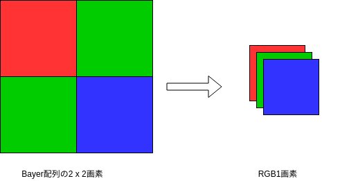

結果として得られる画像サイズは1/4になりますが、もとが24Mもあるので、まだ6M残っていますので簡易処理としては十分でしょう。

なお、解像度低下をともなわないデモザイクアルゴリズムは次章でとりあげます。


では、簡易デモザイク処理してみましょう。なお、2x2ピクセルの中に2画素ある緑は平均値をとります。

今回の処理では２つの緑画素は同じものとして扱うので、bayer配列を0, 1, 2で表しておきましょう。


```python
bayer_pattern = raw.raw_pattern
# Bayer配列を0, 1, 2, 3から0, 1, 2表記に変更
bayer_pattern[bayer_pattern==3] = 1
# 表示して確認
print(bayer_pattern)
```

    [[2 1]
     [1 0]]


では、2x2画素毎に平均をとってRGB画像を作ります。


```python
# RGB画像を容易。サイズは縦横ともRAWデータの半分。
dms_img = np.zeros((h//2, w//2, 3))

# 各画素毎に処理.y, xはRAW画像での位置。
for y in range(0, h, 2):
    for x in range(0, w, 2):
        # bayer_pattern[0, 0]は2x2ブロックの左上の画素の色を示す
        dms_img[y // 2, x // 2, bayer_pattern[0, 0]] += raw_array[y + 0, x + 0]
        # bayer_pattern[0, 1]は2x2ブロックの右上の画素の色を示す
        dms_img[y // 2, x // 2, bayer_pattern[0, 1]] += raw_array[y + 0, x + 1]
        # bayer_pattern[1, 0]は2x2ブロックの左下の画素の色を示す
        dms_img[y // 2, x // 2, bayer_pattern[1, 0]] += raw_array[y + 1, x + 0]
        # bayer_pattern[1, 1]は2x2ブロックの右下の画素の色を示す
        dms_img[y // 2, x // 2, bayer_pattern[1, 1]] += raw_array[y + 1, x + 1]
        # 緑画素は２つあるので平均を取る
        dms_img[y // 2, x // 2, 1] /= 2
```

できあがった画像を見てみましょう。


```python
# 画像を0と1の間でノーマライズ
dms_img[dms_img < 0] = 0
dms_img /= 1024
# 表示
plt.figure(figsize=(8, 8))
plt.imshow(dms_img)
plt.axis('off')
plt.title(u"簡易デモザイク")
plt.show()
```


このようにRGBのフルカラー画像を作ることができました。

まだ色が正しくない、全体的に暗い、などの問題があります。次の節でこのあたりを修正していきます。

### 処理の高速化

上記のコードは、画像処理とコードの対応がわかりやすいように各画素ごとの処理をループを使って記述してあります。

これは処理の内容はわかりやすいのですが、numpyの高速性を十分に活用しておらず、かなり遅い処理になっています。このコードをnumpyの機能を利用して書き直すとこのようになります。


```python
def simple_demosaic(raw_array, bayer_pattern):
    """
    簡易デモザイク処理を行う。

    Parameters
    ----------
    raw_array: numpy array
        入力BayerRAW画像データ
    bayer_pattern: int[2, 2]
        ベイヤーパターン。0:赤、1:緑、2:青、3:緑。

    Returns

    -------
    dms_img: numpy array
        出力RGB画像。サイズは入力の縦横共に1/2。
    """
    height, width = raw_array.shape
    dms_img = np.zeros((height//2, width//2, 3))
    bayer_pattern[bayer_pattern == 3] = 1
    dms_img[:, :, bayer_pattern[0, 0]] = raw_array[0::2, 0::2]
    dms_img[:, :, bayer_pattern[0, 1]] += raw_array[0::2, 1::2]
    dms_img[:, :, bayer_pattern[1, 0]] += raw_array[1::2, 0::2]
    dms_img[:, :, bayer_pattern[1, 1]] += raw_array[1::2, 1::2]
    dms_img[:, :, 1] /= 2
    return dms_img
```

処理の内容としては最初のループを使ったコードと同じですが、速度は格段に上がっています。

同じ画像になったか確認してみましょう。


```python
dms_img = simple_demosaic(raw_array, raw.raw_pattern)

# 画像を0と1の間でノーマライズ
dms_img[dms_img < 0] = 0
dms_img /= 1024
# 表示
plt.figure(figsize=(8, 8))
plt.imshow(dms_img)
plt.axis('off')
plt.title(u"simple_demosaic関数の出力")
plt.show()
```


```python

```

同様の画像が出力されたようです。

### この節のまとめ

RAW画像に対して簡易デモザイク処理を行いました。次はホワイトバランス補正を行います。

## 3.3 ホワイトバランス補正

### ホワイトバランス補正とは

ホワイトバランス補正とは、センサーの色ごとの感度や、光のスペクトラムなどの影響を除去して、本来の白を白として再現するための処理です。 
そのためには各色の画素に、別途計算したゲイン値をかけてあげます。

実際のカメラではホワイトバランスの推定はAWB（オートホワイトバランス）と呼ばれる複雑な処理によって行いますが、今回はカメラが撮影時に計算したゲイン値をRAWファイルから抽出して使います。

### ホワイトバランス補正とは

ホワイトバランス補正とは、センサーの色ごとの感度や、光のスペクトラムなどの影響を除去して、本来の白を白として再現するための処理です。 
そのためには各色の画素に、別途計算したゲイン値をかけてあげます。

実際のカメラではホワイトバランスの推定はAWB（オートホワイトバランス）と呼ばれる複雑な処理によって行いますが、今回はカメラが撮影時に計算したゲイン値をRAWファイルから抽出して使います。

### ホワイトバランス補正処理

ますはどんなホワイトバランス値かみてみましょう。RAWファイルの中に記録されたゲインを見てみましょう。

rawpyのアトリビュートcamera_whitebalanceを使います


```python
wb = raw.camera_whitebalance
print(wb)
```

    [1.128000020980835, 1.0, 2.5460000038146973, 1.0]


これは、赤、緑（赤と同じ行）、青、緑（青と同じ行）のゲインがそれぞれ、1.128、1.0、2.546、1.0ということをあらわしています。

緑のゲインは1.0倍なので、赤、青をそれぞれ、1.128倍、2.546倍にしてやればカラーバランスが取れることがわかります。

処理してみましょう。


```python
# 元のRAWデータをコピーします。
wb_img = raw_array.copy()
# RAWデータのベイヤーパターン。
bayer_pattern = raw.raw_pattern
for y in range(0, h):
    for x in range(0, w):
        # cは画素に対応する色チャンネル
        c = bayer_pattern[y % 2, x % 2]
        # 各画素に画素の色に対応するゲインをかけ合わせる
        wb_img[y, x] *= wb[c]
```

これでホワイトバランスがそろったかみてみましょう。
3.2で使用した簡易デモザイクを使って表示します。


```python
# 簡易デモザイク。
dms_img = simple_demosaic(wb_img, raw.raw_pattern)

# 画像を0と1の間でノーマライズ
dms_img /= 1024
dms_img[dms_img < 0] = 0
dms_img[dms_img > 1] = 1.0
# 表示
plt.figure(figsize=(8, 8))
plt.imshow(dms_img)
plt.axis('off')
plt.title(u"ホワイトバランス後の画像")
plt.show()
```


これでだいぶ色味がよくなりました。

しかしまだ青みが強い画像になっています。ブラックレベルの補正がされていないために色ズレがおきてしまったのだと思われます。ブラックレベル補正は次の節で扱います

### 処理の高速化

先程扱ったホワイトバランスの処理はコードの読みやすさを優先したものなので低速です。

numpyの機能を利用して高速化した関数は次のようになります。


```python
def white_balance(raw_array, wb_gain, raw_colors):
    """
    ホワイトバランス補正処理を行う。

    Parameters
    ----------
    raw_array: numpy array
        入力BayerRAW画像データ。
    wb_gain: float[4]
        ホワイトバランスゲイン。
    raw_colors: int[h, w]
        RAW画像のカラーチャンネルマトリクス。

    Returns
    -------
    wb_img: numpy array
        出力RAW画像。
    """
    norm = wb_gain[1]
    gain_matrix = np.zeros(raw_array.shape)
    for color in (0, 1, 2, 3):
        gain_matrix[raw_colors == color] = wb_gain[color] / norm
    wb_img = raw_array * gain_matrix
    return wb_img
```

この関数を使ってホワイトバランス処理を行うにはこのように書きます。


```python
wb_img = white_balance(raw_array, raw.camera_whitebalance, raw.raw_colors)
```

簡易デモザイク処理を行って確認しましょう。


```python
# 簡易デモザイク。
dms_img = simple_demosaic(wb_img, raw.raw_pattern)

# 画像を0と1の間でノーマライズ
dms_img /= 1024
dms_img[dms_img < 0] = 0
dms_img[dms_img > 1] = 1.0
# 表示
plt.imshow(dms_img)
plt.axis('off')
plt.title(u"white_balance関数を使った出力")
plt.show()
```


同様の画像が出力されたようです。

### この節のまとめ

この節ではホワイトバランスの調整を行いました。次はブラックレベル補正を行い色再現を向上します。

## 3.4 ブラックレベル補正

### ブラックレベル補正とは

RAWデータの黒に対応する値は通常０より大きくなっています。

これは、センサーの読み出しノイズがマイナスの値を取ることがあるために、画像の値を０以上にしてしまうとノイズのクリッピングがおきて非常に暗い領域で色ズレがおきてしまうためです。

したがって正しい画像処理を行うにはブラックレベルを調整して置かなくてはなりません。これをやって置かないと黒が十分黒くないカスミがかかったような眠い画像になってしまいますし、色もずれてしまいます。

### ブラックレベル補正処理

ますはどんなブラックレベル値かみてみましょう。

まずrawpyのアトリビュートを使ってブラックレベルを確認しましょう。


```python
blc = raw.black_level_per_channel
print(blc)
```

    [66, 66, 66, 66]


これは全チャンネルでブラックレベルは66であるという事をしめしています。

今回は全チャンネルで同じ値でしたが他のRAWファイルでもこのようになっているとは限りません。各画素ごとのチャンネルに対応した値を引くようにしておきましょう。


```python
# ベイヤー配列パターンを変数に保存
bayer_pattern = raw.raw_pattern

# RAWデータを符号付き整数としてコピー。
blc_raw = raw_array.astype('int')
# 各画素毎に対応するブラックレベルを参照して引いていく。
for y in range(0, h, 2):
    for x in range(0, w, 2):
        blc_raw[y + 0, x + 0] -= blc[bayer_pattern[0, 0]]
        blc_raw[y + 0, x + 1] -= blc[bayer_pattern[0, 1]]
        blc_raw[y + 1, x + 0] -= blc[bayer_pattern[1, 0]]
        blc_raw[y + 1, x + 1] -= blc[bayer_pattern[1, 1]]
```

処理が正常に行われたか最大値と最小値を比較して確認しておきましょう。


```python
print("ブラックレベル補正前: 最小値=", raw_array.min(), ", 最大値=", raw_array.max())
print("ブラックレベル補正前: 最小値=", blc_raw.min(), ", 最大値=", blc_raw.max())
```

    ブラックレベル補正前: 最小値= 53 , 最大値= 1023
    ブラックレベル補正前: 最小値= -13 , 最大値= 957


最大値最小値ともちょうと66減っています。これで全ての値が66減少している事が示せたわけではありませんが、処理が正しく行われている可能性は高そうです。


### ブラックレベル後の画像の確認

ホワイトバランスと簡易デモザイク処理を行って、ブラックレベルが正常に補正されたか確認しましょう。


```python
# 最初に定義したwhite_balance()関数を使って、ホワイトバランス調整。
wb_img = white_balance(blc_raw, raw.camera_whitebalance, raw.raw_colors)
# simple_demosaic()関数を使って、簡易デモザイク処理。
dms_img = simple_demosaic(wb_img, raw.raw_pattern)
```

では、処理の結果を見てみましょう。


```python
# 表示
plt.figure(figsize=(8, 8))
# imshowでは画像は0から1.0の値をとる必用があるので、ノーマライズする。
dms_img /= 1024
dms_img[dms_img<0] = 0
dms_img[dms_img>1] = 1
# 画像表示
plt.imshow(dms_img)
plt.axis('off')
plt.title(u"ブラックレベル補正後の画像")
plt.show()
```


だいぶきれいになりました。
前回問題だった青みがかった色も集成されています。後は画像全体の暗さを直す必用がありそうです。これは次の節で扱うガンマ補正で修正できます。

### 処理の高速化

今回のブラックレベル補正処理も、コードの読みやすさを優先して非常に遅いものになっています。

numpyの機能を利用して高速化すると次のようになります。


```python
def black_level_correction(raw_array, blc, bayer_pattern):
    """ 
    ブラックレベル補正処理を行う。
    
    Parameters
    ----------
    raw_array: numpy array
        入力BayerRAW画像データ。
    blc: float[4]
        各カラーチャンネルごとのブラックレベル。
    bayer_pattern: int[2, 2]
        ベイヤーパターン。0:赤、1:緑、2:青、3:緑。
        
    Returns
    -------
    blc_raw: numpy array
        出力RAW画像。
    """    
    # 符号付き整数として入力画像をコピー
    blc_raw = raw_array.astype('int')
    # 各カラーチャンネル毎にブラックレベルを引く。
    blc_raw[0::2, 0::2] -= blc[bayer_pattern[0, 0]]
    blc_raw[0::2, 1::2] -= blc[bayer_pattern[0, 1]]
    blc_raw[1::2, 0::2] -= blc[bayer_pattern[1, 0]]
    blc_raw[1::2, 1::2] -= blc[bayer_pattern[1, 1]]
    return blc_raw
```

簡易デモザイク処理などを使ってこの関数の動作を確認しましょう。


```python
# 上記のblack_level_correction関数を使用してブラックレベル補正。
blc_raw = black_level_correction(raw_array, blc, raw.raw_pattern)
# 最初に定義したwhite_balance()関数を使って、ホワイトバランス調整。
wb_img = white_balance(blc_raw, raw.camera_whitebalance, raw.raw_colors)
# simple_demosaic()関数を使って、簡易デモザイク処理。
dms_img = simple_demosaic(wb_img, raw.raw_pattern)

# 表示
plt.figure(figsize=(8, 8))
# imshowでは画像は0から1.0の値をとる必用があるので、ノーマライズする。
dms_img /= 1024
dms_img[dms_img<0] = 0
dms_img[dms_img>1] = 1
# 画像表示
plt.imshow(dms_img)
plt.axis('off')
plt.title(u"black_level_correction関数を使った出力")
plt.show()
```


同様の画像が出力されたようです。

### まとめ

この節ではブラックレベル補正を行いました。次はガンマ補正を行い明るさとトーンを補正します。

## 3.5 ガンマ補正

### ガンマ補正とは

ガンマ補正というのは、もともとテレビがブラウン管だった頃にテレビの出力特性と信号の強度を調整するために使われていたものです。 

今でも残っているのは、ガンマ補正による特性が結果的に人間の目の非線形的な感度と相性が良かったからのようです。 そんなわけで現在でもディスプレイの輝度は信号に対してブラウン管と似たような信号特性を持って作られており、画像にはガンマ補正をかけておかないと出力は暗い画像になってしまいます。

ガンマ特性自体は次の式で表されます

$$ y = x^{2.2} $$

グラフで書くと次のようになります。


```python
# 0~1.0の範囲の値を0.01刻みで作る。
xs = np.arange(0.0, 1.0, 0.01)
# xsに対応したx^2.2の値を作る。
ys = np.power(xs, 2.2)
# Pyplotの機能でグラフ表示。
plt.plot(xs, ys)
# ｘ軸とｙ軸の範囲を0-1.0に設定。
plt.xlim(0, 1.0)
plt.ylim(0, 1.0)
plt.title(u"ガンマカーブ")
plt.show()
```


モニターなどの出力の強さはは入力に対してこのような特性になるので、入力の方をこれに合わせて調整しておく必用があります。これがガンマ補正です。

ガンマ補正はこれを打ち消す必要があるので、このような式になります。

$$ y = x^{\frac{1}{2.2}} $$

グラフはこうなります。


```python
xs = np.arange(0.0, 1.0, 0.01)
ys = np.power(xs, 1/2.2)
plt.plot(xs, ys)
plt.xlim(0, 1.0)
plt.ylim(0, 1.0)
plt.title(u"ガンマ補正カーブ")
plt.show()
```


### ガンマ補正処理

それではガンマ補正をかけてみましょう。

ガンマをかけるのはデモザイクまで行ったRGB画像が対象ですので、まずブラックレベル補正、ホワイトバランス補正、簡易デモザイク処理をかけます。


```python
# raw_processからインポートしたblack_level_correction関数を使用してブラックレベル補正。
blc_raw = black_level_correction(raw_array, raw.black_level_per_channel, raw.raw_pattern)
# raw_processからインポートしたwhite_balance()関数を使って、ホワイトバランス調整。
wb_img = white_balance(blc_raw, raw.camera_whitebalance, raw.raw_colors)
# raw_processからインポートしたsimple_demosaic()関数を使って、簡易デモザイク処理。
dms_img = simple_demosaic(wb_img, raw.raw_pattern)
```

正常に処理できているか確認しておきましょう。


```python
# 表示
plt.figure(figsize=(8, 8))
# imshowでは画像は0から1.0の値をとる必用があるので、ノーマライズする。
img = dms_img.copy()
img /= 1024
img[img<0] = 0
img[img>1] = 1
plt.imshow(img)
plt.axis('off')
plt.title(u"ガンマ補正前")
plt.show()
```


デモザイクまでの処理は正常に行われたようです。次は実際にガンマ補正をかけてみましょう。


```python
# デモザイク後の画像をfloatタイプとしてコピー。
gamma_img = dms_img.astype(float)
# ガンマ関数は0-1の範囲で定義されているので、その範囲に正規化する。
gamma_img[gamma_img < 0] = 0
gamma_img /= gamma_img.max()
# numpyのpower関数を使って、ガンマ関数を適用。
gamma_img = np.power(gamma_img, 1/2.2)
```

処理の結果を見てみましょう。


```python
# 表示
plt.figure(figsize=(8, 8))
plt.imshow(gamma_img)
plt.axis('off')
plt.title(u"ガンマ補正後")
plt.show()
```


ガンマ補正により明るさが適正になりました。

### 処理のモジュール化

今回のガンマ補正も関数にしておきましょう。


```python
def gamma_correction(input_img, gamma):
    """
    ガンマ補正処理を行う。

    Parameters
    ----------
    input_img: numpy array [h, w, 3]
        入力RGB画像データ。
        0-1の範囲で正規化されていること。
    gamma: float
        ガンマ補正値。通常は2.2。

    Returns
    -------
    gamma_img: numpy array [h, 2, 3]
        出力RGB画像。
    """
    # デモザイク後の画像をfloatタイプとしてコピー。
    gamma_img = input_img.copy()
    gamma_img[gamma_img < 0] = 0
    gamma_img[gamma_img > 1] = 1.0
    # numpyのpower関数を使って、ガンマ関数を適用。
    gamma_img = np.power(gamma_img, 1/gamma)
    return gamma_img
```

なお、このgamma_correction()を含めこの章で扱った関数ははraw_process.pyモジュールの一部としてgithubにアップロードされています。 使用する場合は、

```
!wget https://raw.githubusercontent.com/moizumi99/camera_raw_processing/master/raw_process.py
```

としてダウンロードした後、


```
import raw_process
```


としてインポートしてください。


```python
! wget https://raw.githubusercontent.com/moizumi99/camera_raw_processing/master/raw_process.py

import raw_process
```

実際に使用するにはこのようにします。


```python
# raw_processのblack_level_correction関数を使用してブラックレベル補正。
blc_raw = raw_process.black_level_correction(raw_array, raw.black_level_per_channel, raw.raw_pattern)
# raw_processのwhite_balance()関数を使って、ホワイトバランス調整。
wb_img = raw_process.white_balance(blc_raw, raw.camera_whitebalance, raw.raw_colors)
# raw_processのsimple_demosaic()関数を使って、簡易デモザイク処理。
dms_img = raw_process.simple_demosaic(wb_img, raw.raw_pattern)
# raw_processのgamma_correction()関数を使って、ガンマ補正
gmm_img = raw_process.gamma_correction(dms_img, 2.2)
```

表示してみます。


```python
# 表示
plt.figure(figsize=(8, 8))
plt.imshow(gamma_img)
plt.axis('off')
plt.title(u"モジュールを使った処理の結果")
plt.show()
```


先ほどと同じ画像ができました。

### まとめ

この節ではガンマ補正を行いました。またこの章で扱った処理をモジュールのメソッドとして登録しました。

これで基本的な処理はすべておわりです。
次の章ではその他の[重要な処理](https://colab.research.google.com/github/moizumi99/camera_raw_processing/blob/master/camera_raw_chapter_4.ipynb)を扱います。

<a href="https://colab.research.google.com/github/moizumi99/camera_raw_processing/blob/master/camera_raw_chapter_4.ipynb" target="_parent"></a>

#  4. 重要な処理

## 4.1 この章について

### はじめに

この章ではカメラ画像処理の中でも重要な処理を紹介します。

この章の内容はColabノートブックとして公開してあります。ノートブックを見るには[目次ページ](https://colab.research.google.com/github/moizumi99/camera_raw_processing/blob/master/camera_raw_toc.ipynb)から参照するか、以下のリンクを使ってアクセスしてください。

https://colab.research.google.com/github/moizumi99/camera_raw_processing/blob/master/camera_raw_chapter_4.ipynb


### この章で扱う処理について

前章でRAW画像に最低限の処理を行いフルRGBとして表示することができました。
処理が単純な割には以外のきれいな画像ができたのではないでしょうか？

でもこれは画像を随分小さく表示しているせいで粗が目立っていないという面が大きいのです。またRAW現像やカメラ画像処理で扱う画像は常に理想的な状態で撮影されるわけではありません。撮影は室内などの暗いところで扱われることも多いですし、センサーもスマートフォン向けを始め非常に小さい物を使う事が多々あります。そういった画像データにはさまざまな理想的でない特性があり、そういったものは、各種の補正処理を行わないと最終的な画質は低品質になってしまいます。

また、前章で扱ったデモザイクは簡易的なもので出力画像が入力画像の４分の１の大きさになるという重大な問題があります。これも解決しなくてはなりません。

この章ではそういった通常のRAW画像を処理する上で重要な処理を紹介します。

とりあげるのは以下の処理です。
- デモザイク
- 欠陥画素補正
- カラーマトリクス補正
- レンズシェーディング補正

最初に扱うデモザイクでは、出力サイズが入力サイズと同じになる通常のデモザイク処理を取り上げます。

次の欠陥画素補正では、画像センサーにはつきものの欠陥画素を修正する方法を紹介します。

カラーマトリクス補正は色再現性を向上する処理です。

レンズシェーディング補正は画像の周辺で明るさが低下する周辺減光・レンズシェーディングと呼ばれる現象を補正します。

### まとめ

この章で扱う内容について概要を説明しました。次は[線形補間デモザイク処理](https://colab.research.google.com/github/moizumi99/camera_raw_processing/blob/master/camera_raw_chapter_4_2.ipynb)です。

## 4.2 線形補間デモザイク

### この節について

この節では、画像サイズを変えないデモザイク処理を解説します。

この節のの内容はColabノートブックとして公開してあります。ノートブックを見るには[目次ページ](https://colab.research.google.com/github/moizumi99/camera_raw_processing/blob/master/camera_raw_toc.ipynb)から参照するか、以下のリンクを使ってアクセスしてください。

https://colab.research.google.com/github/moizumi99/camera_raw_processing/blob/master/camera_raw_chapter_4_2.ipynb

### 準備

まず3章で行ったライブラリーのインストールと、モジュールのインポートを行います。
内容については各節を参照ください。


```
# rawpyとimageioのインストール
!pip install rawpy;
!pip install imageio;

# rawpy, imageio, numpuy, pyplot, imshowのインポート
import rawpy, imageio
import numpy as np
import matplotlib.pyplot as plt

# 前節までに作成したモジュールのダウンロード
!if [ ! -f raw_process.py ]; then wget https://raw.githubusercontent.com/moizumi99/camera_raw_process/master/camera_raw_process.py; fi

# 日本語フォントの設定
!apt -y install fonts-ipafont-gothic
plt.rcParams['font.family'] = 'IPAPGothic'
# もし日本語が文字化けしている場合`! rm /content/.cache/matplotlib/fontList.json`を実行して、
# Runtime->Restart Runtimeで再実行

from raw_process import simple_demosaic, white_balance, black_level_correction, gamma_correction
```

    Requirement already satisfied: rawpy in /home/moiz/anaconda3/lib/python3.7/site-packages (0.13.0)
    Requirement already satisfied: numpy in /home/moiz/anaconda3/lib/python3.7/site-packages (from rawpy) (1.15.1)
    Requirement already satisfied: imageio in /home/moiz/anaconda3/lib/python3.7/site-packages (2.4.1)
    E: Could not open lock file /var/lib/dpkg/lock-frontend - open (13: Permission denied)
    E: Unable to acquire the dpkg frontend lock (/var/lib/dpkg/lock-frontend), are you root?


次に画像のダウンロードと読み込みを行います。

今回はラズベリーパイで撮影したこの画像を使用します。


```
# 画像をダウンロードします。
!if [ ! -f chart.jpg ]; then wget https://raw.githubusercontent.com/moizumi99/camera_raw_process/master/chart.jpg; fi

# 自分で撮影した画像を使用する場合は以下のコメントを取り除きアップロードします。
# from google.colab import files
# uploaded = files.upload()

# RAWファイルの名前。
# アップロードしたファイルを使う場合はその名前に変更。
raw_file  = "chart.jpg"
raw = rawpy.imread(raw_file)
raw_array = raw.raw_image
h, w = raw_array.shape
```

ラズベリーパイによるRAW画像の撮影方法については付録を参照ください。

### 簡易デモザイク処理の問題点

前節では、デモザイク処理（Bayer配列の画像からフルカラーの画像を作り出す処理）として、簡易的な画像サイズが1/4になるものを使いました。
単純な処理の割に意外なほどきれいな出力が得られるのですが、いかんせん画像が小さくなるのは問題です。また、出力画像が1/4になるので、細かい部分は潰れてしまいます。

この点を確認するために、先程の画像を`raw_process`モジュールを使ってRGB画像に変換してみましょう。


```
# raw_processからインポートしたblack_level_correction関数を使用してブラックレベル補正。
blc_raw = black_level_correction(raw_array, raw.black_level_per_channel, raw.raw_pattern)
# raw_processからインポートしたwhite_balance()関数を使って、ホワイトバランス調整。
wb_raw = white_balance(blc_raw, raw.camera_whitebalance, raw.raw_colors)
# raw_processからインポートしたsimple_demosaic()関数を使って、簡易デモザイク処理。
dms_img = simple_demosaic(wb_raw, raw.raw_pattern)
# ラズベリーパイのRAW画像は10bitなので、1024で正規化しておく。
white_level = 1024.0
dms_img = dms_img / white_level
# raw_processからインポートしたgamma_crrection()関数を使って、ガンマ補正。
gmm_img = gamma_correction(dms_img, 2.2)
```

表示してみます。


```
# サイズ設定
plt.figure(figsize=(16, 8))
plt.imshow(gmm_img)
plt.axis('off')
plt.title(u"簡易デモザイクを使ったRAW現像結果")
plt.show()
```


この画像のサイズとRAWデータのサイズを見てみましょう。


```
print("現像後のサイズ = ", gmm_img.shape)
print("RAWデータのサイズ = ", raw_array.shape)
```

    現像後のサイズ =  (1232, 1640, 3)
    RAWデータのサイズ =  (2464, 3280)


この画像の大きさは縦1232ライン、横1640画素であることがわかります。それに対して元のRAW画像のサイズは縦2464ライン、横3280画素です。ちょうど２分の１ずつになっています。

最初に表示したJPEG画像と大きさを合わせて並べてみましょう。まずはJPEG画像をnumpyのarrayとして読み込みます。


```
# matplotlibのモジュールimageを使ってJPEG画像を読み込みます。
from matplotlib import image
jpg_img = image.imread("chart.jpg")
# 0-1の範囲で正規化します
jpg_img = jpg_img / jpg_img.max()
# 画像サイズを取得します
h2, w2, c = jpg_img.shape
```

次に、このJPEGから作ったデータと、先程簡易RAW現像したデータを同じnumpy arrayに代入してみます。


```
# JPEG画像の横幅の倍の幅を持つnumpy arrayを作成
two_img = np.zeros((h2, w2 * 2, c))
# numpy arrayの右半分にJPEG画像のデータをはめこむ。
two_img[0:, w2:, :] = jpg_img
# 左半分に簡易RAW現像したデータをはめこむ。
two_img[h//4:h//4+h//2, w//4:w//4+w//2, :] = gmm_img
```

ならべてた画像データを表示してみましょう。


```
plt.figure(figsize=(16, 8))
plt.imshow(two_img)
plt.axis('off')
plt.title(u"簡易RAW現像結果（左）とJPEG画像(右)")
plt.show()
```


色合いが違う、明るさが違う、という点は無視しても、サイズの違いは明白です。

次は拡大してみましょう。こんどは表示サイズが同じになるように調整します。


```
# 表示サイズ設定
plt.figure(figsize=(16, 8))

# まずは簡易RAW現像したファイルの表示。
# 縦１列、横２列に表示領域を設定。
# そのうち１つ目に画像表示。
plt.subplot(1, 2, 1)
# 簡易RAW現像した画像の表示したい範囲。
y1, x1 = 740, 835
dy1, dx1 = 100, 100
# 選択した範囲を表示
plt.imshow(gmm_img[y1:y1+dy1, x1:x1+dx1])
plt.axis('off')
plt.title("簡易デモザイク結果")

# 次にJPEG画像の表示。
# 縦１列、横２列のうち２つめに表示。
plt.subplot(1, 2, 2)
# 画像位置を簡易RAW現像のものに合わせる
y2, x2 = y1 * 2, x1 * 2
dy2, dx2 = dy1 * 2, dx1 * 2
plt.imshow(jpg_img[y2:y2+dy2, x2:x2+dx2])
plt.axis('off')
plt.title(u"JPEG画像")
# 実際に表示。
plt.show()
```


明るさやコントラストの違いがまっさきに目につきますが、それは次回以降考えましょう。
解像度に注目すると、意外なほど健闘はしているのですが、縦のラインの分解能が低かったりする点がわかると思います。このあたりは簡易デモザイクによる画像サイズの低下の影響があるといえるでしょう。

現代のカメラ内部のデモザイクはかなり高度な処理をしているはずなので、右側のJPEG画像並みの解像度を得るのは難しいと思いますが、せめてもとの画像サイズを取り戻せるような処理を導入してみましょう。

### 線形補完法

デモザイクアルゴリズムの中で、縮小する方法の次に簡単なのは、線形補間法です。
線形補間というとものものしいですが、ようするに、距離に応じて間の値をとるわけです。たとえば、緑の画素ならこうなります。

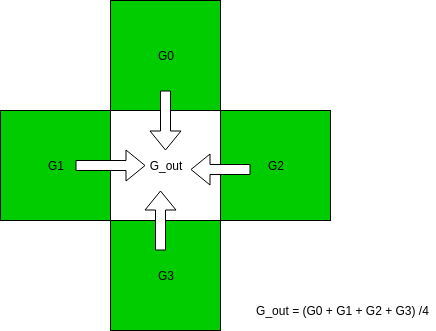

赤の画素ではこうです。

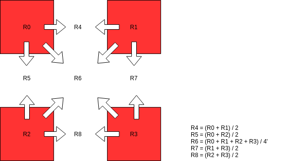

青の画素でも、赤の場合と同じような補完を行います。

では実際やってみましょう。


```
# 画像のヘリの部分で折り返すためのヘルパー関数
def mirror(x, min, max):
    if x < min:
        return min - x
    elif x >= max:
        return 2 * max - x - 2
    else:
        return x

dms_img = np.zeros((h, w, 3))
bayer_pattern = raw.raw_pattern
for y in range(0, h):
    for x in range(0, w):
        color = bayer_pattern[y % 2, x % 2]
        y0 = mirror(y-1, 0, h)
        y1 = mirror(y+1, 0, h)
        x0 = mirror(x-1, 0, w)
        x1 = mirror(x+1, 0, w)
        if color == 0:
            dms_img[y, x, 0] = wb_raw[y, x]
            dms_img[y, x, 1] = (wb_raw[y0, x] + wb_raw[y, x0] + wb_raw[y, x1] + wb_raw[y1, x])/4
            dms_img[y, x, 2] = (wb_raw[y0, x0] + wb_raw[y0, x1] + wb_raw[y1, x0] + wb_raw[y1, x1])/4
        elif color == 1:
            dms_img[y, x, 0] = (wb_raw[y, x0] + wb_raw[y, x1]) / 2
            dms_img[y, x, 1] = wb_raw[y, x]
            dms_img[y, x, 2] = (wb_raw[y0, x] + wb_raw[y1, x]) / 2
        elif color == 2:
            dms_img[y, x, 0] = (wb_raw[y0, x0] + wb_raw[y0, x1] + wb_raw[y1, x0] + wb_raw[y1, x1])/4
            dms_img[y, x, 1] = (wb_raw[y0, x] + wb_raw[y, x0] + wb_raw[y, x1] + wb_raw[y1, x])/4
            dms_img[y, x, 2] = wb_raw[y, x]
        else:
            dms_img[y, x, 0] = (wb_raw[y0, x] + wb_raw[y1, x]) / 2
            dms_img[y, x, 1] = wb_raw[y, x]
            dms_img[y, x, 2] = (wb_raw[y, x0] + wb_raw[y, x1]) / 2
```

画像のサイズを確認します。


```
print(dms_img.shape)
```

    (2464, 3280, 3)


元のRAW画像と同じサイズになっているようです。

画像を確認してみましょう。まずは残っているガンマ補正処理を行います。


```
# ガンマ補正
gmm_full_img = gamma_correction(dms_img / white_level, 2.2)
```

表示します。


```
# サイズ設定
plt.figure(figsize=(16, 8))
plt.imshow(gmm_full_img)
plt.axis('off')
plt.title(u"線形補間デモザイク画像")
plt.show()
```


それでは、JPEG画像と並べて表示してみましょう。


```
# 表示サイズ設定
plt.figure(figsize=(16, 8))

# まずは簡易RAW現像したファイルの描画。
plt.subplot(1, 2, 1)
y1, x1 = 740, 835
dy1, dx1 = 100, 100
plt.imshow(gmm_img[y1:y1+dy1, x1:x1+dx1])
plt.axis('off')
plt.title("簡易デモザイク結果")

# 今回RAW現像した画像の描画。
plt.subplot(1, 2, 2)
y2, x2 = y1 * 2, x1 * 2
dy2, dx2 = dy1 * 2, dx1 * 2
plt.imshow(gmm_full_img[y2:y2+dy2, x2:x2+dx2])
plt.axis('off')
plt.title(u"線形補間デモザイク画像")

# 実際に表示。
plt.show()
```


右側の線形補間した結果では、縦のラインがより細い部分まで分解されていることがわかります。とりあえずは成功としましょう。

なお、より高性能なデモザイクは６章の応用編でとりあげます。

### 処理の高速化

今回のデモザイクもコードの読みやすさを優先させてあります。高速化しておきましょう。

高速化に当たっては、数値計算ライブラリscipyのsignalモジュールを使います。


```
from scipy import signal

def demosaic(raw_array, raw_colors):
    """
    線形補間でデモザイクを行う

    Parameters
    ----------
    raw_array: numpy array
        入力BayerRAW画像データ。
    raw_colors: numpy array
        RAW画像のカラーチャンネルマトリクス。
        通常Rawpyのraw_colorsを用いて与える。

    Returns
    -------
    dms_img: numpy array
        出力RAW画像。
    """
    h, w = raw_array.shape
    dms_img = np.zeros((h, w, 3))
    
    # 緑画素の処理
    # 元のRAW画像から緑画素だけ抜き出す
    green = raw_array.copy()
    green[(raw_colors == 0) | (raw_colors == 2)] = 0
    # 緑画素の線形補間フィルター
    # [[0, 1, 0]]
    #  [1, 4, 1]
    #  [0, 1, 0]] / 4.0
    g_flt = np.array([[0, 1, 0], [1, 4, 1], [0, 1, 0]]) / 4.0
    # フィルターの適用
    # boundary='symm': 画像のヘリで折り返す。
    # mode='same': 出力画像サイズは入力画像と同じ。
    dms_img[:, :, 1] = signal.convolve2d(green, g_flt, boundary='symm', mode='same')

    # 元のRAW画像から赤画素だけ抜き出す
    red = raw_array.copy()
    red[raw_colors != 0] = 0
    # 赤画素の線形補間フィルター
    # [[1, 2, 1]]
    #  [2, 4, 2]
    #  [1, 2, 1]] / 4.0
    rb_flt = np.array([[1 / 4, 1 / 2, 1 / 4], [1 / 2, 1, 1 / 2], [1 / 4, 1 / 2, 1 / 4]])
    # フィルターの適用
    dms_img[:, :, 0] = signal.convolve2d(red, rb_flt, boundary='symm', mode='same')

    # 元のRAW画像から青画素だけ抜き出す
    blue = raw_array.copy()
    blue[raw_colors != 2] = 0
    # 青画素の線形補間フィルターは赤と共通
    # フィルターの適用
    dms_img[:, :, 2] = signal.convolve2d(blue, rb_flt, boundary='symm', mode='same')
    return dms_img
```

ここで使ったconvolve2dは、線形フィルターを画像などの２次元データに畳み込む処理です。

上記の場合は、入力画素の周辺3x3画素を取り出し、その一つ一つの画素とフィルターの値を掛け合わした上で合計し出力するという処理をしています。

例えばこのコードの場合、緑画素なら、$gin$、$gout$を緑画素の入力、出力とすると

$$ g =  \frac{1}{4}
\begin{bmatrix}
    0 & 1 & 0 \\
    1 & 4 & 1 \\
    0 & 1 & 0
    \end{bmatrix} $$

$$ gout_{x, y}= \sum_{i=-1}^{+1}\sum_{j=-1}^{+1} gin_{x+i, y+i} g_{i, j}$$

という処理を行います。これで入力画素が緑画素の場合、上下左右には緑画素がないので入力画素がそのまま出力されます。そうでない場合は、上下左右の緑がその平均値が出力されます。

この`demosaic()`関数は`raw_process.py`モジュールの一部として[githubにアップロード](https://raw.githubusercontent.com/moizumi99/raw_process/master/raw_process.py)されています。
使用する場合は、

`!wget https://raw.githubusercontent.com/moizumi99/raw_process/master/raw_process.py`

としてダウンロードした後、

`from raw_process import demosaic`

としてインポートしてください。

### まとめ

この節では線形補間によるデモザイク処理を行いました。次は[欠陥画素補正](https://colab.research.google.com/github/moizumi99/camera_raw_processing/blob/master/camera_raw_chapter_4_3.ipynb)を行います。

## 4.3 欠陥画素補正

### この節について

この節では、欠陥画素補正を解説します。

この節のの内容はColabノートブックとして公開してあります。ノートブックを見るには[目次ページ](https://colab.research.google.com/github/moizumi99/camera_raw_processing/blob/master/camera_raw_toc.ipynb)から参照するか、以下のリンクを使ってアクセスしてください。

https://colab.research.google.com/github/moizumi99/camera_raw_processing/blob/master/camera_raw_chapter_4_3.ipynb

### 準備

まずライブラリーのインストールと、モジュールのインポート、画像の読み込みを行います。今回もラズベリーパイで撮影したチャート画像を使用します。
内容については各節を参照ください。


```python
# rawpyとimageioのインストール
!pip install rawpy;
!pip install imageio;

# rawpy, imageio, numpuy, pyplot, imshowのインポート
import rawpy, imageio
import numpy as np
import matplotlib.pyplot as plt

# 前節までに作成したモジュールのダウンロード
!if [ ! -f raw_process.py ]; then wget https://raw.githubusercontent.com/moizumi99/camera_raw_process/master/camera_raw_process.py; fi

from raw_process import simple_demosaic, white_balance, black_level_correction, gamma_correction, demosaic

# 日本語フォントの設定
!apt -y install fonts-ipafont-gothic
plt.rcParams['font.family'] = 'IPAPGothic'
# もし日本語が文字化けしている場合`! rm /content/.cache/matplotlib/fontList.json`を実行して、
# Runtime->Restart Runtimeで再実行

# 画像をダウンロードします。
!if [ ! -f chart.jpg ]; then wget https://raw.githubusercontent.com/moizumi99/camera_raw_process/master/chart.jpg; fi

# 自分で撮影した画像を使用する場合は以下のコメントを取り除きアップロードします。
# from google.colab import files
# uploaded = files.upload()

# RAWファイルの名前。
# アップロードしたファイルを使う場合はその名前に変更。
raw_file  = "chart.jpg"
raw = rawpy.imread(raw_file)
raw_array = raw.raw_image
h, w = raw_array.shape
```

    Requirement already satisfied: rawpy in /home/moiz/anaconda3/lib/python3.7/site-packages (0.13.0)
    Requirement already satisfied: numpy in /home/moiz/anaconda3/lib/python3.7/site-packages (from rawpy) (1.15.1)
    Requirement already satisfied: imageio in /home/moiz/anaconda3/lib/python3.7/site-packages (2.4.1)
    E: Could not open lock file /var/lib/dpkg/lock-frontend - open (13: Permission denied)
    E: Unable to acquire the dpkg frontend lock (/var/lib/dpkg/lock-frontend), are you root?


### 欠陥画素

ライブラリーを使って対象画像の左下の方、グレイチャートの一部（図の赤でかこった部分）を現像して拡大表示すると、こんな部分があります。


```python
# raw_processからインポートしたblack_level_correction関数を使用してブラックレベル補正。
blc_raw = black_level_correction(raw_array, raw.black_level_per_channel, raw.raw_pattern)
# raw_processからインポートしたwhite_balance()関数を使って、ホワイトバランス調整。
wb_raw = white_balance(blc_raw, raw.camera_whitebalance, raw.raw_colors)
# raw_processからインポートしたsimple_demosaic()関数を使って、簡易デモザイク処理。
dms_img = demosaic(wb_raw, raw.raw_colors)
# ラズベリーパイのRAW画像は10bitなので、1024で正規化しておく。
white_level = 1024.0
dms_img = dms_img / white_level
# raw_processからインポートしたgamma_crrection()関数を使って、ガンマ補正。
gmm_img = gamma_correction(dms_img, 2.2)
```


```python
# 画像を表示。
plt.figure(figsize=(16, 8))
plt.imshow(gmm_img)
# 欠陥のある部分を示す赤い四角を描画。
# x=2210, y=1150から50x50の正方形を、塗りつぶしなし、赤色、線の太さ2で作成。
box = plt.Rectangle((1150, 2110), 50, 50, fill=False, edgecolor='red', linewidth=2)
# Pyplotのgca()を使ってAxesインスタンス（描画用の軸インスタンス）を取得。
# そのAxesインスタンスに先程のBoxをadd_patchを使って追加。
plt.gca().add_patch(box)
plt.axis('off')
plt.title(u"全体画像")
plt.show()

# 画像の一部分を拡大表示。
plt.figure(figsize=(16, 8))
plt.imshow(gmm_img[2110:2160, 1150:1210, :])
plt.axis('off')
plt.title(u"欠陥画素")
plt.show()
```


これはいわゆる欠陥画素です。 「欠陥」という名前がついていますが、製品の欠陥ではなく、一部の画素が正常な値を出力しない状態です。 多くの場合このように、常に明るく見えますが（ホットピクセル）、常に暗い（デッドピクセルまたはコールドピクセル）こともあれば、本来の信号とずれた値を示すという捕まえにくいケースもあります。

数ミリ角のサイズに数百万から数千万の画素を作り込む現代の画像センサーでは、一部にこのような欠陥画素が含まれていることはごく普通のことです。

なぜこのような欠陥ができるかというのには、さまざまな原因が考えられます。 たとえば製造過程でパーティクルが入り1特定の画素が反応しなくなったとか逆にショートして常に電流が流れるようになった、というのがまっさきに思いつきます。 まだ半導体中の結晶欠陥などのせいで基板側に電流が漏れている（または基板から漏れて入ってくる）のかもしれません。 さらには宇宙線などが当たって製造後に欠陥が形成されるケースもあると聞きます。

このように、画像センサーに欠陥画素はつきもので、画像処理である程度対応していく必用があります。 市販のスマートフォンのカメラはもちろん、一眼レフカメラなどでも欠陥画素補正処理は内部的に行われているはずです。

それでは、実際に簡単な補正処理を行ってみます。

欠陥画素補正には大きく分けて２つのステップがあります2。

- 欠陥画素検出
- 欠陥画素修正

今回は、欠陥画素検出としては、周辺の画素の最大値よりある程度以上大きいか最小値よりある程度以上小さければ欠陥とみなす、という方針で行います。 また修正としては、欠陥画素の上下左右４画素の平均をとる事にします。

それでは処理してみましょう。ブラックレベル補正後のデータ`blc_raw`から処理をはじめます。

各色毎に欠陥画素の検出と修正を行います。なお、ここではGr (Redと同列のGreen)とGb (Blueと同列のGreen)を別の色として処理しています。
まず、左上の色（Blue）からです。処理しやすいようにBlueのみを抜き出します。


```python
dpc_raw = blc_raw.copy()
single_channel = dpc_raw[::2, ::2]
```

周辺の5x5画素の最大値と最小値を求めます。

最大値最小値を求めるのにscipyのndfilerモジュールから、maximum_filterとminimum_filterを使います。


```python
import scipy

# 5x5の行列を作る、全成分を１にする。
footprint = np.ones((5, 5))
# 中心の値のみを０にする。
footprint[2, 2] = 0
# 入力画像の各画素周辺５ｘ５の最大値をもとめて、画像と同じサイズのnumpy arrayとして保存。
local_max = scipy.ndimage.filters.maximum_filter(single_channel, footprint=footprint, mode='mirror')
# 入力画像の各画素周辺５ｘ５の最小値をもとめて、画像と同じサイズのnumpy arrayとして保存。
local_min = scipy.ndimage.filters.minimum_filter(single_channel, footprint=footprint, mode='mirror')
```

ここでfootprintによって、どの画素を最大値・最小値の計算の対象にするか決めることができます。

ここでは、5x5の行列を作り、中心の成分のみをゼロ、他は1としてfootprintを作成しました。

$$ footprint = \begin{bmatrix}
    1 & 1 & 1 & 1 & 1 \\
    1 & 1 & 1 & 1 & 1 \\
    1 & 1 & 0 & 1 & 1 \\
    1 & 1 & 1 & 1 & 1 \\
    1 & 1 & 1 & 1 & 1
\end{bmatrix} $$

これを使うことで、欠陥画素かどうか判定する対象を最大値最小値の計算から取り除くことができます。

この最大値と最小値を使って、欠陥画素判定を行います。 最大値や最小値との差がthreshold値より大きい場合欠陥画素とみなす事にします。


```python
threshold = 16
mask = (single_channel < local_min - threshold) + (single_channel > local_max + threshold)
```

これで欠陥画素の位置がmaskにTrueとして記録されました。（欠陥画素以外はFalse）

それでは修正しましょう。

まず、欠陥画素の上下左右の画素の平均値を計算しておきます。


```python
# 上下左右の平均値を取るフィルター。
flt = np.array([[0, 1, 0], [1, 0, 1], [0, 1, 0]]) / 4
# scipyの機能で上下左右画素の平均値をとり、結果をnumpy arrayとして保存。
average = scipy.signal.convolve2d(single_channel, flt, mode='same')
```

次に欠陥画素をこの平均値で置き換えます。

欠陥画素はmaskのうちTrueになっている部分です。


```python
single_channel[mask] = average[mask]
```

これでBlue面の欠陥画素補正ができました。

他の色の欠陥も補正するためにループ化します。


```python
# ブラックレベル補正後の画像をコピー。
dpc_raw = blc_raw.copy()
# footprintとして5x5のマスクを作成
# [[1 1 1 1 1]
#  [1 1 1 1 1]
#  [1 1 0 1 1]
#  [1 1 1 1 1]
#  [1 1 1 1 1]]
footprint = np.ones((5, 5))
footprint[2, 2] = 0

# 各カラーごとの処理。左上(0, 0)、左下(1, 0), 右上(0, 1), 右下(1, 1)
for (yo, xo) in ((0, 0), (1, 0), (0, 1), (1, 1)):
    # １カラーチャンネルを取り出す。
    single_channel = dpc_raw[yo::2, xo::2]
    # 上下左右の平均をとるフィルター
    flt = np.array([[0, 1, 0], [1, 0, 1], [0, 1, 0]]) / 4
    # 平均値をとった画像の作成
    average = scipy.signal.convolve2d(single_channel, flt, mode='same')
    # 周辺画像の最大値を求める。footprintにより、対象となる画素は含めない。
    local_max = scipy.ndimage.filters.maximum_filter(single_channel, footprint=footprint, mode='mirror')
    # 周辺画像の最小値を求める。footprintにより、対象となる画素は含めない。
    local_min = scipy.ndimage.filters.minimum_filter(single_channel, footprint=footprint, mode='mirror')
    # 中心画素が最大値よりthreshold分以上大きい、または最小値よりthreshold分以上小さければ欠陥とみなす。
    threshold = 16
    # 欠陥の位置をTrueとして保存。
    mask = (single_channel < local_min - threshold) + (single_channel > local_max + threshold)
    # 欠陥画素を平均値で置換。
    single_channel[mask] = average[mask]
    # single_channelはdpc_rawへの参照なので書き戻す必用がない
```

残りのホワイトバランス、デモザイク、ガンマ処理を行い、出力結果を確認します。


```python
wb_raw = white_balance(dpc_raw, raw.camera_whitebalance, raw.raw_colors)
# raw_processからインポートしたsimple_demosaic()関数を使って、簡易デモザイク処理。
dms_img = demosaic(wb_raw, raw.raw_colors)
# ラズベリーパイのRAW画像は10bitなので、1024で正規化しておく。
white_level = 1024.0
dms_img = dms_img / white_level
# raw_processからインポートしたgamma_crrection()関数を使って、ガンマ補正。
gmm_img = gamma_correction(dms_img, 2.2)

# 画像の一部分を拡大表示。
plt.figure(figsize=(16, 8))
plt.imshow(gmm_img)
plt.axis('off')
plt.title(u"欠陥画素補正後")
plt.show()
```


欠陥画素が修正されたか、先ほどと同じ部分を拡大して確認しましょう。


```python
# 画像の一部分を拡大表示。
plt.figure(figsize=(16, 8))
plt.imshow(gmm_img[2110:2160, 1150:1210, :])
plt.axis('off')
plt.title(u"補正された欠陥画像")
plt.show()
```


どうやら修正されたようです。

### モジュールへの追加

この処理も関数としてモジュールへ追加しておきましょう。


```python
def defect_correction(raw_array, threshold):
    """
    線形補間でデモザイクを行う

    Parameters
    ----------
    raw_array: numpy array
        入力BayerRAW画像データ。
    threshold: int
        欠陥画素判定の閾値。
        10bitRAW入力に対して典型的には16程度。

    Returns
    -------
    dpc_raw: numpy array
        出力RAW画像。
    """
    dpc_raw = raw_array.copy()
    # footprintとして5x5のマスクを作成
    # [[1 1 1 1 1]
    #  [1 1 1 1 1]
    #  [1 1 0 1 1]
    #  [1 1 1 1 1]
    #  [1 1 1 1 1]]
    footprint = np.ones((5, 5))
    footprint[2, 2] = 0
    # 各カラーごとの処理。左上(0, 0)、左下(1, 0), 右上(0, 1), 右下(1, 1)
    for (yo, xo) in ((0, 0), (1, 0), (0, 1), (1, 1)):
        single_channel = dpc_raw[yo::2, xo::2]
        # 上下左右の平均をとるフィルター
        flt = np.array([[0, 1, 0], [1, 0, 1], [0, 1, 0]]) / 4
        # 上下左右の平均値をとった画像の作成
        average = scipy.signal.convolve2d(single_channel, flt, mode='same')
        # 周辺画像の最大値を求める。footprintにより、対象となる画素は含めない。
        local_max = scipy.ndimage.filters.maximum_filter(single_channel, footprint=footprint, mode='mirror')
        # 周辺画像の最小値を求める。footprintにより、対象となる画素は含めない。
        local_min = scipy.ndimage.filters.minimum_filter(single_channel, footprint=footprint, mode='mirror')
        # 中心画素が最大値よりthreshold分以上大きい、または最小値よりthreshold分以上小さければ欠陥とみなす。
        # 欠陥の位置をTrueとして保存。
        mask = (single_channel < local_min - threshold) + (single_channel > local_max + threshold)
        # 欠陥画素を平均値で置換。
        single_channel[mask] = average[mask]
        # single_channelはdpc_rawへの参照なので書き戻す必用がない
    return dpc_raw
```

この`defect_correction()`関数は`raw_process.py`モジュールの一部として[githubにアップロード](https://raw.githubusercontent.com/moizumi99/raw_process/master/raw_process.py)されています。
使用する場合は、

`!wget https://raw.githubusercontent.com/moizumi99/raw_process/master/raw_process.py`

としてダウンロードした後、

`from raw_process import defect_correction`

としてインポートしてください。

### まとめ

この節では欠陥画素補正を行いました。次は[カラーマトリクス補正](https://colab.research.google.com/github/moizumi99/camera_raw_processing/blob/master/camera_raw_chapter_4_4.ipynb)を行います。

## 4.4 カラーマトリクス補正

### この節について

この節では、カラーマトリクス補正を解説します。

この節のの内容はColabノートブックとして公開してあります。ノートブックを見るには[目次ページ](https://colab.research.google.com/github/moizumi99/camera_raw_processing/blob/master/camera_raw_toc.ipynb)から参照するか、以下のリンクを使ってアクセスしてください。

https://colab.research.google.com/github/moizumi99/camera_raw_processing/blob/master/camera_raw_chapter_4_4.ipynb

### 準備

まずライブラリーのインストールと、モジュールのインポート、画像の読み込みを行います。今回もラズベリーパイで撮影したチャート画像を使用します。
内容については各節を参照ください。


```python
# rawpyとimageioのインストール
!pip install rawpy;
!pip install imageio;

# rawpy, imageio, numpuy, pyplot, imshowのインポート
import rawpy, imageio
import numpy as np
import matplotlib.pyplot as plt
from matplotlib.pyplot import imshow

# 前節までに作成したモジュールのダウンロードとインポート
!if [ ! -f raw_process.py ]; then wget raw_process.py; fi
from raw_process import simple_demosaic, white_balance, black_level_correction, gamma_correction, demosaic, defect_correction

# 日本語フォントの設定
!apt -y install fonts-ipafont-gothic
plt.rcParams['font.family'] = 'IPAPGothic'
# もし日本語が文字化けしている場合`! rm /content/.cache/matplotlib/fontList.json`を実行して、
# Runtime->Restart Runtimeで再実行

# 画像をダウンロードします。
!if [ ! -f chart.jpg ]; then wget chart.jpg; fi

# 自分で撮影した画像を使用する場合は以下のコメントを取り除きアップロードします。
# from google.colab import files
# uploaded = files.upload()

# RAWファイルの名前。
# アップロードしたファイルを使う場合はその名前に変更。
raw_file  = "chart.jpg"
raw = rawpy.imread(raw_file)
raw_array = raw.raw_image
h, w = raw_array.shape
```

    Requirement already satisfied: rawpy in /home/moiz/anaconda3/lib/python3.7/site-packages (0.13.0)
    Requirement already satisfied: numpy in /home/moiz/anaconda3/lib/python3.7/site-packages (from rawpy) (1.15.1)
    Requirement already satisfied: imageio in /home/moiz/anaconda3/lib/python3.7/site-packages (2.4.1)
    E: Could not open lock file /var/lib/dpkg/lock-frontend - open (13: Permission denied)
    E: Unable to acquire the dpkg frontend lock (/var/lib/dpkg/lock-frontend), are you root?


### カラーマトリクスとは

前節までにRAW現像した画像と、JPEG画像を並べて比較してみましょう。
こちらがJPEG画像をJPEGとしてそのまま表示したものです。


```python
# JPEG画像をnumpyのarrayとして取得
# [4.2節参照](https://colab.research.google.com/github/moizumi99/camera_raw_processing/blob/master/camera_raw_chapter_4_2.ipynb)
from matplotlib import image
import matplotlib
jpg_img = image.imread("chart.jpg")
jpg_img = jpg_img / jpg_img.max()

# JPEG画像表示
plt.figure(figsize=(16, 8))
imshow(jpg_img)
plt.axis('off')
plt.title(u"JPEG画像")
plt.show()
```


それに対してこちらが、前回までに現像したものです。


```python
# ブラックレベル補正。
blc_raw = black_level_correction(raw_array, raw.black_level_per_channel, raw.raw_pattern)
# 前節で作成したdefect_correction関数を使って、欠陥画素補正。
dpc_raw = defect_correction(blc_raw, 16)
# 残りの現像処理
wb_raw = white_balance(dpc_raw, raw.camera_whitebalance, raw.raw_colors)
dms_img = demosaic(wb_raw, raw.raw_colors)
# ガンマ処理の前にwhite_levelで正規化
white_level = 1024
dms_img = dms_img / white_level
gmm_img = gamma_correction(dms_img, 2.2)

# 画像表示。
plt.figure(figsize=(16, 8))
imshow(gmm_img)
plt.axis('off')
plt.title(u"RAW現像した画像")
plt.show()
```


２つの画像を見比べると、色の鮮やかさが違うことがわかると思います。また色合いも完全には一致していません。実際の見た目も最初のJPEGの画像に近くなっています。

どうしてこうなってしまうかというと、最大の原因はカメラのセンサーの色ごとの感度が人間の目とは完全には一致しないことです。例えば人間の目はある光の周波数の範囲を赤、青、緑、と感じるのですが、センサーが緑を検知する範囲は人間が緑と感じる領域とは微妙に異なっています。同じように青や赤の範囲も違います。これは、センサーが光をなるべく沢山取り込むため、だとか、製造上の制限、などの理由があるようです。 さらに、人間の目には、ある色を抑制するような領域まであります。これはセンサーで言えばマイナスの感度があるようなものですが、そんなセンサーは作れません。

こういったセンサー感度と人間の目の間隔とがなるべく小さくなるように、3色を混ぜて、より人間の感覚に近い色を作り出す必要があります。この処理を通常は行列を使って行い、これをカラーマトリクス補正と呼びます。

カラーマトリクス補正というのは処理的には3x3の行列に、3色の値を成分としたベクトルをかけるという処理になります。

$$ 
\left(
    \begin{matrix}
        R_{out} \\
        G_{out} \\
        B_{out} \\
    \end{matrix}
\right) = 
\left(
    \begin{matrix}
        c_0 & c_1 & c_2 \\
        c_3 & c_4 & c_5 \\
        c_6 & c_7 & c_8 \\
    \end{matrix}
\right)
\left(
    \begin{matrix}
        R_{in} \\
        G_{in} \\
        B_{in} \\
    \end{matrix}
\right)
$$

このような処理で、色の深み・鮮やかさ（Saturationと呼ばれます）、色合い（Hueと呼ばれます）をある程度修正することができます。

### カラーマトリクス補正

それでは実際にカラーマトリクス補正をかけてみましょう。

まず、撮影されたRAW画像に保存されているカラーマトリクスの値を読んでみましょう。
RAWPYにもカラーマトリクスを読み取る機能はあるのですが、実際に実行するとこうなってしまいます。


```python
print(raw.color_matrix)
```

    [[0. 0. 0. 0.]
     [0. 0. 0. 0.]
     [0. 0. 0. 0.]]


これでは仕方がないので、exiftoolを使います。exiftoolはコマンドラインから各種画像ファイルの情報を取り出すツールです。

まずcolabの環境にexiftoolをインストールします。


```python
! apt install exiftool
```

    E: Could not open lock file /var/lib/dpkg/lock-frontend - open (13: Permission denied)
    E: Unable to acquire the dpkg frontend lock (/var/lib/dpkg/lock-frontend), are you root?


Exiftoolをつかって、カラーマトリクスの内容を見てみましょう。

Raspberry PiのRAW画像の場合、カラーマトリクスはメーカーノート情報（カメラメーカー独自のデータ）に含まれています[^1]。メーカーノートは`-EXIF:MakerNoteUnknownText -b`オプションで読むことができます。

[^1]: α7IIIのRAW画像ではEXIF情報に含まれているのでオプションをつけなくとも`! exiftool sample.ARW`で読み取ることができます。


```python
! exiftool -EXIF:MakerNoteUnknownText -b chart.jpg -b
```

    ev=-1 mlux=-1 exp=62998 ag=556 focus=255 gain_r=1.128 gain_b=2.546 greenness=3 ccm=6022,-2314,394,-936,4728,310,300,-4324,8126,0,0,0 md=0 tg=262 262 oth=0 0 b=0 f=262 262 fi=0 ISP Build Date: Oct  8 2018, 17:46:45 VC_BUILD_ID_VERSION: 656741eb5ba785fc4f1014a3a3b1c0e9c2cc8487 (clean) VC_BUILD_ID_USER: dc4 VC_BUILD_ID_BRANCH: master 

繋がっていて読みにくいですが、よく見てみるとこのような部分があるのがわかります。

> ccm=6022,-2314,394,-936,4728,310,300,-4324,8126,0,0,0

これは、カラーマトリクス(CCM: Color Correction Matrix)が次のような値であることを示しています。

$$ \left(
    \begin{matrix}
        6022 & -2314 & 394 \\
        -936 & 4728 & 310 \\
        300 & -4324 & 8126 \\
    \end{matrix}
\right) $$

このままでは入力と掛け合わせた時に非常に大きくなってしまうので、何かの値で正規化しなくてはなりません。Exifのメーカーノートには特に記載がありませんが、各行の和が4096に近いので、4096で正規化しておくことにしましょう。

それではこの値を使ってカラーマトリクス補正を行ってみましょう。カラーマトリクス補正は線形な色空間で行う必用があるので、ガンマ補正の前に行います。


```python
# カラーマトリクス
# [[6022,-2314,394]
#  [-936,4728,310]
#  [300,-4324,8126]] / 4096
color_matrix = np.array([[6022,-2314,394],[-936,4728,310],[300,-4324,8126]]) / 4096

# 出力先を作成しておく
ccm_img = np.zeros_like(dms_img)
# 実際に１画素毎に処理
# 入力はデモザイク処理後の画像。
for y in range(0, h):
    for x in range(0, w):
        pixel = dms_img[y, x, :]
        # numpyのdotは行列同士の掛け算を計算する関数
        pixel = np.dot(color_matrix, pixel)
        ccm_img[y, x, :] = pixel
```

残っているガンマ補正を行います。


```python
ccm_gmm_img = gamma_correction(ccm_img, 2.2)
```

最終的な画像を表示して、カラーマトリクス補正なしのものと比較してみましょう。


```python
# 表示領域設定
plt.figure(figsize=(12, 16))
# 2 x 1 (縦２，横１)のうち１つめの表示
plt.subplot(2, 1, 1)
# CCM補正なしの画像を表示
plt.imshow(gmm_img)
plt.axis('off')
plt.title(u"CCM補正なし")
# 2 x 1 (縦２，横１)のうち２つめの表示
plt.subplot(2, 1, 2)
# CCM補正ありの画像を表示
plt.imshow(ccm_gmm_img)
plt.axis('off')
plt.title(u"CCM補正あり")
# 画像を描画
plt.show()
```


CCMありのほうが色が鮮やかになっているのがわかると思います。

### モジュールへの追加

この処理も高速化して、関数としてモジュールへ追加しておきましょう。


```python
def color_correction_matrix(rgb_array, color_matrix):
    """
    カラーマトリクス補正を行う。
    
    Parameters
    ----------
    rgb_array: numpy array
        入力RGB画像
    color_matrix: 2D (3x3) array like
        3x3 Color Correction Matrix
        Need to be normalized to 1.0
    
    Returns
    -------
    ccm_img: numpy array
        出力RGB画像
    """
    
    # 出力先を作成
    ccm_img = np.zeros_like(rgb_array)
    # CCMが3x3フォーマットでない場合、3x3に変換
    ccm = np.array(color_matrix).reshape((3, 3))
    # 各色毎に処理。この方が各画素ごとに処理するよりも高速なようだ。
    for color in (0, 1, 2):
        # 行列と入力画像の各色を掛け合わせる。
        ccm_img[:, :, color] = ccm[color, 0] * rgb_array[:, :, 0] + \
                               ccm[color, 1] * rgb_array[:, :, 1] + \
                               ccm[color, 2] * rgb_array[:, :, 2]
    return ccm_img
```

この`color_correction_matrix()`関数は`raw_process.py`モジュールの一部として[githubにアップロード](https://raw.githubusercontent.com/moizumi99/raw_process/master/raw_process.py)されています。
使用する場合は、

`!wget https://raw.githubusercontent.com/moizumi99/raw_process/master/raw_process.py`

としてダウンロードした後、

`from raw_process import color_correction_matrix`

としてインポートしてください。

### まとめ

この節ではカラーマトリクス補正を行いました。次は[レンズシェーディング補正](https://colab.research.google.com/github/moizumi99/camera_raw_processing/blob/master/camera_raw_chapter_4_5.ipynb)を行います。

## 4.5 シェーディング補正

### この節について

この節では、シェーディング補正について解説します。

この節のの内容はColabノートブックとして公開してあります。ノートブックを見るには[目次ページ](https://colab.research.google.com/github/moizumi99/camera_raw_processing/blob/master/camera_raw_toc.ipynb)から参照するか、以下のリンクを使ってアクセスしてください。

https://colab.research.google.com/github/moizumi99/camera_raw_processing/blob/master/camera_raw_chapter_4_5.ipynb

### 準備

まずライブラリーのインストールと、モジュールのインポート、画像の読み込みを行います。今回もラズベリーパイで撮影したチャート画像を使用します。
内容については各節を参照ください。


```
# rawpyとimageioのインストール
!pip install rawpy;
!pip install imageio;

# rawpy, imageio, numpuy, pyplot, imshowのインポート
import rawpy, imageio
import numpy as np
import matplotlib.pyplot as plt
from matplotlib.pyplot import imshow

# 前節までに作成したモジュールのダウンロードとインポート
!if [ ! -f raw_process.py ]; then wget raw_process.py; fi
from raw_process import simple_demosaic, white_balance, black_level_correction, gamma_correction
from raw_process import demosaic, defect_correction, color_correction_matrix, lens_shading_correction

# 日本語フォントの設定
!apt -y install fonts-ipafont-gothic
plt.rcParams['font.family'] = 'IPAPGothic'
# もし日本語が文字化けしている場合`! rm /content/.cache/matplotlib/fontList.json`を実行して、
# Runtime->Restart Runtimeで再実行

# RAWファイルの名前。
# アップロードしたファイルを使う場合はその名前に変更。
raw_file  = "chart.jpg"
raw = rawpy.imread(raw_file)
raw_array = raw.raw_image
h, w = raw_array.shape
```

    Requirement already satisfied: rawpy in /home/moiz/anaconda3/lib/python3.7/site-packages (0.13.0)
    Requirement already satisfied: numpy in /home/moiz/anaconda3/lib/python3.7/site-packages (from rawpy) (1.15.1)
    Requirement already satisfied: imageio in /home/moiz/anaconda3/lib/python3.7/site-packages (2.4.1)
    E: Could not open lock file /var/lib/dpkg/lock-frontend - open (13: Permission denied)
    E: Unable to acquire the dpkg frontend lock (/var/lib/dpkg/lock-frontend), are you root?


### レンズシェーディング（周辺減光）とは

デジタルカメラに限らず、レンズを通して結像した画像は中央部より周辺部のほうが暗くなっています。

このような現象をレンズシェーディングや単にシェーディング、また日本語では周辺減光などといいます。英語ではLens ShadingやVignettingと呼ばれます。

このような事が起きてしまう第一の原因は、レンズを通してセンサーにあたる光の量が、センサーの中央部と、センサーの周辺部とで異なる事です。
良く説明に出されるのが二枚のレンズを持つ単純な系の場合です。

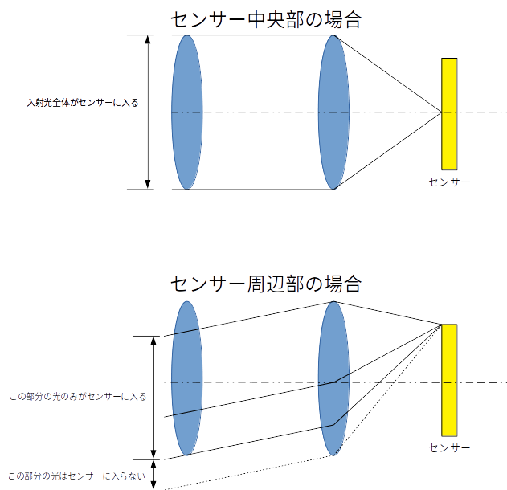

この図の例では、センサー中央部分にあたる光はレンズの開口部全体を通ってくるのに対して、センサー周辺部にあたる光はレンズの一部分しか通過できません。
結果的に中心部が明るく、周辺部が暗くなります。
実際のカメラの光学系はこれより遥かに複雑ですが、同様の理由により画像の周辺部分が暗くなります。

この要因の他に、センサー周辺部ではレンズやカバーの縁に遮られる光の量も増えます。また、光の入射角度によってレンズ等のコーティングと干渉する可能性もあります。
またデジタルカメラ独特の状況として、画像センサー上のフォトダイオードに到達する光の量が、光の入射角に依存するケースがあります。

シェーディングを起こす要因はこのように多岐にわたり、一概に、これが原因だとは言うことはできません。
したがってモデル計算で減光量を求めるよりも、実際のレンズで測定した結果を元に画像補正する必要があります。

### レンズシェーディングの確認

では実際にシェーディングの影響を見てみましょう。

本来ならば明るさを均一にしたグレイチャート（その名の通り灰色の大きなシート）などを撮影してテストするのですが普通の家庭にそのような物はないので、今回はラズベリーパイのレンズの上に白いコピー用紙を載せ、そこに後ろから光を当てることでなるべく一様な明るさの画像を撮影しました。ファイル名は ```flat.jpg```です。このファイルは[githubにアップロードしてあります](flat.jpg)。

まずはダウンロードしてみます。


```
! wget flat.jpg
```

    --2019-02-03 09:03:40--  flat.jpg
    Resolving github.com (github.com)... 192.30.255.112, 192.30.255.113
    Connecting to github.com (github.com)|192.30.255.112|:443... connected.
    HTTP request sent, awaiting response... 302 Found
    Location: https://raw.githubusercontent.com/moizumi99/camera_raw_processing/master/flat.jpg [following]
    --2019-02-03 09:03:40--  https://raw.githubusercontent.com/moizumi99/camera_raw_processing/master/flat.jpg
    Resolving raw.githubusercontent.com (raw.githubusercontent.com)... 151.101.188.133
    Connecting to raw.githubusercontent.com (raw.githubusercontent.com)|151.101.188.133|:443... connected.
    HTTP request sent, awaiting response... 200 OK
    Length: 14561271 (14M) [application/octet-stream]
    Saving to: ‘flat.jpg.5’
    
    flat.jpg.5          100%[===================>]  13.89M  40.4MB/s    in 0.3s    
    
    2019-02-03 09:03:41 (40.4 MB/s) - ‘flat.jpg.5’ saved [14561271/14561271]
    


このファイルからRAW画像を取り出し現像してみましょう。
まだレンズシェーディング補正は行いません。


```
# RAW画像の読み込み。
raw_file  = "flat.jpg"
raw = rawpy.imread(raw_file)
raw_array = raw.raw_image
h, w = raw.sizes.raw_height, raw.sizes.raw_width
raw_array = raw_array.reshape((h, w));

#RAW現像処理
blc_raw = black_level_correction(raw_array, raw.black_level_per_channel, raw.raw_pattern)
dpc_raw = defect_correction(blc_raw, 16)
wb_raw = white_balance(dpc_raw, raw.camera_whitebalance, raw.raw_colors)
dms_img = demosaic(wb_raw, raw.raw_colors)
color_matrix = np.array([6022,-2314,394,-936,4728,310,300,-4324,8126])/4096
ccm_img = color_correction_matrix(dms_img, color_matrix)
white_level = 1024.0
no_shading_img = gamma_correction(ccm_img / white_level, 2.2)

# 画像表示
plt.figure(figsize=(16, 8))
plt.imshow(no_shading_img)
plt.axis('off')
plt.title(u"レンズシェーディング補正前")
plt.show()
```


確かに周辺光量が落ちているのが確認できます。その他に画像中央部と周辺部とで色味が違うのもわかると思います。

画像の中で明るさがどう変わっているか見てみましょう。
画面の高さ方向中央付近、上下３２画素幅で左から右まで帯状の画像をとりだし、明るさがどう変わるをグラフにしてみます。


```
# 基準となる画像中央部の位置
center_y, center_x = h // 2, w // 2
# 明るさの配列を保存する配列
shading_profile = [[], [], []]

# 画面中央の上下+/-16ライン幅で測定
y = center_y - 16
# 横方向３２画素毎にサンプリング
for x in range(0, w - 32, 32):
    xx = x + 16
    # (x, y)から(x+32, y+32)を対角線とする正方形内部の画素の平均
    # 色ごとに保存する。
    shading_profile[0].append(no_shading_img[y:y+32, x:x+32, 0].mean())
    shading_profile[1].append(no_shading_img[y:y+32, x:x+32, 1].mean())
    shading_profile[2].append(no_shading_img[y:y+32, x:x+32, 2].mean())
# 画像中央部の値で正規化する
shading_profile = [np.array(a) / max(a) for a in shading_profile]
```


```
plt.axis(ymin=0, ymax=1.1)
plt.plot(shading_profile[0], color='red')
plt.plot(shading_profile[1], color='green')
plt.plot(shading_profile[2], color='blue')
plt.title(u"明るさの横方向の変化")
plt.show()
```


画像の左右端では中心部分に比べて50%程度の明るさに落ちていることがわかります。
これはガンマ補正後の値なので、RAW画像では明るさの違いはさらに大きいことが予想できます。

また、赤画素と、緑・青画素とではシェーディングの様子がだいぶ違います。画像の色が中央と周辺部でだいぶ違うのはこのせいでしょう。

### レンズシェーディングのモデル化

レンズシェーディングを補正するために、まずどの程度の減光があるのか測定してみましょう。

画像を見てわかるとおり、光の量は中心から離れるに従って減っています。中央からの距離によってパラメータ化できそうです。
また、対称性を考えると偶関数で近似できるはずです。

では各画素の明るさを、中央からの距離に応じてグラフにしてみましょう。

一画素毎に計算するのは計算量が大きくまたノイズによる誤差も入ってくるので、32 x 32のブロックごとに測定します。
また、今度は実際に補正する量の見積もりに使いたいのでBayerでの値を使います。
ゼロレベルを正しく取る必用があるので、測定する対象はブラックレベル補正後の画像です。


```
# 測定値を入れる配列を色の数分だけ準備する。
vals = [[], [], [], []]
# 中心からの距離を保存
radials = []

# 32x32のブロック毎に処理を行います。
# (x, y)から(x+32, y+32)を対角線とする正方形毎に処理。
for y in range(0, h, 32):
    for x in range(0, w - 32, 32):
        # (xx, yy)は正方形の中心。
        xx = x + 16
        yy = y + 16
        # 正方形の中心と画像の中心の間の距離を求め記録。
        r2 = (yy - center_y) * (yy - center_y) + (xx - center_x) * (xx - center_x)
        radials.append(r2)
        # 色ごとに正方形の中の画素の平均値を求める。
        vals[0].append(blc_raw[y:y+32:2, x:x+32:2].mean())
        vals[1].append(blc_raw[y:y+32:2, x+1:x+32:2].mean())
        vals[2].append(blc_raw[y+1:y+32:2, x:x+32:2].mean())
        vals[3].append(blc_raw[y+1:y+32:2, x+1:x+32:2].mean())
```

これで```vals[]```には色ごとの画素の明るさ、```radials```には中央からの距離の２乗が入っているはずです。

最大値でノーマライズしてグラフにして確認してみます。


```
# 扱いやすいようにnumpyの配列に変換。
rs = np.array(radials)
vs = np.array(vals)
# 最大値で正規化
norm = vs.max(axis=1)
vs[0, :] /= vs[0, :].max()
vs[1, :] /= vs[1, :].max()
vs[2, :] /= vs[2, :].max()
vs[3, :] /= vs[3, :].max()
# Pyplotの散乱図機能でグラフを描画。
plt.figure(figsize=(8, 8))
plt.scatter(rs, vs[0,:], color='blue')
plt.scatter(rs, vs[1,:], color='green')
plt.scatter(rs, vs[2,:], color='green')
plt.scatter(rs, vs[3,:], color='red')
plt.ylim(0, 1.05)
plt.title(u"RAW画像の明るさと中心からの距離")
plt.show()
```


きれいに中心からの距離に応じて明るさが減少しています。
また、この段階では周辺部では中心部に比べて３分の１程度に暗くなっていることがわかります。

これを補正するには、明るさの減少率の逆数をかけてやればよい事になります。
逆数のグラフを書いてみましょう。


```
# 明るさの逆数を求める。
gs = 1 / vs
# 明るさの逆数のグラフ。
plt.figure(figsize=(8, 8))
plt.scatter(rs, gs[0,:], color='blue')
plt.scatter(rs, gs[1,:], color='green')
plt.scatter(rs, gs[2,:], color='green')
plt.scatter(rs, gs[3,:], color='red')
plt.title(u"RAW画像の明るさと中心からの距離")
plt.ylim(0, 6)
plt.show()
```


これなら１次関数で近似できそうです。
横軸は距離の二乗なので、距離の関数としては二次多項式になります。

やってみましょう。近似には、numpyの多項式近似機能polyfitを使います。使い方は、

`ps = polyfit(xs, ys, o)`

で、xsは入力、ysは出力、oは次数です。psには各次の係数が入ります。


```
# 係数をしまう配列を色の数分だけ準備。
par = [[], [], [], []]
# 各色ごとに１次式で近似。
for color in range(4):
    par[color] = np.polyfit(rs, gs[color, :], 1)
```

これで```par[]```には近似関数の傾きと切片が入っているはずです。
確認してみましょう。


```
print(par)
```

    [array([6.55713373e-07, 9.35608322e-01]), array([6.53200037e-07, 9.60626646e-01]), array([6.49653241e-07, 9.63338394e-01]), array([1.00153497e-06, 9.09326661e-01])]


それらしい値が入っています。グラフにしてでみてみましょう。


```
# 各色ごとの１次式の出力
es = [[], [], [], []]
# 各色ごとに、中心からの距離(rs)に応じた値を求める
for color in range(4):
    es[color] = par[color][0] * rs + par[color][1]
# 各色ごとにグラフ表示
plt.figure(figsize=(8, 8))
for color in range(4):
    plt.scatter(rs, es[color])
plt.ylim(0, 6)
plt.title(u"近似した補正強度")
plt.show()
```


良さそうです。

### レンズシェーディング補正

ではいよいよ、実際の画像のレンズシェーディングを補正してみましょう。

まず、レンズシェーディング補正前の、ブラックレベル補正のみをかけたRAW画像がこちらです。


```
plt.figure(figsize=(8, 8))
plt.imshow(blc_raw, cmap='gray')
plt.axis('off')
plt.show()
```


先に各画素ごとに掛け合わせるゲインを、先程の近似関数から計算しておきます。


```
gain_map = np.zeros((h, w))
center_y, center_x = h // 2, w // 2
for y in range(0, h, 2):
    for x in range(0, w, 2):
        r2 = (y - center_y) **2 + (x - center_x) **2
        gain = [par[i][0] * r2 + par[i][1] for i in range(4)]
        gain_map[y, x] = gain[0]
        gain_map[y, x+1] = gain[1]
        gain_map[y+1, x] = gain[2]
        gain_map[y+1, x+1] = gain[3]
```

このゲインをブラックレベル補正した画像にかけ合わせます。


```
lsc_raw = blc_raw * gain_map
```


```
outimg = lsc_raw.copy()
outimg /= 1024
outimg[outimg < 0] = 0
outimg[outimg > 1] = 1
plt.figure(figsize=(8, 8))
plt.imshow(outimg, cmap='gray')
plt.axis('off')
plt.show()
```


フラットな画像が出力されました！

残りの処理（ホワイトバランス補正、デモザイク、カラーマトリクス補正、ガンマ補正）を行ってフルカラー画像を出力してみましょう。


```
dpc_raw = defect_correction(lsc_raw, 16)
wb_raw = white_balance(dpc_raw, raw.camera_whitebalance, raw.raw_colors)
dms_img = demosaic(wb_raw, raw.raw_colors)
color_matrix = np.array([6022,-2314,394,-936,4728,310,300,-4324,8126])/4096
ccm_img = color_correction_matrix(dms_img, color_matrix)
white_level = 1024
shading_img = gamma_correction(ccm_img / white_level, 2.2)

# 画像表示
plt.figure(figsize=(16, 8))
plt.imshow(shading_img)
plt.axis('off')
plt.title(u"レンズシェーディング補正後")
plt.show()
```


RGB画像で効果が確認できました。

残っているシェーディング量を測定してみましょう。


```
#画素の明るさの横方向の分布の測定。 
center_y, center_x = h // 2, w // 2
shading_after = [[], [], []]
y = center_y - 16
for x in range(0, w - 32, 32):
    xx = x + 16
    shading_after[0].append(shading_img[y:y+32, x:x+32, 0].mean())
    shading_after[1].append(shading_img[y:y+32, x:x+32, 1].mean())
    shading_after[2].append(shading_img[y:y+32, x:x+32, 2].mean())
shading_after = [np.array(a) / max(a) for a in shading_after]

plt.axis(ymin=0, ymax=1.1)
plt.plot(shading_after[0], color='red')
plt.plot(shading_after[1], color='green')
plt.plot(shading_after[2], color='blue')
plt.show()
```


シェーディングがほぼなくなりフラットになりました。
また、赤色と緑・青色との違いもほぼ消えました。成功のようです。

### 通常画像への適用

それではテスト用の平坦画像(Flat Field)ではなく、実際の画像にレンズシェーディング補正を適用してみましょう。

今回も`chart.jpg`を使います。


```
# 画像をダウンロードします。
!if [ ! -f chart.jpg ]; then wget chart.jpg; fi

# 自分で撮影した画像を使用する場合は以下のコメントを取り除きアップロードします。
# from google.colab import files
# uploaded = files.upload()

# RAWファイルの名前。
# アップロードしたファイルを使う場合はその名前に変更。
raw_file  = "chart.jpg"
raw = rawpy.imread(raw_file)
raw_array = raw.raw_image
h, w = raw_array.shape
```

ではRAW画像データを取り出し、まずはレンズシェーディング補正なしで現像してみます。


```
#RAW現像処理
blc_raw = black_level_correction(raw_array, raw.black_level_per_channel, raw.raw_pattern)
dpc_raw = defect_correction(blc_raw, 16)
wb_raw = white_balance(dpc_raw, raw.camera_whitebalance, raw.raw_colors)
dms_img = demosaic(wb_raw, raw.raw_colors)
color_matrix = np.array([6022,-2314,394,-936,4728,310,300,-4324,8126])/4096
ccm_img = color_correction_matrix(dms_img, color_matrix)
white_level = 1024
no_shading_img = gamma_correction(ccm_img / white_level, 2.2)

# 画像表示
plt.figure(figsize=(16, 8))
plt.imshow(no_shading_img)
plt.axis('off')
plt.title(u"チャート画像レンズシェーディング補正前")
plt.show()
```


レンズシェーディングの影響に気をつけてみると、周辺部が若干暗くなっているのがわかると思います。
また、全体に青みがかっているようです。

それでは次にレンズシェーディング補正を入れて処理してみます。補正パラメータは先程の平坦画像で計算したものを使います。


```
blc_raw = black_level_correction(raw_array, raw.black_level_per_channel, raw.raw_pattern)
#先程計算したゲインマップを使いシェーディング補正。
lsc_raw = blc_raw * gain_map
dpc_raw = defect_correction(lsc_raw, 16)
wb_raw = white_balance(dpc_raw, raw.camera_whitebalance, raw.raw_colors)
dms_img = demosaic(wb_raw, raw.raw_colors)
color_matrix = np.array([6022,-2314,394,-936,4728,310,300,-4324,8126])/4096
ccm_img = color_correction_matrix(dms_img, color_matrix)
shading_img = gamma_correction(ccm_img / white_level, 2.2)

# 画像表示
plt.figure(figsize=(16, 8))
plt.imshow(shading_img)
plt.axis('off')
plt.title(u"チャート画像レンズシェーディング補正後")
plt.show()
```


先程の画像に比べると明るさが均一になり、不自然な青みも消えました。
成功のようです。

## モジュールへの追加

この処理も関数としてモジュールへ追加しておきましょう。


```
def lens_shading_correction(raw_array, coef):
    """
    レンズシェーディング補正を行う。
    
    Parameters
    ----------
    raw_array: numpy array
        Bayerフォーマット入力RAW画像
    coef: array of size 4x2
        coef[c][1]: 定数項
        coef[c][0]: 傾き
        cはBayer配列内のカラーチャンネル
        c = 0: 左上
        c = 1: 右上
        c = 2: 左下
        c = 3: 右下
    
    Returns
    -------
    lsc_raw: numpy array
        出力RAW画像
    """
    
    # ゲインマップの保存場所。
    gain_map = np.zeros(raw_array.shape)
    # 起点となる画像の中心位置。
    h, w = raw_array.shape
    center_y, center_x = h // 2, w // 2
    # 中心からの距離を配列に保存。
    x = np.arange(0, w) - center_x
    y = np.arange(0, h) - center_y
    # numpyのmeshgridは,x, yを並べた配列を生成する。
    # この場合範囲内のi, jに対し、xs[i, j] = x[j]
    # 同様にi, jに対し、ys[i, j] = y[i]
    xs, ys = np.meshgrid(x, y, sparse=True)
    # 各点ごとの中心からの距離を計算
    r2 = ys * ys + xs * xs
    # 中心からの距離に係数をかけて各点のゲインを計算。
    gain_map[::2, ::2] = r2[::2, ::2] * coef[0][0] + coef[0][1]
    gain_map[1::2, ::2] = r2[1::2, ::2] * coef[1][0] + coef[1][1]
    gain_map[::2, 1::2] = r2[::2, 1::2] * coef[2][0] + coef[2][1]
    gain_map[1::2, 1::2] = r2[1::2, 1::2] * coef[3][0] + coef[3][1]
    # 入力画像にゲインをかけ合わせる。
    lsc_array = raw_array * gain_map
    return lsc_array
```

正常に動作するか確認しておきます。


```
blc_raw = black_level_correction(raw_array, raw.black_level_per_channel, raw.raw_pattern)
lsc_raw = lens_shading_correction(blc_raw, par)
dpc_raw = defect_correction(lsc_raw, 16)
wb_raw = white_balance(dpc_raw, raw.camera_whitebalance, raw.raw_colors)
dms_img = demosaic(wb_raw, raw.raw_colors)
color_matrix = np.array([6022,-2314,394,-936,4728,310,300,-4324,8126])/4096
ccm_img = color_correction_matrix(dms_img, color_matrix)
shading_img = gamma_correction(ccm_img / white_level, 2.2)

# 画像表示
plt.figure(figsize=(16, 8))
plt.imshow(shading_img)
plt.axis('off')
plt.title(u"lens_shading_correction関数を使った画像")
plt.show()
```


正常に処理できているようです。

### まとめ

今回はレンズシェーディング補正（周辺減光補正）をとりあげました。
おそらく、『カメラ』画像処理以外のいわゆる画像処理では取り上げることのない特殊な処理だと思います。

今回行ったのは、半径方向の二次多項式による補正ゲインの近似で、レンズシェーディング補正の中では最も単純なものです。
実際のカメラの中では、より高次の関数による近似や、２次元ルックアップテーブルによる補正などが行われているのが普通です。
また、補正パラメータも、明るさや光源の種類、オートフォーカスの場合はフォーカス位置、などにより調整します。

一見単純そうな見た目や効果と比べて、実際には遥かに複雑で非常に重要な処理です。ある意味カメラの出力画像の画質を決める肝と言ってもよいと思います。

これで第４章は終わりです。次は[第五章 画像をきれいにする処理](https://colab.research.google.com/github/moizumi99/camera_raw_processing/blob/master/camera_raw_chapter_5.ipynb)に入ります。

# 5 画質を良くする処理

## 5.1 この章について


### はじめに

この章では画像の画質を良くする処理を紹介します。

この章の内容はColabノートブックとして公開してあります。ノートブックを見るには[目次ページ](https://colab.research.google.com/github/moizumi99/camera_raw_processing/blob/master/camera_raw_toc.ipynb)から参照するか、以下のリンクを使ってアクセスしてください。

https://colab.research.google.com/github/moizumi99/camera_raw_processing/blob/master/camera_raw_chapter_5.ipynb


### この章で扱う処理について

前章まででカメラ画像処理に最低限必用な処理の説明を行いました。

ここまででとりあえず見るに耐える画像はできましたが、画像の細部を見ていくとなんとなくぼやっとしていたり、平面のはずのところにノイズがのっていたりしていることに気がつくと思います。この章では、こういった点を解決して見栄えの良い、よりきれいな画像を作り上げる処理をとりあげます。

とりあげるのは以下の処理です。
- ノイズフィルター
- エッジ強調
- トーンカーブ補正

最初のノイズフィルターとしてはよく知られているバイラテラルフィルターという処理をとりあげます。

次のエッジ強調では、これまたアナログの時代から知られているアンシャープマスク処理をとりあげます。

最後のトーンカーブ補正では、ヒストグラムについて簡単に説明したあとで、トーンカーブ補正処理を行ってみます。

この章でも、ラズベリーパイのカメラ(v1.2)で撮影したRAW画像を使用します。

### まとめ

この章で扱う内容について概要を説明しました。次は[ノイズフィルター](https://colab.research.google.com/github/moizumi99/camera_raw_processing/blob/master/camera_raw_chapter_5_2.ipynb)です。

## 5.2ノイズフィルター

### この節について

この節では、ノイズフィルターについて解説します。

この節のの内容はColabノートブックとして公開してあります。ノートブックを見るには[目次ページ](https://colab.research.google.com/github/moizumi99/camera_raw_processing/blob/master/camera_raw_toc.ipynb)から参照するか、以下のリンクを使ってアクセスしてください。

https://colab.research.google.com/github/moizumi99/camera_raw_processing/blob/master/camera_raw_chapter_5_2.ipynb

### 準備

まずライブラリーのインストールと、モジュールのインポート、画像の読み込みを行います。今回もラズベリーパイで撮影したチャート画像を使用します。
内容については各節を参照ください。


```
# rawpyとimageioのインストール
!pip install rawpy;
!pip install imageio;

# rawpy, imageio, numpuy, pyplot, imshowのインポート
import rawpy, imageio
import numpy as np
import matplotlib.pyplot as plt
from matplotlib.pyplot import imshow

# 前節までに作成したモジュールのダウンロードとインポート
!if [ ! -f raw_process.py ]; wget raw_process.py; fi
from raw_process import simple_demosaic, white_balance, black_level_correction, gamma_correction
from raw_process import demosaic, defect_correction, color_correction_matrix, lens_shading_correction

# 日本語フォントの設定
!apt -y install fonts-ipafont-gothic
plt.rcParams['font.family'] = 'IPAPGothic'
# もし日本語が文字化けしている場合`! rm /content/.cache/matplotlib/fontList.json`を実行して、
# Runtime->Restart Runtimeで再実行

# 画像をダウンロードします。
!if [ ! -f chart.jpg ]; then wget chart.jpg; fi

# 自分で撮影した画像を使用する場合は以下のコメントを取り除きアップロードします。
# from google.colab import files
# uploaded = files.upload()

# RAWファイルの名前。
# アップロードしたファイルを使う場合はその名前に変更。
raw_file  = "chart.jpg"
raw = rawpy.imread(raw_file)
raw_array = raw.raw_image
h, w = raw_array.shape
```

    Requirement already satisfied: rawpy in /home/moiz/anaconda3/lib/python3.7/site-packages (0.13.0)
    Requirement already satisfied: numpy in /home/moiz/anaconda3/lib/python3.7/site-packages (from rawpy) (1.15.1)
    Requirement already satisfied: imageio in /home/moiz/anaconda3/lib/python3.7/site-packages (2.4.1)
    /bin/sh: 1: Syntax error: "fi" unexpected (expecting "then")
    E: Could not open lock file /var/lib/dpkg/lock-frontend - open (13: Permission denied)
    E: Unable to acquire the dpkg frontend lock (/var/lib/dpkg/lock-frontend), are you root?


### デジタル画像のノイズ

デジタル画像にも当然ながらノイズはあります。

ノイズ源には様々な物がありますが、ごくごく大雑把に言うと、センサーから画像データを読み出す際に付加されるリードノイズと、センサーの各セルに入ってくる光の量の統計的ゆらぎによる光ショットノイズが大きな要因になります。

もちろんこれは非常に__大雑把__な分類で、リードノイズには、熱ショットノイズ、固定パターンノイズ、暗電流、などがあります。

光ショットノイズは光の量に依存して、その分散は次のようなポアッソン分布を取る事が知られています。

$$ \sigma^{2} \left( n \right) = n $$

本来、光ショットノイズは光の量のみに依存するノイズのはずですが、実在する画像センサーの特性が理想的なものとは異なるために（非線形性やクロストークなど）、実際の観測では複雑な特性を見せたりします。

結局、ノイズ量も実際のセンサーやカメラ系で測定してカリブレーションする事になります。

最近のカメラ画像処理では、こういったカリブレーションによるノイズ量の推定はノイズモデルと呼ばれ重要視されています。

### 実際の画像のノイズ

それでは前章で処理した画像のノイズを観察してみましょう。

まずはRAW現像します。


```
blc_raw = black_level_correction(raw_array, raw.black_level_per_channel, raw.raw_pattern)
lsc = [np.array([6.07106808e-07, 9.60556906e-01]), 
       np.array([6.32044369e-07, 9.70694361e-01]), 
       np.array([6.28455183e-07, 9.72493898e-01]), 
       np.array([9.58743579e-07, 9.29427169e-01])]
lsc_raw = lens_shading_correction(blc_raw, lsc)
dpc_raw = defect_correction(lsc_raw, 16)
wb_raw = white_balance(dpc_raw, raw.camera_whitebalance, raw.raw_colors)
dms_img = demosaic(wb_raw, raw.raw_colors)
color_matrix = np.array([6022,-2314,394,-936,4728,310,300,-4324,8126])/4096
ccm_img = color_correction_matrix(dms_img, color_matrix)
white_level = 1024
gmm_img = gamma_correction(ccm_img / white_level, 2.2)

# 画像表示
plt.figure(figsize=(8, 8))
plt.imshow(gmm_img)
plt.axis('off')
plt.title(u"第２章までのRAW現像結果")
plt.show()
```


この画像を拡大すると、このようになっています。


```
# 画像表示
plt.figure(figsize=(8, 8))
plt.imshow(gmm_img[1950:2150, 800:1000, :])
plt.axis('off')
plt.title(u"ノイズフィルター無し、拡大")
plt.show()
```


なんだかざらざらしていますし、本来グレーや黒の部分に色が浮かんでいます。なるべく明るくして撮影したのですが、まだだいぶノイズがのっているようです。

では実際どの程度の量のノイズがあるのか測定してみましょう。

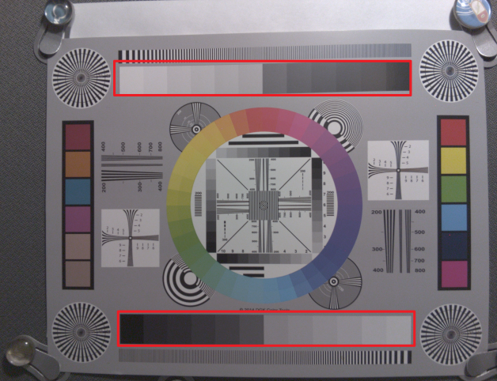

図のグレイパッチ部分（赤い長方形で囲った部分）のノイズ量を実際に測定してみます。

各グレイパッチの座標を画像ビューワーなどで調べ、測定領域を決めておきます。

今回は次のような座標をとり、その点から右下の100x100画素の正方形の領域を測定します。


```
patches = [(2586, 2086), (2430, 2092), (2272, 2090), (2112, 2090), (1958, 2086), (1792, 2094), 
           (1642, 2096), (1486, 2090), (1328, 2090), (1172, 2086), (1016,2084), (860, 2084),
           (866, 482), (1022, 480), (1172, 476), (1328, 474), (1480, 470), (1634, 466),
          (1788, 462), (1944, 460), (2110, 452), (2266, 452), (2424, 448), (2586, 442)]
```

各パッチ内の画素の分散と平均値を測定してみます。
画像のフォーマットがBayerなので、各色チャンネル毎に統計をとります。


```
variances = []
averages = []
for index, (dx, dy) in enumerate(((0, 0), (1, 0), (0, 1), (1, 1))):
    for patch in patches:
        x, y = patch
        p = blc_raw[y+dy:y+100:2, x+dx:x+100:2]
        s2 = (p * p).mean()
        av = p.mean()
        v = s2 - av * av
        variances.append(v)
        averages.append(av)
```

測定結果を見てみましょう。


```
plt.plot(averages, variances, linestyle='None', marker='o', color='blue')
plt.show()
```


どうやら、分散は画素の値に対してほぼ線形になっているようです。光ポワッソンノイズが支配的だと予想されます。

一次多項式で近似してみましょう。


```
par = np.polyfit(averages, variances, 1)
print(par)
```

    [ 0.56326801 -1.1732412 ]


では、近似した１次式ともとのグラフを並べてみましょう。


```
xs = np.arange(0, 300, 1)
ys = par[1] + par[0] * xs
plt.plot(averages, variances, linestyle='None', marker='o', color='blue')
plt.plot(xs, ys, linestyle='None', marker='.', color='red')
plt.show()
```


ほぼ近似できているようです。

### ノイズフィルターの定番バイラテラルフィルター

ノイズフィルターに求められる特性として、ノイズは取り除いてほしいが、元の画像に含まれる情報は残しておきたい、というものがあります。

このような矛盾する要求に答えるものとしてバイラテラルフィルター[^1]があります。

[^1]: Bilateral Filtering for Gray and Color Images, C. Tomasi and R. Manduchi, Proceedings of the 1998 IEEE International Conference on Computer Vision,  pp. 839–846, 1998

バイラテラルフィルターのアイデアは基本的に、

1.  ある画素の周辺の画素のうち、値が近いものは同じものだからフィルターをかける
2. 値が遠いものは違うものだからフィルターをかけない。

というものです。

たとえば、各ターゲット画素のまわりに次のような5x5の領域を設定します。

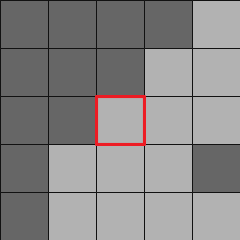

赤で囲った画素がターゲットです。

周りの画素のうち、灰色の画素はターゲットに近い値を持ち、黒い画素は大きく異なる値を持つとします。

この場合、灰色の部分は画像のある部分（たとえば新聞の地の部分）、黒い部分は他の部分（たとえば新聞の印刷部分）に含まれると考えられます。

そうなると、灰色の画素にのみフィルターをかけ、黒い画素にはフィルターをかけないことで、画像の特徴に影響を与えずにノイズフィルターをかける事ができます。

一例としてはこのようなフィルターになるでしょう。（これは説明用の図で、実際のフィルターとは異なります。）

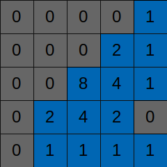

バイラテラルフィルターでは、ターゲット画素と周辺画素の一つ一つの値の差を取り、それをノイズの量とくらべて加重平均のウェイトを計算することで、ターゲット画素に近いものにのみフィルターを適用します。

式としては、例えばこうなります。

$$
p\_{\rm{out}} \left( x, y \right) = 
\frac{\sum_{dy=-N}^{+N} \sum_{dx=-N}^{+N}  w \left( dx, dy \right) p\_{\rm{in}} \left( x + dx, y + dy \right)}
{\sum_{dy=-N}^{+N} \sum_{dx=-N}^{+N}  w \left( dx, dy \right)}
$$

$$
w \left( dx, dy \right) = exp \left( - \frac { a |p\_{\rm{in}} \left(x + dx, y + dy \right) - p\_{\rm{in}} \left( x, y \right) |^{2} + b | dx^{2} + dy^{2} |} {\sigma^{2}} \right)
$$

ただし、$p\_{\rm{in}}$が入力画像で、$p\_{\rm{out}}$が出力画像、$\left(x, y \right)$が座標です。$N$はウィンドウのサイズ、$a$はチューニングパラメータで0以上（通常1以下）です。

この式によって、ターゲット画素と周辺画素は$w$の計算の中で比べられます。差が$\sigma$に比べて大きければ$w$は小さくなり、その画素のウェイトは小さくなります。
逆にターゲットの差が小さい場合は$w$の値は１に近くなり、大きなウェイトを持つことになります。

もし周辺の画像が全てターゲット画像に近い場合、フィルターの形はガウシアンフィルターに近づいていきます。

一つ注意として、ノイズ分散の扱いがあります。
通常の画像処理の教科書ではノイズ分散は画像内で一定という仮定を行います。
もしリード・ノイズが支配的ならこの仮定は正しいのですが、先程見たとおり実際の画像ではショットノイズのためにノイズの分散は画素の値に依存します。

もしノイズフィルターをかけるのがカメラ画像処理後のRGBやYUVの画像だとすると、すでにガンマ補正やローカルトーンマップ補正などの処理が行われていて、元のノイズの分布を推定するのは困難です。
RAW画像から処理する場合はこのような処理が行われていないことはわかっているので、ショットノイズなどのノイズ量を推定するのは簡単です。

次は測定したノイズの特性を利用してノイズ処理を行っていきます。

### バイラテラルノイズフィルターの適用

ではこのノイズフィルターを実際の画像に適用してみましょう。

Bayerフォーマットのままではフィルターがかけにくいので、デモザイク後の値を使用します。一応この段階の画像を確認しておきましょう。


```
outimg = dms_img / 1024
outimg[outimg < 0] = 0
outimg[outimg > 1] = 1
plt.figure(figsize=(8, 8))
plt.imshow(outimg)
plt.axis('off')
plt.title(u"デモザイク後の画像、ノイズフィルター無し")
plt.show()
```


さて、ホワイトバランスやデモザイク処理を行った後でも、ノイズの分散は画素の値に比例するのでしょうか？
RGBの平均に対して確かめてみましょう。


```
luma_img = dms_img.mean(2)
variances = []
averages = []
for patch in patches:
    x, y = patch
    p = luma_img[y:y+100, x:x+100]
    s2 = (p * p).mean()
    av = p.mean()
    v = s2 - av * av
    variances.append(v)
    averages.append(av)

plt.plot(averages, variances, linestyle='None', marker='o', color='blue')
plt.title(u"デモザイク後のノイズ分散")
plt.show()
```


先ほどとは多少様子が違いますが、線形近似で大丈夫そうです。

傾きを求めて確かめてみましょう。


```
par = np.polyfit(averages, variances, 1)
print(u'傾き', par[0], '切片', par[1])

xs = np.arange(0, 500)
ys = par[0] * xs + par[1]
plt.plot(xs, ys, color='red')
plt.plot(averages, variances, linestyle='None', marker='o', color='blue')
plt.title('ノイズ分散と近似式')
plt.show()
```

    傾き 0.29300604909937544 切片 10.754229129481296


Bayerでの測定に比べると誤差が大きいようですが、この程度のずれなら使えそうです。

さあ、これでノイズフィルターを適用する準備ができました。実際にかけてみましょう。
今回はフルカラーなので、ウェイトの計算はRGBの平均に対して行い、フィルターの適用は各カラーごとに行うという方法を使っています。
コード中、coefがバイラテラルフィルターの式の$a$に相当します。なお今回は$b = 0$としました。


```
# 注：これは処理をわかりやすく書いたもので非常に実行速度が遅い。
# 実際にはこの後の高速版を使用することをおすすめする
import math

coef = 0.1
img_flt = dms_img.copy()
for y in range(2, h-2):
    for x in range (2, w - 2):
        # 5x5の平均値からノイズの分散(sigma) を推定する
        average = luma_img[y-2:y+3, x-2:x+3].mean()
        sigma = par[0] * average
        sigma = sigma if sigma > 0 else 1

        weight = np.zeros((5, 5))
        out_pixel = np.zeros(3)
        norm = 0
        # 5x5内の各画素毎に重みを計算する
        for dy in range(-2, 3):
            for dx in range(-2, 3):
                # 中心画素との差
                diff = luma_img[y + dy, x + dx] - luma_img[y, x]
                diff_norm = diff * diff / sigma
                # 差と分散からウェイトを計算し、加重平均値を求める
                weight = math.exp(-coef * diff_norm)
                out_pixel += weight * dms_img[y + dy, x + dx, :]
                norm += weight
        # 各色毎にウェイトの和で正規化する
        img_flt[y, x, 0] = out_pixel[0] / norm
        img_flt[y, x, 1] = out_pixel[1] / norm
        img_flt[y, x, 2] = out_pixel[2] / norm
```


```
outimg = img_flt.copy()
outimg = outimg / 1024
outimg[outimg < 0] = 0
outimg[outimg > 1] = 1
plt.figure(figsize=(8, 8))
plt.imshow(outimg)
plt.axis('off')
plt.title(u"デモザイク後の画像、ノイズフィルターあり")
plt.show()
```


このままではわかりにくいので、残りの処理（カラーマトリクスとガンマ補正）を行います。


```
ccm_flt_img = color_correction_matrix(img_flt, color_matrix)
gmm_flt_img = gamma_correction(ccm_flt_img / white_level, 2.2)

# 画像表示
plt.figure(figsize=(16, 8))
plt.imshow(gmm_flt_img)
plt.axis('off')
plt.title(u"ノイズフィルターあり")
plt.show()
```


拡大してノイズフィルターなしの画像と比較してみましょう。


```
plt.figure(figsize=(16, 8))
plt.subplot(1, 2, 1)
plt.imshow(gmm_img[1950:2150, 800:1000, :])
plt.axis('off')
plt.title(u"ノイズフィルター無し、拡大")
plt.subplot(1, 2, 2)
plt.imshow(gmm_flt_img[1950:2150, 800:1000, :])
plt.axis('off')
plt.title(u"ノイズフィルターあり、拡大")
plt.show()
```


正常に処理できているようです。他の部分も見てみましょう。


```
plt.figure(figsize=(16, 8))
plt.subplot(1, 2, 1)
plt.imshow(gmm_img[1500:1700, 1650:1850, :])
plt.axis('off')
plt.title(u"ノイズフィルター無し、拡大")
plt.subplot(1, 2, 2)
plt.imshow(gmm_flt_img[1500:1700, 1650:1850, :])
plt.axis('off')
plt.title(u"ノイズフィルターあり、拡大")
plt.show()
```


平坦部のノイズは減っていますが、ディテールの大部分は残っていることがわかります。

### ノイズフィルター処理の高速化

最後にもう一点だけ、処理の高速化について触れます。この項はPythonでの最適化に興味のない方は読み飛ばしてかまいません。

上記のノイズフィルターのコードはプログラムとしては動作しますが、非常に遅いコードです。

これはPythonの性能上しかたのない部分もあるのですが、numpyなどの機能を利用することでかなり改善できます。[^2]

[^2]: ただし、処理の内容が一見わかりにくくなるというトレードオフがあります。これが理由で先程はベタ書きの処理を紹介しました。

まず、一般的な傾向としてnumpyではループの処理は遅いので、なるべくforループを減らしたほうが高速になる場合が多いです。
numpyにはこのような用途のためにstride_tricksというライブラリがあります。今回はこのライブラリの[as_strided](https://docs.scipy.org/doc/numpy-1.15.0/reference/generated/numpy.lib.stride_tricks.as_strided.html)という機能を利用してループを減らしていきましょう。

まずは、RGBの平均画像(luma_img)から分散を計算します。


```
# as_stridedのインポート
from numpy.lib.stride_tricks import as_strided
import scipy

# scipyの機能を使って、5x5の平均値フィルター（uniform_filter)をかける。
# mode='mirror'は縁の部分で折り返し処理をする事をしめす。
average = scipy.ndimage.filters.uniform_filter(luma_img, 5, mode='mirror')
# 事前に求めたノイズモデルの切片(par[0])と傾き(par[1])からノイズ量を求める。
sigma_map = average * par[1] + par[0]
sigma_map[sigma_map < 1] = 1
# stridesはnumpyの配列で引数が1変わった時のオフセットの差（ストライド）を示す。
# この場合simga_map[0, 0]とsigma_map[1, 0]との間のストライドはsy。
# sigma_map[0, 0]とsigma_map[0, 1]との間のストライドはsx。
sy, sx = sigma_map.strides
# as_stridedを使って5x5の各画素のコピーを作り出す。結果はh x w x 5 x 5の4次元配列。
# 例えばsigma_tile[y, x, :, :]は画素average[y, x]のノイズ量を5x5の配列にしたもの。
# strides=(sy, sx, 0, 0)はsigma_tile[y, x, z, w]のメモリーオフセットは
# offset(y,x,z,v) = sy*y+sx*x+0*z+0*vであることをしめしている。
sigma_tile = as_strided(sigma_map, strides=(sy, sx, 0, 0), shape=(h, w, 5, 5))
# 縁の近くの2画素にはフィルターをかけないので、その分を除いておく。
sigma_tile = sigma_tile[2:h-2, 2:w-2, : , :]
```

ここではまず、3278 x 2444 通りの5x5のパッチについて、FIRフィルターを使って平均値を計算し、そこからノイズ分散をもとめています。

次にそのノイズ分散値をコピーして同じ要素の5x5の行列を作り、その5x5の行列を3278 x 2444個並べています。

同様に、各パッチの平均値をコピーして同じ要素の5x5の行列を作り、その5x5の行列を3278 x 2444個並べます。


```
# luma_imgのストライドを求める。
sy, sx = luma_img.strides
# lumaの各画素を5x5ならべたパッチを、さらにh x w並べた4次元配列を作成。
luma_tile = as_strided(luma_img, strides=(sy, sx, 0, 0), shape=(h, w, 5, 5))
# 縁の近くの2画素にはフィルターをかけないので、その分を除いておく。
luma_tile = luma_tile[2:h-2, 2:w-2, : , :]
```

ここで`as_strided`により`luma_tile[y, x, a, b]`には`luma_img[y, x]`の画素がコピーされます。`a`と`b`は０〜４の範囲です。
結果的に`luma_img`の各画素を２５個コピーして5x5の配列にしたものをさらにh x w個並べた物が`luma_tile`です。

次に、RGBの平均画像(luma_img)から5x5のパッチを3278 x 2444通り作ります。


```
# luma_imgから5x5の領域を取り出したものをさらに画像サイズ分ならべている。(ただし縁の2画素はのぞく)
# 取り出す際のメモリーオフセットはoffset(y, x, z, v)=sy*x+sx*x+sy*z+sx*v。
luma_box = as_strided(luma_img, strides=(sy, sx, sy, sx), shape=(h-4, w-4, 5, 5))
```

これで`luma_box[y, x, a, b]`には`luma_img[y + a, x + b]`の画素がコピーされます。
つまり`luma_box[y, x, :, :]`をとりだすと`luma_img[y, x]`の周辺の5x5の画素になっています。

次にこのluma_boxから各画素にかける重みを計算します。


```
# 5x5の平均値からの差をとる。
diff = luma_box - luma_tile
# 5x5の各パッチについて、要素毎に重みを計算。
weight = np.exp(-coef * diff * diff / sigma_tile)
# 5x5のパッチ毎に重みの合計を求める。h x wサイズの配列。
weight_sum = weight.sum(axis=(2, 3))
```

これで`weight[y, x, a, b]`には`luma_box[y, x, a, b]`にかけるべき重みが、`weight_sum[y, x]`には重みの合計が入ります。

これで係数の計算はできました。各色毎に処理を行います。


```
# 赤画像処理。まずフルカラー画像から赤のプレーンを取り出す。
red = dms_img[:, :, 0]
# この画像のストライドを取り出す。
sy, sx = red.strides
# 赤画像プレーンから、5x5のパッチを全画素分とりだす（ただし縁の2画素は除く）。
red_boxes = as_strided(red, strides=(sy, sx, sy, sx), shape=(h-4, w-4, 5, 5))
# パッチと重み(weight)をかけ合わせて、パッチ毎に合計し、重みの和(weight_sum)で正規化。
red_out = (weight * red_boxes).sum(axis=(2, 3)) / weight_sum
```

`red_boxes[y, x, :, :]`には`dms_img[y, x, 0]`の周り5x5の赤画素が入っています。これに`weight[y, x, :, :]`をかけて和をとり、`weight_sum[y, x]`で正規化することにより、red_outにはフィルターされた画像がコピーされます。

同じように緑画像と青画像も処理します。


```
# 緑画像処理。処理自体は赤画像と同じ。
green = dms_img[:, :, 1]
sy, sx = green.strides
green_boxes = as_strided(green, strides=(sy, sx, sy, sx), shape=(h-4, w-4, 5, 5))
green_out = (weight * green_boxes).sum(axis=(2, 3)) / weight_sum

# 青画像処理。処理自体は赤画像と同じ。
blue = dms_img[:, :, 2]
sy, sx = blue.strides
blue_boxes = as_strided(blue, strides=(sy, sx, sy, sx), shape=(h-4, w-4, 5, 5))
blue_out = (weight * blue_boxes).sum(axis=(2, 3)) / weight_sum
```

３色の画像を組み合わせてフルカラーの画像にします。


```
# フィルターされた赤、緑、青のプレーンを元の画像にはめ込む。
img_flt2 = dms_img.copy()
img_flt2[2:h-2, 2:w-2, 0] = red_out
img_flt2[2:h-2, 2:w-2, 1] = green_out
img_flt2[2:h-2, 2:w-2, 2] = blue_out
```

画像を表示して確認しましょう。


```
outimg = img_flt2.copy()
outimg = outimg.reshape((h, w, 3))
outimg = outimg / 1024
outimg[outimg < 0] = 0
outimg[outimg > 1] = 1
plt.figure(figsize=(8, 8))
plt.imshow(outimg)
plt.axis('off')
plt.title(u"ノイズフィルター高速版")
plt.show()
```


うまくいったようです。続けてカラーマトリクス補正とガンマ補正をかけてみましょう。


```
# カラーマトリクス処理。
ccm_flt2_img = color_correction_matrix(img_flt2, color_matrix)
# ガンマ補正処理。
gmm_flt2_img = gamma_correction(ccm_flt2_img / white_level, 2.2)

# 最終画像表示
plt.figure(figsize=(8, 8))
plt.imshow(gmm_flt2_img)
plt.axis('off')
plt.title(u"ノイズフィルター高速版")
plt.show()
```


先ほどと同じ部分を拡大して処理ができているか見てみましょう。


```
plt.figure(figsize=(16, 8))
plt.imshow(gmm_flt2_img[1950:2150, 800:1000, :])
plt.axis('off')
plt.title(u"ノイズフィルター高速版、拡大")
plt.show()
```


うまくいっているようです。

これでノイズ処理からループが一掃されました。
処理の速度も数倍になり、実用的になりました。

### モジュール化

ノイズフィルターもモジュール化しておきます。


```
def noise_filter(rgb_img, noise_model, coef=0.1):
    """
    バイラテラルノイズフィルター処理を行う。

    Parameters
    ----------
    rgb_img: numpy array
        入力RGB画像
    noise_model: array of 2 
        ノイズモデル。
        noise[0]:傾き
        noise[1]:切片
    coef: float
        ノイズフィルター強度。
        チューニングパラメーター。

    Returns
    -------
    flt_img: numpy array
        ノイズ除去後のRGB画像
    """
    h, w, _ = rgb_img.shape
    # 平均画像からノイズ量を見積もる。
    luma_img = rgb_img.mean(2)
    average = scipy.ndimage.filters.uniform_filter(luma_img, 5, mode='mirror')
    sigma_map = average * noise_model[0] + noise_model[1]
    sigma_map[sigma_map < 0.1] = 0.1
    sy, sx = sigma_map.strides
    sigma_tile = as_strided(sigma_map, strides=(sy, sx, 0, 0), shape=(h, w, 5, 5))
    sigma_tile = sigma_tile[2:h-2, 2:w-2, : , :]
    # 各画素に与える重みを求める。
    sy, sx = luma_img.strides
    luma_tile = as_strided(luma_img, strides=(sy, sx, 0, 0), shape=(h, w, 5, 5))
    luma_tile = luma_tile[2:h-2, 2:w-2, : , :]
    luma_box = as_strided(luma_img, strides=(sy, sx, sy, sx), shape=(h-4, w-4, 5, 5))
    diff = luma_box - luma_tile
    weight = np.exp(-coef * diff * diff / sigma_tile)
    weight_sum = weight.sum(axis=(2, 3))
    
    # 各色毎にノイズフィルターをかける。
    flt_img = rgb_img.copy()
    for color in (0, 1, 2):
        single = rgb_img[:, :, color]
        sy, sx = single.strides
        single_boxes = as_strided(single, strides=(sy, sx, sy, sx), shape=(h-4, w-4, 5, 5))
        single_out = (weight * single_boxes).sum(axis=(2, 3)) / weight_sum
        flt_img[2:h-2, 2:w-2, color] = single_out
    return flt_img
```

正常に動作するか確認します。


```
blc_raw = black_level_correction(raw_array, raw.black_level_per_channel, raw.raw_pattern)
lsc = [np.array([6.07106808e-07, 9.60556906e-01]), 
       np.array([6.32044369e-07, 9.70694361e-01]), 
       np.array([6.28455183e-07, 9.72493898e-01]), 
       np.array([9.58743579e-07, 9.29427169e-01])]
lsc_raw = lens_shading_correction(blc_raw, lsc)
dpc_raw = defect_correction(lsc_raw, 16)
wb_raw = white_balance(dpc_raw, raw.camera_whitebalance, raw.raw_colors)
dms_img = demosaic(wb_raw, raw.raw_colors)
noise_model=(0.29300604909937544, 10.754229129481296)
nfl3_img = noise_filter(dms_img, noise_model)
color_matrix = np.array([6022,-2314,394,-936,4728,310,300,-4324,8126])/4096
ccm_img = color_correction_matrix(nfl3_img, color_matrix)
white_level = 1024
gmm_img = gamma_correction(ccm_img / white_level, 2.2)

# 最終画像表示
plt.figure(figsize=(8, 16))
plt.subplot(2, 1, 1)
plt.imshow(gmm_img)
plt.axis('off')
plt.title(u"ノイズフィルター高速版")
plt.subplot(2, 1, 2)
plt.imshow(gmm_img[1950:2150, 800:1000, :])
plt.axis('off')
plt.title(u"ノイズフィルター高速版、拡大")
plt.show()
```


動作が確認できました。

このメソッドは`raw_process`モジュールに追加してあります。

### まとめ

今回はノイズフィルターをとりあげ、エッジを残すノイズフィルターとしてよく使われるバイラテラル・フィルターを解説し、実装しました。

バイラテラルフィルターは移り変わりの激しい画像処理の分野では、もはや古典的ともいえるアルゴリズムです。
アルゴリズムの発表から時間が立つとはいえその基本的な考え方は現在のノイズフィルターにも受け継がれています。

とはいえ、次々に、より高性能なノイズフィルターアルゴリズムが提案されているのは間違いなく、性能もどんどん進化しています。
今回の内容で物足りない方は、BM3D[^4]やディープラーニングを用いたノイズフィルター[^5]など、さらに現代的なノイズフィルターアルゴリズムを実装されてはいかがでしょうか。

[^4]: [http://www.cs.tut.fi/~foi/GCF-BM3D/:title]
[^5]: [https://web.stanford.edu/class/cs331b/2016/projects/zhao.pdf]

もう一つ重要な点として、画像内のノイズの解析と分散の推定を行い非常に簡単なノイズモデルを作成しました。
これは画像の素性のわかっているカメラ画像処理だからできることであり、このような処理ができる事がRAW現像の利点であるともいえます。
今回は光ショットノイズが支配的な画像でしたが、他のノイズが大きい画像の場合はまた違った処理が必要です。
たとえば高ISO画像（低照度画像）ではリードノイズが相対的に大きくなってきます。

また、最後にnumpyによる画像処理の高速化テクニックについても触れました。
画像処理としては本質的ではありませんが、実用上は重要な点です。

つぎは[エッジ強調](https://colab.research.google.com/github/moizumi99/camera_raw_processing/blob/master/camera_raw_chapter_5_3.ipynb)を扱います。

## 5.3エッジ強調

### この節について

この節ではエッジ強調について解説します。

この節のの内容はColabノートブックとして公開してあります。ノートブックを見るには[目次ページ](https://colab.research.google.com/github/moizumi99/camera_raw_processing/blob/master/camera_raw_toc.ipynb)から参照するか、以下のリンクを使ってアクセスしてください。

https://colab.research.google.com/github/moizumi99/camera_raw_processing/blob/master/camera_raw_chapter_5_3.ipynb

### 準備

まずライブラリーのインストールと、モジュールのインポート、画像の読み込みを行います。今回もラズベリーパイで撮影したチャート画像を使用します。
内容については各節を参照ください。


```
# rawpyとimageioのインストール
!pip install rawpy;
!pip install imageio;

# rawpy, imageio, numpuy, pyplot, imshowのインポート
import rawpy, imageio
import numpy as np
import matplotlib.pyplot as plt
from matplotlib.pyplot import imshow

# 前節までに作成したモジュールのダウンロードとインポート
!if [ ! -f raw_process.py ]; then wget raw_process.py; fi
from raw_process import simple_demosaic, white_balance, black_level_correction, gamma_correction
from raw_process import demosaic, defect_correction, color_correction_matrix, lens_shading_correction
from raw_process import noise_filter

# 日本語フォントの設定
!apt -y install fonts-ipafont-gothic
plt.rcParams['font.family'] = 'IPAPGothic'

# 画像をダウンロードします。
!if [ ! -f chart.jpg ]; then wget chart.jpg; fi

# 自分で撮影した画像を使用する場合は以下のコメントを取り除きアップロードします。
# from google.colab import files
# uploaded = files.upload()

# RAWファイルの名前。
# アップロードしたファイルを使う場合はその名前に変更。
raw_file  = "chart.jpg"
raw = rawpy.imread(raw_file)
raw_array = raw.raw_image
h, w = raw_array.shape
```

    Requirement already satisfied: rawpy in /usr/local/lib/python3.6/dist-packages (0.13.1)
    Requirement already satisfied: numpy in /usr/local/lib/python3.6/dist-packages (from rawpy) (1.14.6)
    Requirement already satisfied: imageio in /usr/local/lib/python3.6/dist-packages (2.4.1)
    Requirement already satisfied: numpy in /usr/local/lib/python3.6/dist-packages (from imageio) (1.14.6)
    Requirement already satisfied: pillow in /usr/local/lib/python3.6/dist-packages (from imageio) (4.0.0)
    Requirement already satisfied: olefile in /usr/local/lib/python3.6/dist-packages (from pillow->imageio) (0.46)
    Reading package lists... Done
    Building dependency tree       
    Reading state information... Done
    fonts-ipafont-gothic is already the newest version (00303-18ubuntu1).
    0 upgraded, 0 newly installed, 0 to remove and 8 not upgraded.


```
# もし日本語が文字化けしている場合以下の３行の行頭の#を削除して実行後、Runtime->Restart Runtime
# import matplotlib
# target_dir = matplotlib.get_cachedir()
# ! rm {target_dir}/*.json
```

### 画像の解像感

前回までに作成した画像の細部をもう一度よく見てみましょう。


```
blc_raw = black_level_correction(raw_array, raw.black_level_per_channel, raw.raw_pattern)
lsc = [np.array([6.07106808e-07, 9.60556906e-01]), 
       np.array([6.32044369e-07, 9.70694361e-01]), 
       np.array([6.28455183e-07, 9.72493898e-01]), 
       np.array([9.58743579e-07, 9.29427169e-01])]
lsc_raw = lens_shading_correction(blc_raw, lsc)
dpc_raw = defect_correction(lsc_raw, 16)
wb_raw = white_balance(dpc_raw, raw.camera_whitebalance, raw.raw_colors)
dms_img = demosaic(wb_raw, raw.raw_colors)
noise_model=(0.29300604909937544, 10.754229129481296)
nfl3_img = noise_filter(dms_img, noise_model)
color_matrix = np.array([6022,-2314,394,-936,4728,310,300,-4324,8126])/4096
ccm_img = color_correction_matrix(nfl3_img, color_matrix)
white_level = 1024
gmm_img = gamma_correction(ccm_img / white_level, 2.2)
```


```
# 最終画像表示
plt.figure(figsize=(8, 8))
plt.imshow(gmm_img[1500:1700, 1650:1850, :])
plt.axis('off')
plt.title(u"前回までの画像、拡大")
plt.show()
```


どことなくぼやっとしていて、コントラストも少し低いようです。

エッジ強調を使って改善してみましょう。

今回エッジ強調に使うのはアナログの時代から使われてきたアンシャープマスキングという手法です。
これは、入力画像をぼやけさせた画像をまず作り、そのぼやけさせた画像を元の画素から引いてやることで行います。
ぼやけさせた画像は入力画像より暗くしておく必用があります。

式で表すとこのようになります。入力画像$g \left( x, y \right)$に対し、ぼやけさせた画像を$f \left( x, y \right)$とすると、出力画像は

$$
h \left( x, y \right) = g \left( x, y \right) - a f \left( x, y \right)
$$

となります。このままでは暗くなってしまうので、明るさを調整すると、こうなります。

$$
h \left( x, y \right) = g \left( x, y \right) + a \left( g \left( x, y \right) -  f \left( x, y \right) \right)
$$

後半の部分はハイパスフィルターになっており、結局元の画像に高周波成分を足し合わせるのと同じ処理になっていることがわかります。

では実際に処理してみましょう。

エッジ強調は輝度成分に対して行うことが多いので、まずRGB画像から輝度成分を分離しましょう。
輝度と色の成分を含む色空間としては、カメラやJPEGでは通常YCbCr空間が使われます。今回もYCbCrを使ってみましょう。
YCbCrというのは輝度信号(Y)と２つの色差信号(Cb, Cr)でフルカラーを表す方式です。

sRGBからJPEGで使われるYCbCr空間への変換マトリクスはこのようになっています。

$$
\left(
\begin{array}{rrr}
0.299 &0.587 &0.144 \\\
-0.168736 &-0.331264 &0.5 \\\ 
0.5 &-0.418688 &-0.081312\\\
\end{array}
\right)
$$

この他に通常CbとCr信号には+0.5のオフセットがのりますが、今回は省きました。

ではRGB信号をYCbCrに分解してみます。


```
rgb2ycbcr = np.array([[0.299, 0.587, 0.144], [-0.168736, -0.331264, 0.5], [0.5, -0.418688, -0.081312]])

# 色空間の変換
ycb_img = np.zeros_like(gmm_img)
for c in (0, 1, 2):
    ycb_img[:, :, c] = rgb2ycbcr[c, 0] * gmm_img[:, :, 0] + \
                           rgb2ycbcr[c, 1] * gmm_img[:, :, 1] + \
                           rgb2ycbcr[c, 2] * gmm_img[:, :, 2]
```

このうち輝度成分を取り出して確認してみましょう。


```
luma = ycb_img[:, :, 0]
plt.figure(figsize=(8, 8))
plt.imshow(luma, cmap='gray')
plt.axis('off')
plt.title('輝度信号')
plt.show()
```


うまく変換できているようです。

それではアンシャープマスクをかけてみましょう。

まずはぼやけた画像を作成します。このためにscipyのgaussian_filterという機能を使います。


```
import scipy
# scipyのgaussian_filterによってガウシアンフィルターをかける。
blurred = scipy.ndimage.gaussian_filter(luma, sigma = 2)
```

どんな画像になったか見てみましょう。


```
plt.figure(figsize=(16, 8))
plt.subplot(1, 2, 1)
plt.imshow(luma[1500:1700, 1650:1850], cmap='gray')
plt.axis('off')
plt.title('元の画像')
plt.subplot(1, 2, 2)
plt.imshow(blurred[1500:1700, 1650:1850], cmap='gray')
plt.axis('off')
plt.title('ガウンシアンフィルター処理後')
plt.show()
```


ガウシアンフィルターをかけた画像はかなりぼやけているのがわかります。

元の画像からフィルターをかけた画像を引き明るさを調整します。


```
# アンシャープマスクの強度。
coef = 0.25
unsharp = luma + coef * (luma - blurred)
```

表示して確認してみましょう。


```
plt.figure(figsize=(16, 8))
plt.subplot(1, 2, 1)
plt.imshow(luma[1500:1700, 1650:1850], cmap='gray')
plt.axis('off')
plt.title('元の画像(輝度)')
plt.subplot(1, 2, 2)
plt.imshow(unsharp[1500:1700, 1650:1850], cmap='gray')
plt.axis('off')
plt.title('アンシャープマスク後(輝度)')
plt.show()
```


解像感が上がっているのが確認できました。

次にカラー画像に戻します。


```
# YCbCrからRGBへの変換の逆行列を求める。
ycbcr2rgb = np.linalg.inv(rgb2ycbcr)
shp_img = ycb_img.copy()
# YCbCr画像の輝度成分をエッジ強調したもので置き換える
shp_img[:, :, 0] = unsharp
out_img = np.zeros_like(shp_img)
# RGBに変換。
for c in (0, 1, 2):
    out_img[:, :, c] = ycbcr2rgb[c, 0] * shp_img[:, :, 0] + \
                           ycbcr2rgb[c, 1] * shp_img[:, :, 1] + \
                           ycbcr2rgb[c, 2] * shp_img[:, :, 2]
```

カラーでも画像を確認しておきます。


```
plt.figure(figsize=(16, 8))
plt.subplot(1, 2, 1)
plt.imshow(gmm_img[1500:1700, 1650:1850, :])
plt.axis('off')
plt.title('元の画像（カラー）')
plt.subplot(1, 2, 2)
plt.imshow(out_img[1500:1700, 1650:1850, :])
plt.axis('off')
plt.title('アンシャープマスク後（カラー）')
plt.show()
```


カラー画像でも細部がはっきりしたのが確認できました

### モジュールへの追加

エッジ強調もモジュールとして追加しておきます。


```
# RGB to YCbCr 変換マトリクス
RGB_TO_YCBCR = np.array([[0.299, 0.587, 0.144],
                         [-0.168736, -0.331264, 0.5],
                         [0.5, -0.418688, -0.081312]])

def apply_matrix(rgb_img, matrix):
    """
    画像に3x3の色変換行列をかける。

    Parameters
    ----------
    rgb_img: numpy 3d array
        入力RGB画像
    matrix: float 2d array
        3x3の色空間変換マトリクス

    Returns
    -------
    out_img: numpy array
        色空間変換後の画像
    """
    out_img = np.zeros_like(rgb_img)
    for c in (0, 1, 2):
        out_img[:, :, c] = matrix[c, 0] * rgb_img[:, :, 0] + \
                           matrix[c, 1] * rgb_img[:, :, 1] + \
                           matrix[c, 2] * rgb_img[:, :, 2]
    return out_img

def edge_enhancement(rgb_img, sigma=2, coef=0.25):
    """
    アンシャープマスクによるエッジ強調。

    Parameters
    ----------
    rgb_img: numpy 3d array
        入力RGB画像
    sigma: float
        ガウシアンフィルターのsigma
    coef: float
        アンシャープマスクの強度。

    Returns
    -------
    out_img: numpy array
        エッジ強調後の画像
    """
    
    # 色空間をRGBからYCbCrに変換。
    ycr_img = apply_matrix(rgb_img, RGB_TO_YCBCR)
    # 輝度成分のみとりだしガウシアンフィルターでぼかす。
    luma = ycr_img[:, :, 0]
    unsharpen = scipy.ndimage.gaussian_filter(luma, sigma=sigma)
    # アンシャープマスク処理。
    sharpen = luma + coef * (luma - unsharpen)
    ycr_img[:, :, 0] = sharpen
    
    #　逆行列を求め、YCbCrからRGBへの変換行列を求める。
    ycbcr2rgb = np.linalg.inv(RGB_TO_YCBCR)
    # RGB画像を生成して調整。
    shp_img = apply_matrix(ycr_img, ycbcr2rgb)
    shp_img[shp_img < 0] = 0
    shp_img[shp_img > 1] = 1
    return shp_img
```

全処理を行って動作を確認します。


```
blc_raw = black_level_correction(raw_array, raw.black_level_per_channel, raw.raw_pattern)
lsc = [np.array([6.07106808e-07, 9.60556906e-01]), 
       np.array([6.32044369e-07, 9.70694361e-01]), 
       np.array([6.28455183e-07, 9.72493898e-01]), 
       np.array([9.58743579e-07, 9.29427169e-01])]
lsc_raw = lens_shading_correction(blc_raw, lsc)
dpc_raw = defect_correction(lsc_raw, 16)
wb_raw = white_balance(dpc_raw, raw.camera_whitebalance, raw.raw_colors)
dms_img = demosaic(wb_raw, raw.raw_colors)
noise_model=(0.29300604909937544, 10.754229129481296)
nfl3_img = noise_filter(dms_img, noise_model)
color_matrix = np.array([6022,-2314,394,-936,4728,310,300,-4324,8126])/4096
ccm_img = color_correction_matrix(nfl3_img, color_matrix)
white_level = 1024
gmm_img = gamma_correction(ccm_img / white_level, 2.2)
shp_img = edge_enhancement(gmm_img, 2, 0.25)
```


```
# 最終画像表示
plt.figure(figsize=(8, 16))
plt.subplot(2, 1, 1)
plt.imshow(shp_img)
plt.axis('off')
plt.title(u"エッジ強調")
plt.subplot(2, 1, 2)
plt.imshow(shp_img[1500:1700, 1650:1850, :])
plt.axis('off')
plt.title(u"エッジ強調、拡大")
plt.show()
```


うまく処理できているようです。

### まとめ

今回は古典的なアンシャープマスキングによるエッジ強調を行いました。
昔から知られている処理ですが、現代のエッジ強調アルゴリズムにも通じる部分の多い重要なアルゴリズムです。

次は[トーンカーブ補正](https://colab.research.google.com/github/moizumi99/camera_raw_processing/blob/master/camera_raw_chapter_5_4.ipynb)をあつかいます。

## 5.4 トーンカーブ補正

### この節について

この節ではトーンカーブ補正について解説します。

この節のの内容はColabノートブックとして公開してあります。ノートブックを見るには[目次ページ](https://colab.research.google.com/github/moizumi99/camera_raw_processing/blob/master/camera_raw_toc.ipynb)から参照するか、以下のリンクを使ってアクセスしてください。

https://colab.research.google.com/github/moizumi99/camera_raw_processing/blob/master/camera_raw_chapter_5_4.ipynb

### 準備

まずライブラリーのインストールと、モジュールのインポート、画像の読み込みを行います。今回もラズベリーパイで撮影したチャート画像を使用します。
内容については各節を参照ください。


```python
# rawpyとimageioのインストール
!pip install rawpy;
!pip install imageio;

# rawpy, imageio, numpuy, pyplot, imshowのインポート
import rawpy, imageio
import numpy as np
import matplotlib.pyplot as plt
from matplotlib.pyplot import imshow

# 前節までに作成したモジュールのダウンロードとインポート
!if [ ! -f raw_process.py ]; then wget raw_process.py; fi
from raw_process import simple_demosaic, white_balance, black_level_correction, gamma_correction
from raw_process import demosaic, defect_correction, color_correction_matrix, lens_shading_correction
from raw_process import noise_filter, apply_matrix, edge_enhancement

# 日本語フォントの設定
!apt -y install fonts-ipafont-gothic
plt.rcParams['font.family'] = 'IPAPGothic'
# もし日本語が文字化けしている場合`! rm /content/.cache/matplotlib/fontList.json`を実行して、
# Runtime->Restart Runtimeで再実行

# 画像をダウンロードします。
!if [ ! -f chart.jpg ]; then wget chart.jpg; fi

# 自分で撮影した画像を使用する場合は以下のコメントを取り除きアップロードします。
# from google.colab import files
# uploaded = files.upload()

# RAWファイルの名前。
# アップロードしたファイルを使う場合はその名前に変更。
raw_file  = "chart.jpg"
raw = rawpy.imread(raw_file)
raw_array = raw.raw_image
h, w = raw_array.shape
```

    Requirement already satisfied: rawpy in /home/moiz/anaconda3/lib/python3.7/site-packages (0.13.0)
    Requirement already satisfied: numpy in /home/moiz/anaconda3/lib/python3.7/site-packages (from rawpy) (1.15.1)
    Requirement already satisfied: imageio in /home/moiz/anaconda3/lib/python3.7/site-packages (2.4.1)
    /bin/sh: 1: Syntax error: "fi" unexpected (expecting "then")
    E: Could not open lock file /var/lib/dpkg/lock-frontend - open (13: Permission denied)
    E: Unable to acquire the dpkg frontend lock (/var/lib/dpkg/lock-frontend), are you root?


### ヒストグラムとトーンカーブ

前回までに作成した画像を表示します。


```python
blc_raw = black_level_correction(raw_array, raw.black_level_per_channel, raw.raw_pattern)
lsc = [np.array([6.07106808e-07, 9.60556906e-01]), 
       np.array([6.32044369e-07, 9.70694361e-01]), 
       np.array([6.28455183e-07, 9.72493898e-01]), 
       np.array([9.58743579e-07, 9.29427169e-01])]
lsc_raw = lens_shading_correction(blc_raw, lsc)
dpc_raw = defect_correction(lsc_raw, 16)
wb_raw = white_balance(dpc_raw, raw.camera_whitebalance, raw.raw_colors)
dms_img = demosaic(wb_raw, raw.raw_colors)
noise_model=(0.29300604909937544, 10.754229129481296)
nfl3_img = noise_filter(dms_img, noise_model)
color_matrix = np.array([6022,-2314,394,-936,4728,310,300,-4324,8126])/4096
ccm_img = color_correction_matrix(nfl3_img, color_matrix)
white_level = 1024
gmm_img = gamma_correction(ccm_img / white_level, 2.2)
shp_img = edge_enhancement(gmm_img, 2, 0.25)
```


```python
# 最終画像表示
plt.figure(figsize=(8, 8))
plt.imshow(shp_img)
plt.axis('off')
plt.title(u"前回までの画像、拡大")
plt.show()
```


この画像の輝度成分のヒストグラムを見てみましょう。


```python
rgb2ycbcr = np.array([[0.299, 0.587, 0.144], [-0.168736, -0.331264, 0.5], [0.5, -0.418688, -0.081312]])
ycr_img = apply_matrix(shp_img, rgb2ycbcr)
luma = ycr_img[:, :, 0]

plt.hist(luma.flatten(), 256)
plt.axis((0, 1, 0, 120000))
plt.title("輝度成分のヒストグラム")
plt.show()
```


特におかしなところはありませんが、全体に中央に集まっていて、せっかくの256階調のダイナミックレンジを十分には使い切っていないことがわかります。

このような画像のダイナミックレンジ拡張方法としてヒストグラム平坦化というものがあります。これは、ヒストグラムの積算値と同じ形をした関数を元の画像に適用することでヒストグラムを平坦にしてしまう、というものです。しかし、ヒストグラムを完全に平坦にしてしまうと大概は不自然な画像になってしまいます。ここでは、そこまで極端でない補正をかけたいところです。

実際のカメラの中では非常に複雑なアルゴリズムでトーンカーブ補正を計算しますが、その部分は今回の記事では対象ではありませんので、適当にちょうど良さそうな関数を設定してトーンカーブ補正の画像処理の部分だけ行ってみましょう。

先程のヒストグラムをみると中央部分が高いので、この部分をバラけさせるために、0.5付近で急になる関数をかけましょう。まず適当なアンカーポイントを設定します。


```python
xs = [0, 0.28, 0.78, 1.0]
ys = [0, 0.22, 0.88, 1.0]
```

図示するとこうなります


```python
plt.plot(xs, ys)
plt.axis((0, 1, 0, 1))
plt.title("トーンカーブ（スムージング前）")
plt.show()
```


この関数をそのまま使うと折れ曲がっている周辺で何らかのアーティファクトが発生しそうです。 スプライン関数を利用して、スムースな関数を用意しましょう。

scipyのinterpolate.splrepに入力点と出力点の値を渡すと、スプライン関数で補完した関数を作ってくれます。


```python
import scipy
func = scipy.interpolate.splrep(xs, ys)
```

この関数を図示するとこうなります。


```python
xx = np.arange(0, 1.0, 0.01)
# splevはsplrepで作成した関数を実際に適用する。
yy = scipy.interpolate.splev(xx, func)
plt.plot(xx, yy)
plt.axis((0, 1.0, 0, 1.0))
plt.title("トーンカーブ（スムージング後）")
plt.show()
```


よさそうな関数ができました。輝度信号に適用してみましょう。


```python
# splev関数を使って元の輝度画像にトーンカーブを適用する。
adjusted = scipy.interpolate.splev(luma, func)

# ヒストグラムの表示。
plt.hist(adjusted.flatten(), 256)
plt.axis((0, 1, 0, 120000))
plt.show()
```


先程よりもダイナミックレンジの広い範囲を有効に活用していることがわかります。
フルカラーに変換します[^3]。

[^3]: 本来色差成分（Cb/Cr)も調整しなくてはならないのですが今回は省きます。


```python
# 元のYCbCr画像のうち輝度信号だけをトーンカーブ後のものに置き換える。
ton_img = ycr_img.copy()
ton_img[:, :, 0] = adjusted
# 逆行列の計算を使ってYCbCrからRGBに変換する行列を求める。
ycbcr2rgb = np.linalg.inv(rgb2ycbcr)
# YCbCr空間からRGB空間への変換。
out_img = apply_matrix(ton_img, ycbcr2rgb)
out_img[out_img<0] = 0
out_img[out_img>1] = 1
```

トーンカーブ補正後の画像を補正前の画像と比べてみましょう。


```python
plt.figure(figsize=(16, 8))
plt.subplot(1, 2, 1)
plt.imshow(shp_img)
plt.axis('off')
plt.title('トーンカーブ補正前')
plt.subplot(1, 2, 2)
plt.imshow(out_img)
plt.axis('off')
plt.title('トーンカーブ補正後')
plt.show()
```


補正前の画像より黒がより黒く白も若干明るくなり、メリハリがついて画像の印象がパリッとしました。

### モジュールへの追加

エッジ強調もモジュールとして追加しておきます。


```python
# RGBからYCbCrへの変換行列。
RGB_TO_YCBCR = np.array([[0.299, 0.587, 0.144],
                         [-0.168736, -0.331264, 0.5],
                         [0.5, -0.418688, -0.081312]])

def tone_curve_correction(rgb_img, xs=(0, 0.25, 0.75, 1.0), ys=(0, 0.25, 0.75, 1.0)):
    """
    トーンカーブ補正。

    Parameters
    ----------
    rgb_img: numpy 3d array
        入力RGB画像
    xs: float array
        トーンカーブのアンカーポイントのX座標（入力値）。
    ys: float array
        トーンカーブのアンカーポイントのY座標（出力値）。

    Returns
    -------
    out_img: numpy array
        トーンカーブ補正後の画像
    """
    func = scipy.interpolate.splrep(xs, ys)
    ycr_img = apply_matrix(rgb_img, RGB_TO_YCBCR)
    ycr_img[:, :, 0] = scipy.interpolate.splev(ycr_img[:, :, 0], func)
    ycbcr2rgb = np.linalg.inv(RGB_TO_YCBCR)
    rgb_out = apply_matrix(ycr_img, ycbcr2rgb)
    rgb_out[rgb_out<0] = 0
    rgb_out[rgb_out>1] = 1
    return rgb_out
```

全処理を行って動作を確認します。


```python
blc_raw = black_level_correction(raw_array, raw.black_level_per_channel, raw.raw_pattern)
lsc = [np.array([6.07106808e-07, 9.60556906e-01]), 
       np.array([6.32044369e-07, 9.70694361e-01]), 
       np.array([6.28455183e-07, 9.72493898e-01]), 
       np.array([9.58743579e-07, 9.29427169e-01])]
lsc_raw = lens_shading_correction(blc_raw, lsc)
dpc_raw = defect_correction(lsc_raw, 16)
wb_raw = white_balance(dpc_raw, raw.camera_whitebalance, raw.raw_colors)
dms_img = demosaic(wb_raw, raw.raw_colors)
noise_model=(0.29300604909937544, 10.754229129481296)
nfl3_img = noise_filter(dms_img, noise_model)
color_matrix = np.array([6022,-2314,394,-936,4728,310,300,-4324,8126])/4096
ccm_img = color_correction_matrix(nfl3_img, color_matrix)
white_level = 1024
gmm_img = gamma_correction(ccm_img / white_level, 2.2)
shp_img = edge_enhancement(gmm_img, 2, 0.25)
ton_img = tone_curve_correction(shp_img, (0, 0.28, 0.78, 1.0), (0, 0.22, 0.88, 1.0))
```


```python
# 最終画像表示
plt.figure(figsize=(8, 8))
plt.imshow(ton_img)
plt.axis('off')
plt.title(u"トーンカーブ補正")
plt.show()
```


うまく処理できているようです。

### まとめ

今回はトーンカーブ補正を行いました。ここではトーンカーブを手動で設定しましたが、カメラの中では画像の内容や状況に応じて自動的に最適なトーンカーブを設定します。この本の範囲を超えるのであつかいませんが、こういったアルゴリズムもそれ自体かなり重要な処理です。
またここで扱ったものは画像全体に一律のトーンカーブを使いますがこういったものはグローバル・トーンカーブ補正と呼ばれます。さらに高度な処理では画像内の領域ごとにコントラストの調整を行ったりします。興味がある方は論文など参照されてはどうでしょうか？

これで画質を良くする処理の章は終わりです。次は[応用編](https://colab.research.google.com/github/moizumi99/camera_raw_processing/blob/master/camera_raw_chapter_6_1.ipynb)に入ります。


```python

```

# 6 応用編

## 6.1 線形補間デモザイクの周波数特性

### はじめに

この章（応用編）ではより高度なデモザイクアルゴリズムを扱いますが、そのために若干アドバンストな数学的内容をとりあげます。

もし画像処理の数学的な側面に興味のない方は数式や信号処理的な説明の部分は読み飛ばし、コードとその使い方にお進みくださっても問題ありません。

### この節について

この節では第４章で取り上げた線形補間デモザイクの特徴について調べて次の章の準備とします。

この節のの内容はColabノートブックとして公開してあります。ノートブックを見るには[目次ページ](https://colab.research.google.com/github/moizumi99/camera_raw_processing/blob/master/camera_raw_toc.ipynb)から参照するか、以下のリンクを使ってアクセスしてください。

https://colab.research.google.com/github/moizumi99/camera_raw_processing/blob/master/camera_raw_chapter_6_1.ipynb

### 準備

まずモジュールのインポートと日本語の設定を行っておきます。


```python
import numpy as np
import matplotlib.pyplot as plt

# 日本語フォントの設定
!apt -y install fonts-ipafont-gothic
plt.rcParams['font.family'] = 'IPAPGothic'
# もし日本語が文字化けしている場合`! rm /content/.cache/matplotlib/fontList.json`を実行して、
# Runtime->Restart Runtimeで再実行
```

    E: Could not open lock file /var/lib/dpkg/lock-frontend - open (13: Permission denied)
    E: Unable to acquire the dpkg frontend lock (/var/lib/dpkg/lock-frontend), are you root?


### ベイヤー画像の周波数特性

_この節は、画像処理の理論的背景に興味がない方は読み飛ばして構いません。_

それではまず、前回のデモザイク処理の問題点を分析してみましょう。

前回の記事の最後で、線形補間処理をFIRフィルターとして書き換える作業を行いました。これは処理の高速化を念頭においたものですが、FIRを使った画像処理として解釈することもできます。

まず、ベイヤー配列のある特定の色の画素は、もともとのフル解像度の画像に、位置によって0または１を取るサンプリング関数を画像にかけたものと解釈する事ができます。

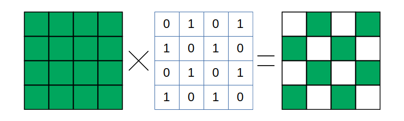

これを数式で表すとこうなります。

$$ \displaystyle f_G(x, y) = f(x, y) \cdotp s(x, y) $$

$$ \displaystyle 
s(x, y) = 
\begin{cases}
0   \text{  if } x \mod 2 = y \mod 2 \\\
1  \text{  otherwise}
\end{cases}
$$

$ s(x, y) $はさらに

$$
\begin{eqnarray}
s \left ( x, y \right )  =  \frac{1}{2} \left ( 1 - \left ( -1 \right ) ^ {x + y} \right ) \\
 = \frac{1}{2} \left ( 1 - e ^ {i \pi \left ( x + y \right ) } \right )
\end{eqnarray}
$$

とかけます。
たとえば$ x $と$ y $の和が偶数だと

$$ e ^ {i \pi \left ( x + y \right )} = 1 $$

になり、奇数だと

$$ e ^ {i \pi \left ( x + y \right )} = -1 $$

になることを利用しています。

したがって、元の式は

$$
\begin{eqnarray}
f_{G} \left ( x, y \right ) =  \frac{1}{2} f_{full}\left ( 1 - \left ( -1 \right ) ^ {x + y} \right ) \\
= \frac{1}{2} \left ( f_{full} - f_{full} e ^ {i \pi \left ( x + y \right ) } \right )
\end{eqnarray}
$$

と表されます。この式の後半は、元の関数をx軸方向とy軸方向に$ \pi$ずつずらし、元の信号から引く事を意味します。

さて、この画像をフーリエ変換して周波数特性を求めたらどのようになるでしょうか？$ f_G $ をフーリエ変換したものを$ F_G $とすると、

$$
\begin{eqnarray}
F_G \left( w, v \right ) &=& \int f_G \left ( x, y \right) e ^ {i w} e ^ {i v} dx dy \\
&=& \int \frac{1}{2} \left (
    f \left( x, y \right) - f \left( x, y \right ) e ^ {\pi i \left( x + y \right) } 
    \right ) e ^ {i w} e ^ {i v} dx dy
\end{eqnarray}
$$

ここで元の$ f \left( x, y \right) $をフーリエ変換したものを $F(w, v)$とすると、

$$
F\left( w, v \right) = \int f \left( x, y  \right )  e ^ {i w x} e ^ {i v y} dx dy
$$

なので、

$$
\begin{eqnarray}
F_G \left( w, v \right ) 
&=& \frac{1}{2} F \left( x, y \right) - \frac{1}{2} \int f \left( x, y \right ) e ^ {\pi i \left( x + y \right) } 
    e ^ {i w} e ^ {i v} dx dy
\end{eqnarray}
$$

ここで、

$$
\begin{eqnarray}
\int f \left( x, y \right ) e ^ {\pi i \left( x + y \right) } e ^ {i w} e ^ {i v} dx dy
&=& \int f \left( x, y \right ) e ^ {i \left( w + \pi \right ) x } e ^ {i \left( v + \pi \right) y} dx dy \\
&=& F\left(w + \pi, v + \pi \right) 
\end{eqnarray}
$$

を利用すると

$$
F_G \left( w, v \right ) = \frac{1}{2} F\left( x, y \right) - \frac{1}{2} F\left( x + \pi, y + \pi\right)
$$

となります。

これは$\frac{1}{2}$の係数をのぞけば、元の画像の周波数特性を周波数軸上に$pi$だけずらすしてもとの画像から引いたものです。

つまり、もし元の画像の周波数特性が模式的にこのように表されるとしたら、

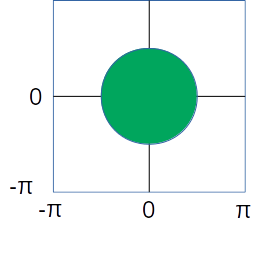

Bayer上の緑画素の周波数特性はこのようになります。

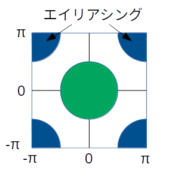

青い部分が、全式の後半部分にできたもので元の画像の一部を定間隔でとりだした（サブサンプリング）したためにできた副生成物（アーティファクト）です。このような副生成物をエイリアシングとよびます[^1]。

[^1]: 通常の画像で拡大縮小などによってエイリアシングがおきると、高周波成分が低い周波数に干渉してモアレなどを生成することがしられています。

### 線形補間フィルターの周波数特性

画像の周波数成分は低い部分に多いと考えると、サンプリング前の信号を取り出すには、低周波部分を取り出してやれば良いことになります。
信号処理的にはローパスフィルターをかけます。

ここで、線形補間の式から作ったフィルターを思い出すと、このような形をしていました。

$$
h_1 = 
\begin{bmatrix}
    0 & 1/4 &   0 \\
  1/4 &   1 & 1/4 \\
    0 & 1/4 &   0 \\
\end{bmatrix}
$$

これはそのものズバリ、ローパスフィルターです。

この周波数特性はこのようになります。
$$
\begin{eqnarray}
H_1\left(w, v\right) 
&=& \sum_{n=-1}^{1} \sum_{m=-1}^{1} h_1 \left(n, m\right) e^{-i w n} e^{-i v m}\\
&=& \frac{1}{2} cos\left( w \right) + \frac{1}{2} cos\left( v \right) + 1
\end{eqnarray}
$$

画像として表示してみましょう。


```python
# 横軸と縦軸の位置
sample_num = 64
ws = np.linspace(-np.pi, np.pi, sample_num)
vs = np.linspace(-np.pi, np.pi, sample_num)

# wsとvsを並べたもの。
wmesh, vmesh = np.meshgrid(ws, vs, sparse=True)
# 周波数特性
f1 = np.cos(wmesh)/2 + np.cos(vmesh)/2 + 1
# パワーを求めるために２乗
f1 = f1 * f1

# pyplotのcountourfを使って表示
plt.figure(figsize=(6, 6))
plt.imshow(f1, cmap='gray')
plt.axis('off')
plt.title("緑画素用線形補間フィルターの周波数特性")
plt.show()
```


この図では明るい部分の値が大きく、暗い部分の値が小さくなっています。特に角の部分では０になります。

先程のベイヤー画像の緑画素の周波数特性の図と比べると、ちょうど４つの角にあるエイリアシングの部分で周波数特性が０になり打ち消すようになっていることがわかります。

### 赤・青画素の周波数特性とフィルター

同様に赤画素のサンプリング関数は、xとyがどちらも偶数のときのみ値が存在することを考えると、

\begin{equation}
s_R \left ( x, y \right ) =  \frac{1}{4} \left ( 1 - \left ( -1 \right ) ^ x \right ) \left ( 1 - \left ( -1 \right ) ^ y \right ) 
=  \frac{1}{4} \left ( 1 - e ^ {i \pi x} \right ) \left ( 1 - e ^ {i \pi y} \right )  
\end{equation}

で、青画素は、

\begin{equation}
s_B \left ( x, y \right ) =  \frac{1}{4} \left ( 1 + \left ( -1 \right ) ^ x \right ) \left ( 1 + \left ( -1 \right ) ^ y \right ) 
=  \frac{1}{4} \left ( 1 + e ^ {i \pi x} \right ) \left ( 1 + e ^ {i \pi y} \right )  
\end{equation}

符号を無視すると周波数特性はどちらも同じになり、エイリアシングの様子はこうなります。

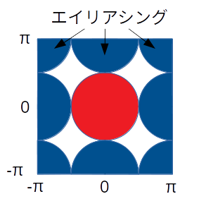

緑の画素にくらべて、エイリアシングの影響を受ける領域が大きくなっています。したがって、緑よりも強めのローパスフィルターをかける必要があることが予想されます。

前回使用した赤・青画素線形補間用ののFIRフィルターはこうなっています。

$$
h_2 = 
\begin{bmatrix}
  1/4 & 1/2 & 1/4 \\
  1/2 &   1 & 1/4 \\
  1/4 & 1/2 & 1/4 \\
\end{bmatrix}
$$


周波数特性はこうです。

$$
\begin{eqnarray}
H_2\left(w, v\right) 
&=& \sum_{n=-1}^{1} \sum_{m=-1}^{1} h_2 \left(n, m\right) e^{-i w n} e^{-i v m} \\
&=& \left( 1 + cos\left( w \right) \right) \left( 1 + cos\left( v \right) \right)
\end{eqnarray}
$$

図示してみましょう。


```python
# 周波数特性
f2 = (1 + np.cos(wmesh)) * (1 + np.cos(vmesh))
# パワーを求めるために２乗
f2 = f2 * f2

# pyplotのcountourfを使って表示
plt.figure(figsize=(6, 6))
plt.imshow(f2, cmap='gray')
plt.axis('off')
plt.title("赤・青画素用線形補間フィルターの周波数特性")
plt.show()
```


ちょうと赤青画像のエイリアシングを取り除くような特性になっています。

こうしてみると理想的なフィルター処理をしているように見えますが、実際の画像はだいぶぼやけていて、細かい模様の周りには偽色という本来ないはずの色がでてきています。

画像のぼやけは、もともとの画像の周波数特性を十分にカバーしていないことを、偽色の存在は本来の信号とエイリアシングとが十分に分割できていない事を示しています。
このような単純な形のフィルターの限界でしょう。

### まとめ

今回は線形補間デモザイクフィルターの周波数特性を調べてその問題点を調べてきました。

次はこういった問題点を改善した[高度なデモザイク処理](https://colab.research.google.com/github/moizumi99/camera_raw_processing/blob/master/camera_raw_chapter_6_1.ipynb)に入ります。


```python

```

## 6.2 高度なデモザイク処理

### この節について

この節では線形補間デモザイクよりも高度なデモザイクアルゴリズムをとりあげます。なお、この節の内容の大部分は"Frequency-Domain Methods for Demosaicking of Bayer-Sampled Color Images, Eric Dubois, IEEE Signal Processing Letters, Dec. 2005"に基づいています。

この節のの内容はColabノートブックとして公開してあります。ノートブックを見るには[目次ページ](https://colab.research.google.com/github/moizumi99/camera_raw_processing/blob/master/camera_raw_toc.ipynb)から参照するか、以下のリンクを使ってアクセスしてください。

https://colab.research.google.com/github/moizumi99/camera_raw_processing/blob/master/camera_raw_chapter_6_1.ipynb

### 準備

まずライブラリーのインストールと、モジュールのインポート、画像の読み込みを行います。今回もラズベリーパイで撮影したチャート画像を使用します。
内容については各節を参照ください。


```python
# rawpyとimageioのインストール
!pip install rawpy;
!pip install imageio;

# rawpy, imageio, numpuy, pyplot, imshowのインポート
import rawpy, imageio
import numpy as np
import matplotlib.pyplot as plt
from matplotlib.pyplot import imshow

# 前節までに作成したモジュールのダウンロードとインポート
!if [ ! -f raw_process.py ]; then wget raw_process.py; fi
from raw_process import simple_demosaic, white_balance, black_level_correction, gamma_correction
from raw_process import demosaic, defect_correction, color_correction_matrix, lens_shading_correction
from raw_process import noise_filter, apply_matrix, edge_enhancement, tone_curve_correction

# 日本語フォントの設定
!apt -y install fonts-ipafont-gothic
plt.rcParams['font.family'] = 'IPAPGothic'
# もし日本語が文字化けしている場合`! rm /content/.cache/matplotlib/fontList.json`を実行して、
# Runtime->Restart Runtimeで再実行

# 画像をダウンロードします。
!if [ ! -f chart.jpg ]; then wget chart.jpg; fi

# 自分で撮影した画像を使用する場合は以下のコメントを取り除きアップロードします。
# from google.colab import files
# uploaded = files.upload()

# RAWファイルの名前。
# アップロードしたファイルを使う場合はその名前に変更。
raw_file  = "chart.jpg"
raw = rawpy.imread(raw_file)
raw_array = raw.raw_image
h, w = raw_array.shape
```

    Requirement already satisfied: rawpy in /home/moiz/anaconda3/lib/python3.7/site-packages (0.13.0)
    Requirement already satisfied: numpy in /home/moiz/anaconda3/lib/python3.7/site-packages (from rawpy) (1.15.1)
    You are using pip version 19.0.1, however version 19.0.2 is available.
    You should consider upgrading via the 'pip install --upgrade pip' command.
    Requirement already satisfied: imageio in /home/moiz/anaconda3/lib/python3.7/site-packages (2.4.1)
    You are using pip version 19.0.1, however version 19.0.2 is available.
    You should consider upgrading via the 'pip install --upgrade pip' command.
    E: Could not open lock file /var/lib/dpkg/lock-frontend - open (13: Permission denied)
    E: Unable to acquire the dpkg frontend lock (/var/lib/dpkg/lock-frontend), are you root?


### より高度なデモザイク処理

_この項は、画像処理の理論的背景に興味がない方は読み飛ばして構いません。_

線形補間デモザイクでは各色チャンネルをそれぞれ独立なものとして処理しました。ここでは、３色のBayer配列全体を一つの画像と見てみます。

前節でもとめた各色チャンネルの表現をもちいると、Bayer画像はこのように表記できます。

\begin{aligned}
f_{bayer} = & \frac{1}{2} f_G \left ( 1 - \left ( -1 \right ) ^ {x + y} \right ) + \\\
& \frac{1}{2} f_R \left ( 1 - \left ( -1 \right ) ^ {x} \right ) \left ( 1 - \left ( -1 \right ) ^ {y} \right ) + \\\
& \frac{1}{2} f_B \left ( 1 + \left ( -1 \right ) ^ {x} \right ) \left ( 1 + \left ( -1 \right ) ^ {y} \right )
\end{aligned}


ここで、
\begin{equation}
\left ( -1 \right ) ^ {x} = e ^ {i \pi x}\\
\left ( -1 \right ) ^ {y} = e ^ {i \pi y}\\
\left ( -1 \right ) ^ {x + y} = e ^ {i \pi \left( x + y \right)}\\
\end{equation}


を利用して、

\begin{aligned}
f_{bayer} = & \left ( \frac{1}{4} f_B + \frac{1}{2} f_G + \frac{1}{4} f_R \right ) + \\\
& \left ( \frac{1}{4} f_B - \frac{1}{2} f_G + \frac{1}{4} f_R \right ) \cdot e^{i \pi (x + y)} + \\\
& \left ( \frac{1}{4} f_B - \frac{1}{4} f_R \right ) \cdot (e^{i \pi x} + e^{i \pi y})
\end{aligned}


まとめると

\begin{aligned}
f_{bayer} & = f_{L} - f_{C1} e^{i \pi \left ( x + y \right ) } + f_{C2} \left ( e^{i \pi x} + e^{i \pi y} \right ) \\\
f_L & = \frac{1}{4} f_R + \frac{1}{2} f_G + \frac{1}{4} f_B \\\
f_{C1} & = \left ( \frac{1}{4} f_B - \frac{1}{2} f_G + \frac{1}{4} f_R \right ) \\\
f_{C2} & = \left ( \frac{1}{4} f_B - \frac{1}{4} f_R \right ) 
\end{aligned}

逆に、$ f_L $、 $ f_{C1} $、$ f_{C2} $から、$ f_R $、$ f_G $、$ f_B $は、

\begin{cases}
f_R = f_L + f_{C1} - 2f_{C2} \\\
f_G = f_L - f_{C1} \\\
f_B = f_L + f_{C1} - 2f_{C2} 
\end{cases}

と、求められます。

では、$ f_L $、$ f_{C1} $、$ f_{C2} $はどうやって計算すれば良いのか、というのが次の問題になります。

$ f_L$、$ f_{C1} $、$ f_{C2} $の定義をみると、$ f_R $、$ f_G $、$ f_B $の線形結合なので元の画像が周波数制限されていて低い周波数の成分しかもっていないとすると、$ f_L $、$ f_{C1} $、$ f_{C2} $も周波数制限されていると考えられます。

ここで前節のベイヤー画像の周波数特性の計算を思い出すと、$ f_{C1} e^{i \pi (x + y)} $や$ f_{C2} \left ( e^{i \pi x} + e^{i \pi y} \right )$は$ f_{C1}$、$ f_{C2} $を周波数空間で$ \pi$だけシフトしたものです。
もとの$f_{Bayer}$はこれらを足し合わせたものなので、図に表すとこうなります。

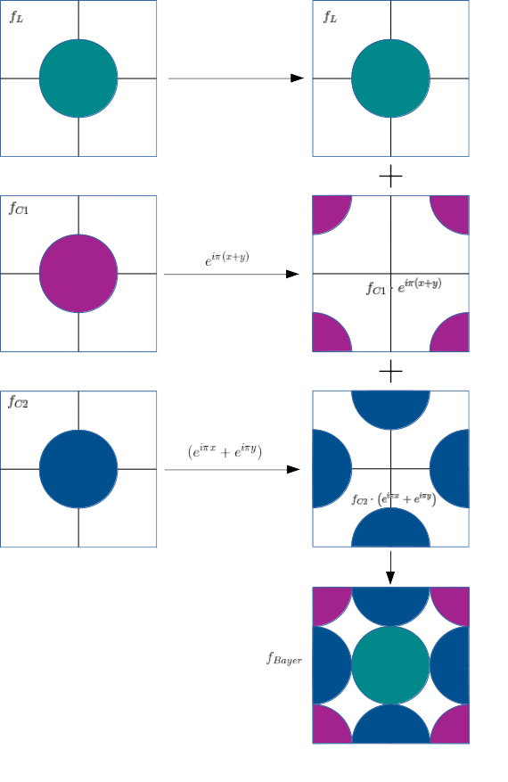

ということは、$_{Bayer} $に帯域制限フィルターをかけて各成分をとりだして周波数をシフトすれば$ f_L $、$ f_{C1}$、$ f_{C2} $を得られるという事になります。

必要なフィルターは4つです。

- FC1 : 縦・横ハイパスフィルター。$ f_{C1} $を取り出すのに使います。

例：
\begin{equation}
F_{C1} = 
\left(\begin{array}{c} -1 \\\ 2 \\\ -3 \\\ 4 \\\ -3 \\\ 2 \\\ -1\end{array}\right)
\left(\begin{array}{c} -1, 2, -3, 4, -3, 2, -1\end{array}\right)
\end{equation}

- FC2V : 縦方向ハイパスフィルター、横方向ローパスフィルター。$ f_{C2}$の上下の成分を取り出すのに使います。

例：
\begin{equation}
F_{C2V} = 
\left(\begin{array}{c} -1 \\\ 2 \\\ -3 \\\ 4 \\\ -3 \\\ 2 \\\ -1\end{array}\right)
\left(\begin{array}{c} 1, 2, 3, 4, 3, 2, 1\end{array}\right)
\end{equation}

- FC2H: 縦方向ローパスフィルター、横方向ハイパスフィルター。$ f_{C2} $の左右の成分を取り出すのに使います。

例：
\begin{equation}
F_{C2H} = 
\left(\begin{array}{c} 1 \\\ 2 \\\ 3 \\\ 4 \\\ 3 \\\ 2 \\\ 1\end{array}\right)
\left(\begin{array}{c} -1, 2, -3, 4, -3, 2, -1\end{array}\right)
\end{equation}

- FL: (FC1 + FC2V + FC2H)を反転させたフィルター。$ f_{L} $の成分を取り出すのに使います。

例
\begin{equation}
F_L = 1 - F_{C1} - F_{C2V} - F_{C2H}
\end{equation}


これらを使えば、

\begin{aligned}
f_{C1} & = F_{C1}  \left ( f_{Bayer} \right ) e^{- i \pi \left ( x + y \right )} \\\
f_{C2V} & = F_{C2V} \left ( f_{Bayer} \right )  e^{-i \pi y} \\\
f_{C2H} & = F_{C2H} \left ( f_{Bayer} \right )  e^{-i \pi x} \\\
f_{C2} & = \left ( f_{C2V} + f_{C2H} \right ) / 2 \\\
f_L & = F_L \left ( f_{Bayer} \right ) 
\end{aligned}

となって$ f_L $、$ f_{C1}$、$ f_{C2} $の近似が計算でき、そこから$ f_R $、$ f_G$、$ f_B$が求められるはずです。
やってみましょう。

まずはホワイトバランスまでの処理を行います。


```python
blc_raw = black_level_correction(raw_array, raw.black_level_per_channel, raw.raw_pattern)
lsc = [np.array([6.07106808e-07, 9.60556906e-01]), 
       np.array([6.32044369e-07, 9.70694361e-01]), 
       np.array([6.28455183e-07, 9.72493898e-01]), 
       np.array([9.58743579e-07, 9.29427169e-01])]
lsc_raw = lens_shading_correction(blc_raw, lsc)
dpc_raw = defect_correction(lsc_raw, 16)
wb_raw = white_balance(dpc_raw, raw.camera_whitebalance, raw.raw_colors)
dms_input = wb_raw
```

次に必要なFIRフィルターを準備しましょう。
まず、横方向のローパスフィルターです。


```python
hlpf = np.array([[1, 2, 3, 4, 3, 2, 1]]) / 16
```

これを利用して、縦方向のローパスフィルターを作ります。numpyの転置機能を使います。


```python
vlpf = np.transpose(hlpf)
```

同様に、横・縦方向のハイパスフィルターを作ります。


```python
hhpf = np.array([[-1, 2, -3, 4, -3, 2, -1]]) / 16
vhpf = np.transpose(hhpf)
```

次に、等価フィルターを作ります。なにもしない（出力＝入力）フィルターです。


```python
identity_filter = np.zeros((7, 7))
identity_filter[3, 3] = 1
```

これらの基本的なフィルターから、必要なフィルターを作っていきます。

FC1は、縦横ハイパスフィルターなので、こうなります。


```python
FC1 = np.matmul(vhpf, hhpf)
```

FC2Vは縦ハイパス・横ローパス、FC2Hは縦ローパス・横ハイパスです。


```python
FC2H = np.matmul(vlpf, hhpf)
FC2V = np.matmul(vhpf, hlpf)
```

FLは、等価フィルターからFC1, FC2V, FC2Hを取り除いたものです。


```python
FL = identity_filter - FC1 - FC2V - FC2H
```

これで準備ができました。

ではまず、ハイパスフィルターを使って、C1成分を周波数空間の角からとりだしてみましょう。
SciPyの２次元コンボリューション機能を使います。


```python
import scipy

# f_C1 at 4 corners
c1_mod = scipy.signal.convolve2d(dms_input, FC1, boundary='symm', mode='same')
```

同様に、C2V成分、C2H成分を取り出してみましょう。


```python
# f_C1^1 at wy = 0, wx = +Pi/-Pi
c2h_mod = scipy.signal.convolve2d(dms_input, FC2H, boundary='symm', mode='same')
# f_C1^1 at wy = +Pi/-Pi, wx = 0
c2v_mod = scipy.signal.convolve2d(dms_input, FC2V, boundary='symm', mode='same')
```

最後にL成分をとりだします。


```python
# f_L at center
f_L = scipy.signal.convolve2d(dms_input, FL, boundary='symm', mode='same')
```

今の所、C1成分、C2V・C2H成分は、周波数空間で$ \pi $だけずれています。色情報を復元するにはこれを復調してやる必要があります。

復調するためには$e^{-i \pi x}$や$e^{-i \pi y}$を掛け合わせなくてはならないのですが$x$, $y$はいずれも整数なので、結局$-1$と$＋１$の繰り返しになります。
つまり$e^{-i \pi x}$をかけるのは奇数列の成分に-1をかける、$e^{-i \pi y}$をかけるのは奇数行の成分に-1をかけるのと同じです。

まずC1についてやってみましょう。必要な計算はこうなります。


```python
# Move c1 to the center by shifting by Pi in both x and y direction
# f_c1 = c1 * (-1)^x * (-1)^y
f_c1 = c1_mod.copy()
f_c1[:, 1::2] *= -1
f_c1[1::2, :] *= -1
```

同様にC2V・C2Hでは必要な計算はこうなります。


```python
# Move c2a to the center by shifting by Pi in x direction, same for c2b in y direction
c2v = c2v_mod.copy()
c2v[1::2, :] *= -1
c2h = c2h_mod.copy()
c2h[:, 1::2] *= -1
# f_c2 = (c2v_mod * x_mod + c2h_mod * y_mod) / 2
f_c2 = (c2v + c2h) / 2
```

これで$f_L$、$f_{C1}$、$f_{C2}$が求められました。

最後に、以下の式にしたがって$f_R$、$f_G$、$f_B$を計算します。

$$
\begin{eqnarray}
f_R &=& f_L + f_{C1} + 2f_{C2} \\
f_G &=& f_L - f_{C1} \\
f_B &=& f_L + f_{C1} - 2f_{C2} 
\end{eqnarray}
$$

やってみましょう。


```python
# generate RGB channel using 
# [R, G, B] = [[1, 1, 2], [1, -1, 0], [1, 1, - 2]] x [L, C1, C2]
height, width = dms_input.shape
dms_img = np.zeros((height, width, 3))
dms_img[:,:,0] = f_L + f_c1 - 2 * f_c2
dms_img[:,:,1] = f_L - f_c1
dms_img[:,:,2] = f_L + f_c1 + 2 * f_c2
```

これでRGB画像が再現されたはずです！

解像感に影響のあるエッジ強調とノイズフィルター以外の処理を行い結果を確認してみましょう。


```python
color_matrix = np.array([6022,-2314,394,-936,4728,310,300,-4324,8126])/4096
ccm_img = color_correction_matrix(dms_img, color_matrix)
white_level = 1024
gmm_img = gamma_correction(ccm_img / white_level, 2.2)
ton_img = tone_curve_correction(gmm_img, (0, 0.28, 0.78, 1.0), (0, 0.22, 0.88, 1.0))
```

表示してみます。


```python
# 最終画像表示
plt.figure(figsize=(8, 8))
plt.imshow(ton_img)
plt.axis('off')
plt.title(u"トーンカーブ補正")
plt.show()
```


```python
dms2_img = demosaic(wb_raw, raw.raw_colors)
ccm2_img = color_correction_matrix(dms2_img, color_matrix)
gmm2_img = gamma_correction(ccm2_img / white_level, 2.2)
ton2_img = tone_curve_correction(gmm2_img, (0, 0.28, 0.78, 1.0), (0, 0.22, 0.88, 1.0))
```


```python
plt.figure(figsize=(10, 20))
plt.subplot(2, 1, 1)
plt.imshow(ton2_img[1400:1600, 1650:1850, :])
plt.axis('off')
plt.title(u"線形補間デモザイク、拡大")
plt.subplot(2, 1, 2)
plt.imshow(ton_img[1400:1600, 1650:1850, :])
plt.axis('off')
plt.title(u"高度なデモザイク、拡大")
plt.show()
```


全体に画像のシャープさ感が上がっていること、また細かい模様やエッジ近辺などで偽色（本来ないはずの色）が減っている事がわかります。副作用としてノイズの量が増えていますが、このあたりはノイズフィルターで抑制するべきでしょう。

### モジュールへの追加

このデモザイクも関数としてモジュールに追加しておきましょう。


```python
def advanced_demosaic(raw_array, bayer_pattern):
    """
    ベイヤー配列の周波数特性を利用したデモザイク処理。
    
    Parameters
    ----------
    raw_array: numpy 2d array
        入力RAW画像
    bayer_pattern: [2, 2] array
        2x2のBayer配列。0: R, 1:Gr(or G), 2:B, 3:Gb
        通常はRAWPYのrawpy.raw_patternの値を渡す。

    Returns
    -------
    dms_img: numpy array
        デモザイク後の画像
    """
    # 横方向ローパスフィルター
    hlpf = np.array([[1, 2, 3, 4, 3, 2, 1]]) / 16
    # 縦方向ローパスフィルター
    vlpf = np.transpose(hlpf)
    # 横方向ハイパスフィルター
    hhpf = np.array([[-1, 2, -3, 4, -3, 2, -1]]) / 16
    # 縦方向ハイパスフィルター
    vhpf = np.transpose(hhpf)
    # 等価フィルター
    identity_filter = np.zeros((7, 7))
    identity_filter[3, 3] = 1

    # 必用な周波数領域に対応するフィルター
    FC1 = np.matmul(vhpf, hhpf)
    FC2H = np.matmul(vlpf, hhpf)
    FC2V = np.matmul(vhpf, hlpf)
    FL = identity_filter - FC1 - FC2V - FC2H

    # f_C1 (四つ角の成分)をとりだす。
    c1_mod = scipy.signal.convolve2d(raw_array, FC1, boundary='symm', mode='same')
    # f_C2H (横軸方向の端)
    c2h_mod = scipy.signal.convolve2d(raw_array, FC2H, boundary='symm', mode='same')
    # f_C2V (縦軸方向の端)
    c2v_mod = scipy.signal.convolve2d(raw_array, FC2V, boundary='symm', mode='same')
    # f_L (中心部)
    f_L = scipy.signal.convolve2d(raw_array, FL, boundary='symm', mode='same')

    # C1を復調。周波数空間で(Pi, Pi)シフトして中心を(0, 0)に戻すのに相当。
    f_c1 = c1_mod.copy()
    f_c1[:, 1::2] *= -1
    f_c1[1::2, :] *= -1
    # 緑画像が左上にある場合、位相を１８０度ずらす。
    if bayer_pattern[0, 0] == 1 or bayer_pattern[0, 0] == 3:
        f_c1 *= -1
    # C2Hを復調。周波数空間で(Pi, 0)シフトして中心を(0, 0)に戻すのに相当。
    c2h = c2h_mod.copy()
    c2h[:, 1::2] *= -1
    # 青画像が左上か左下にある場合、位相を１８０度ずらす。
    if bayer_pattern[0, 0] == 2 or bayer_pattern[1, 0] == 2:
        c2h *= -1
    # C2Vを復調。周波数空間で(0, Pi)シフトして中心を(0, 0)に戻すのに相当。
    c2v = c2v_mod.copy()
    c2v[1::2, :] *= -1
    # 青画像が左上か右上にある場合、位相を１８０度ずらす。
    if bayer_pattern[0, 0] == 2 or bayer_pattern[0, 1] == 2:
        c2v *= -1
    # C2HとC2Vの平均からC2を求める。
    f_c2 = (c2v + c2h) / 2

    # R/G/B画像の合成。
    # [R, G, B] = [[1, 1, 2], [1, -1, 0], [1, 1, - 2]] x [L, C1, C2]
    height, width = raw_array.shape
    dms_img = np.zeros((height, width, 3))
    dms_img[:, :, 0] = f_L + f_c1 + 2 * f_c2
    dms_img[:, :, 1] = f_L - f_c1
    dms_img[:, :, 2] = f_L + f_c1 - 2 * f_c2

    return dms_img
```

このメソッドを使って全ての処理を行い、結果を確認してみましょう。


```python
blc_raw = black_level_correction(raw_array, raw.black_level_per_channel, raw.raw_pattern)
lsc = [np.array([6.07106808e-07, 9.60556906e-01]), 
       np.array([6.32044369e-07, 9.70694361e-01]), 
       np.array([6.28455183e-07, 9.72493898e-01]), 
       np.array([9.58743579e-07, 9.29427169e-01])]
lsc_raw = lens_shading_correction(blc_raw, lsc)
dpc_raw = defect_correction(lsc_raw, 16)
wb_raw = white_balance(dpc_raw, raw.camera_whitebalance, raw.raw_colors)
dms_img = advanced_demosaic(wb_raw, raw.raw_pattern)
noise_model=(0.29300604909937544, 10.754229129481296)
nfl3_img = noise_filter(dms_img, noise_model)
color_matrix = np.array([6022,-2314,394,-936,4728,310,300,-4324,8126])/4096
ccm_img = color_correction_matrix(nfl3_img, color_matrix)
white_level = 1024
gmm_img = gamma_correction(ccm_img / white_level, 2.2)
shp_img = edge_enhancement(gmm_img, 2, 0.25)
ton_img = tone_curve_correction(shp_img, (0, 0.28, 0.78, 1.0), (0, 0.22, 0.88, 1.0))
```

表示してみます。


```python
# 最終画像表示
plt.figure(figsize=(16, 8))
plt.subplot(1, 2, 1)
plt.imshow(ton_img)
plt.axis('off')
plt.title(u"高度なデモザイク最終画像")
plt.subplot(1, 2, 2)
plt.imshow(ton_img[1400:1600, 1650:1850, :])
plt.axis('off')
plt.title(u"高度なデモザイク最終画像、拡大")
plt.show()
```


うまくいったようです。

### まとめ

今回は高度なデモザイク処理をとりあげました。

参照した論文[^1]ではさらに、一部のチャンネルを混ぜ合わせるときに各画素毎に重み計算を行うという適合処理的アルゴリズムを扱っています。今回は割愛しましたが、興味のある方は試されてはいかがでしょうか[^2]？

[^1]: Frequency-Domain Methods for Demosaicking of Bayer-Sampled Color Images, Eric Dubois, IEEE Signal Processing Letters, Dec. 2005

[^2]: 論文の著者グループが[WebにてMatlabのサンプルプログラムを配布しています](http://www.site.uottawa.ca/~edubois/SingleSensorImaging/Bayer_structure/)。また、今回のスクリプトを少し書き換えれば実現できることは確認済みです。

また、このアルゴリズムが発表されたのがすでに１３年前であり、これまでにさらにさまざまなアルゴリズムが提案されており、現在も進歩をつづけています[^3]。
たとえば、最近の流行はデモザイク処理にディープラーニングを使う手法です[^4]。

[^3]: たとえば高機能なRAW現像ソフトウェアRawTherapeeではさまざまなアルゴリズムを実装しているようです。[https://rawpedia.rawtherapee.com/Demosaicing/jp]

[^4]: [https://arxiv.org/abs/1802.03769:title]

こういった事情を考慮にいれても、今回紹介した手法はシンプルな割には高画質の出力が得られる良いアルゴリズムだと思います。

次は全体の[まとめ](https://colab.research.google.com/github/moizumi99/camera_raw_processing/blob/master/camera_raw_chapter_7_1.ipynb)です。


```python

```
