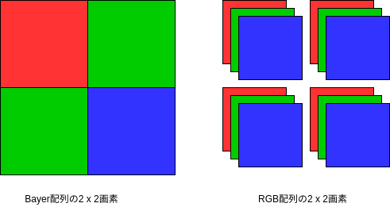
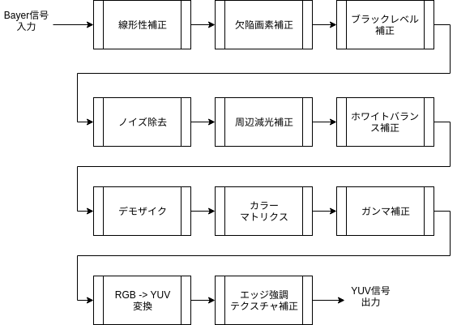
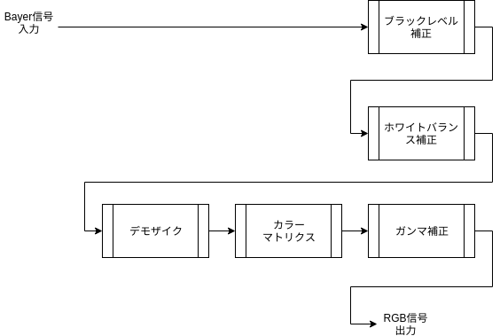
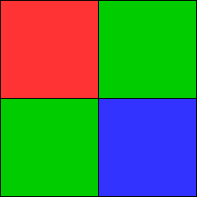
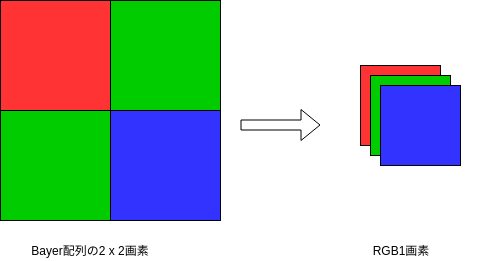
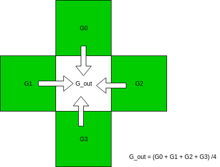

# PythonとColabで作る - RAW現像ソフト作成入門


## 目次

1. [はじめに](https://colab.research.google.com/github/moizumi99/camera_raw_processing/blob/master/camera_raw_chapter_1.ipynb)

2. [カメラ画像処理について](https://colab.research.google.com/github/moizumi99/camera_raw_processing/blob/master/camera_raw_chapter_2.ipynb)

3. 基本的な処理

  3.1 [準備](https://colab.research.google.com/github/moizumi99/camera_raw_processing/blob/master/camera_raw_chapter_3_1.ipynb)


  3.2 [簡易デモザイク処理](https://colab.research.google.com/github/moizumi99/camera_raw_processing/blob/master/camera_raw_chapter_3_2.ipynb)

  3.3 [ブラックレベル調整](https://colab.research.google.com/github/moizumi99/camera_raw_processing/blob/master/camera_raw_chapter_3_3.ipynb)

  3.4 [ホワイトバランス調整](https://colab.research.google.com/github/moizumi99/camera_raw_processing/blob/master/camera_raw_chapter_3_4.ipynb)

  3.5 [ガンマ補正](https://colab.research.google.com/github/moizumi99/camera_raw_processing/blob/master/camera_raw_chapter_3_5.ipynb)

4. 重要な処理

  4.1 [この章について](https://colab.research.google.com/github/moizumi99/camera_raw_processing/blob/master/camera_raw_chapter_4.ipynb)

  4.1 [線形補間デモザイク](https://colab.research.google.com/github/moizumi99/camera_raw_processing/blob/master/camera_raw_chapter_4_1.ipynb)

  4.2 欠陥画素補正

  4.3 カラーマトリクス

  4.4 レンズシェーディング補正

5. 画質を良くする処理

  5.1 この章について

  5.2 ノイズフィルター

  5.3 エッジ強調

  5.4 トーンカーブ補正

6. 応用編

  6.2 線形補間デモザイクの周波数特性

  6.1 高度なデモザイク処理

7. まとめ

8. Appendix

  8.1. Google Colabの使い方
  
  8.2. RAW画像の撮影方法
  

# 1. はじめに

## この本について

この本では、カメラ画像処理・RAW画像現像の内容を実際の動作レベルで解説し、なるべくスクラッチからPython上で実行してみる事を目的としています。

そのために、解説する処理は最重要なものにしぼり、使用するアルゴリズムは一部の例外（デモザイク）を除き、もっとも簡単なものを選びました<sup name="footnote1">[1]</sup>。

またすべての処理はGoogle Colab上で行うことができ、読者の皆さんはパワフルなPCや特殊なソフトウェアをよういせずとも、ブラウザ上で全ての処理を試してみることができます。
  
記事の最後ではラズベリーパイのカメラで撮影したRAW画像からこんなRGB画像が作れるようになります。

(TODO: 画像を入れる)

## 対象読者

この本は以下のような読者を対象としています。
- カメラ内部の画像処理またはRAW現像の内容に興味がある。

また次のような知識があれば、内容を深く理解する助けになります。
- Pythonプログラミングの基本的な内容について知っている。
- 高校で学ぶ程度の数学の知識がある。

## Colabについて


Google Colab (グーグル・コラボ)とはGoogleが提供するサービスの一つで、ブラウザ上で実行可能なPythonのインタラクティブ環境です。

Google Colabを利用することにより、Pythonの環境を無料でブラウザ上で利用することができます。

詳しくは[Google自身によるColabの解説](https://colab.research.google.com/notebooks/welcome.ipynb?hl=ja)をご覧ください。

## この本で扱うもの


この本で扱う内容は基本的に以下のとおりです。

- 基本的なRAW現像処理・カメラ画像処理の流れ
- Bayer画像からRGB画像出力までの各アルゴリズムのうち、基本的な最低限のものの解説
- 解説した基本的なアルゴリズムのPythonによる実装と処理例

一部例外はありますが、そういったものは関連した話題として触れられるだけにとどまります。

## この記事で扱わないもの


この本で基本的に扱わない物は以下のとおりです。ただし、記事の解説上最低限必要なものについては触れることがあります。

- ３A（オートフォーカス、オートホワイトバランス、オート露出）などを始めとするカメラコントロールアルゴリズム
- 高度なカメラ画像処理アルゴリズム
- 画像評価、カリブレーション、及びチューニング
- 画像圧縮


## 環境について

この記事で解説する内容は一般的なものですが、使用した画像ファイルは特定のカメラに依存しています。
他のカメラでもわずかな変更で同等の処理ができるとは予想されますが、検証はしていません。

### 使用カメラ


- Sony Alpha 7 III
- Raspberry Pi Camera v2.1

なお、使用したファイルはGithubからダウンロードできるので、これらのカメラをお持ちでなくても、紹介した処理の内容を実行することは可能です。

### 実行環境

この内容を再現するには通常のPC環境に加えて以下の環境等が必用です。

- Google Colabにアクセスできるブラウザ
 - 多くのブラウザが対応できると思われます。なお、本書の内容はChromeによって確かめられています。

- ColabにアクセスできるGoogleアカウント

必須ではありませんが、次の物があれば、本書の内容を更に深く理解することができます

- PC上で実行できるPerl環境（ExifToolの実行に必用)

- [exiftool](https://www.sno.phy.queensu.ca/~phil/exiftool/)

# 2. カメラ画像処理について

## この章について

この章ではカメラのしくみやRAW画像からはじめて、カメラ画像処理やRAW現像ソフトの中でどのような処理が行われているのかを説明します。

この章を含む全ての内容はColabノートブックとして公開してあります。この章のノートブックを見るには[目次ページ](https://colab.research.google.com/github/moizumi99/camera_raw_processing/blob/master/camera_raw_toc.ipynb)から参照するか、以下のリンクを使ってアクセスしてください。

https://colab.research.google.com/github/moizumi99/camera_raw_processing/blob/master/camera_raw_chapter_2.ipynb

## カメラのしくみ

(TODO: 追加)

## RAW画像、RAWファイルとは？

RAWファイルやRAWデータというのは厳密な定義はないのですが、カメラ処理でRAWというとBayerフォーマットの画像データを指すことが多いようです。したがって多くの場合、RAWデータはBayerフォーマットの画像データ、RAWファイルはそのRAWデータを含んだファイルということになります。

まず前提として、今使われているカメラの画像センサーの殆どはBayer配列というものを使ってフルカラーを実現しています。

画像センサーは、碁盤の目状にならんだ小さな光センサーの集まりでできています。一つ一つの光センサーはそのままでは色の違いを認識できません。そこで色を認識するためには、3原色のうち一色を選択して光センサーにあてて、その光の強度を測定する必要があります。 方法としてはまず、分光器を使って光を赤、青、緑に分解して、３つの画像センサーにあてて、それぞれの色の画像を認識し、その後その３枚をあわせることでフルカラーの画像を合成するという方法がありました。これは３板方式などとよばれることがあります。この方法は手法的にもわかりやすく、また、余計な処理が含まれないためフルカラーの画像がきれい、といった特徴があり高級ビデオカメラなどで採用されていました。欠点としては分光器と３つの画像センサーを搭載するためにサイズが大きくなるという点があります。

これに対して、画像センサー上の一つ一つの光センサーの上に、一部の波長の光だけを通す色フィルターを載せ、各画素が異なる色を取り込むという方法もあります。この方法では１枚の画像センサーでフルカラー画像を取り込めるため、３板方式に対して単板方式とよばれることもあります。３版方式とくらべた利点としては分光器が不要で１枚のセンサーで済むのでサイズが小さい。逆に欠点としては、１画素につき１色の情報しか無いので、フルカラーの画像を再現するには画像処理が必要になる、という点があります。

単版方式の画像センサーの上に載る色フィルターの種類としては、３原色を通す原色フィルターと、３原色の補色（シアン・マゼンダ・イエロー）を通す補色フィルター[^1]というものがあります。補色フィルターは光の透過率が高いためより明るい画像を得ることができます。それに対して原色フィルターは色の再現度にすぐれています。Bayer配列はこの単版原色フィルター方式のうち最もポピュラーなものです。

[^1]: 実際にはこの他に緑色の画素もあり、2x2の４画素のパターンになっているのが普通

こういうわけでBayer配列の画像センサーの出力では１画素につき一色しか情報をもちません。Bayer配列のカラーフィルターはこの図左のように、2x2ブロックの中に、赤が1画素、青が1画素、緑が2画素ならぶようになっています。緑は対角線上にならびます。緑が2画素あるのは、可視光の中でも最も強い光の緑色を使うことで解像度を稼ぐため、という解釈がなされています。Bayerというのはこの配列の発明者の名前です。




カメラ用センサーでは2000年代初頭までは、補色フィルターや３板方式もそれなりの割合で使われていたのですが、センサーの性能向上やカメラの小型化と高画質化の流れの中でほとんどがBayer方式にかわりました。今では、SigmaのFoveonのような意欲的な例外を除くと、DSLRやスマートフォンで使われているカラー画像センサーの殆どがBayer方式を採用しています。したがって、ほとんどのカメラの中ではBayerフォーマットの画像データをセンサーから受取り、フルカラーの画像に変換するという処理が行われている、ということになります。

こういったBayerフォーマットの画像ファイルは、すなわちセンサーの出力に近いところで出力されたことになり、カメラが処理したJPEGに比べて以下のような利点があります。

* ビット数が多い（RGBは通常８ビット。Bayerは10ビットから12ビットが普通。さらに多いものもある）
* 信号が線形（ガンマ補正などがされていない）
* 余計な画像処理がされていない
* 非可逆圧縮がかけられていない（情報のロスがない）

したがって、優秀なソフトウェアを使うことで、カメラが出力するJPEGよりもすぐれた画像を手に入れる事ができる「可能性」があります。

逆に欠点としては

* データ量が多い（ビット数が多い。通常非可逆圧縮がされていない）
* 手を加えないと画像が見れない
* 画像フォーマットの情報があまりシェアされていない
* 実際にはどんな処理がすでに行われているのか不透明

などがあります。最後の点に関して言うと、RAWデータといってもセンサー出力をそのままファイルに書き出すことはまずなく、欠陥画素除去など最低限の前処理が行われいるのが普通です。
しかし、実際にどんな前処理がおこなわれているのかは必ずしも公開されていません。

## カメラ画像処理のあらまし

Bayerからフルカラーの画像を作り出すRAW現像処理・カメラ画像処理のうち、メインになる部分の例はこんな感じになります。[^2]

[^2]: これはあくまで一例です。実際のカメラやRAW現像ソフト内で行われる処理はメーカーや機種ごとに異なります。



このうち、最低限必要な処理は、以下のものです。

* ブラックレベル補正
* ホワイトバランス補正（デジタルゲイン補正も含む）
* デモザイク（Bayerからフルカラー画像への変換）
* ガンマ補正

これらがないと、まともに見ることのできる画像を作ることができません。

さらに、最低限の画質を維持するには、通常は、

* 線形性補正
* 欠陥画素補正
* 周辺減光補正
* カラーマトリクス

が必要です。ただし、線形性補正や欠陥画素補正は、カメラがRAWデータを出力する前に処理されていることが多いようです。また、センサーの特性がよければ線形性補正やカラーマトリクスの影響は小さいかもしれません。

次に、より良い画質を実現するものとして、

* ノイズ除去
* エッジ強調・テクスチャ補正

があります。RGB->YUV変換はJPEGやMPEGの画像を作るのには必要ですが、RGB画像を出力する分にはなくてもかまいません。

この他に、最近のカメラでは更に画質を向上させるために

* レンズ収差補正
* レンズ歪補正
* 偽色補正
* グローバル・トーン補正
* ローカル・トーン補正
* 高度なノイズ処理
* 高度な色補正
* ズーム
* マルチフレーム処理

などの処理が行われるのが普通です。今回はベーシックな処理のみとりあげるので、こういった高度な処理は行いません。

結局、今回扱うのは次の部分のみです。




## この章のまとめ

カメラ内部の仕組みとRAW現像処理・カメラ画像処理を、画像処理の観点から説明しました。

## 次の章

次は[RAW画像の準備](https://colab.research.google.com/github/moizumi99/camera_raw_processing/blob/master/camera_raw_chapter_3_1pynb)を行います。


```python

```

# 3.1 準備と簡易デモザイク

## この節について

この節ではまずRAW画像を準備し、簡易的なデモザイクを行ってみます。

この節のの内容はColabノートブックとして公開してあります。ノートブックを見るには[目次ページ](https://colab.research.google.com/github/moizumi99/camera_raw_processing/blob/master/camera_raw_toc.ipynb)から参照するか、以下のリンクを使ってアクセスしてください。

https://colab.research.google.com/github/moizumi99/camera_raw_processing/blob/master/camera_raw_chapter_3_1.ipynb

## RAW画像の準備

まずRAW画像を用意します。今回はSony α 7 IIIで撮影したこの画像を使います。

  

ここで表示している画像は使用するRAWファイルから作成したRGB画像（PNGファイル）です。

元になるRAWファイルはこのURLにあります。

https://raw.githubusercontent.com/moizumi99/raw_process/master/sample.ARW

では、colab上にダウンロードしてみましょう。


```python
!if [ ! -f sample.ARW ]; then wget https://raw.githubusercontent.com/moizumi99/camera_raw_process/master/sample.ARW; fi

```

    --2019-01-26 10:54:31--  https://raw.githubusercontent.com/moizumi99/raw_process/master/sample.ARW
    Resolving raw.githubusercontent.com (raw.githubusercontent.com)... 151.101.188.133
    Connecting to raw.githubusercontent.com (raw.githubusercontent.com)|151.101.188.133|:443... connected.
    HTTP request sent, awaiting response... 200 OK
    Length: 24746752 (24M) [application/octet-stream]
    Saving to: ‘sample.ARW.1’
    
    sample.ARW.1        100%[===================>]  23.60M  52.3MB/s    in 0.5s    
    
    2019-01-26 10:54:32 (52.3 MB/s) - ‘sample.ARW.1’ saved [24746752/24746752]
    


自分で撮影したRAWデータを使用する場合は次のコマンド利用してください。


```python
# from google.colab import files
# uploaded = files.upload()
```

使いやすいようにRAWファイル名を変数に保存しておきます。

自分でアップロードしたファイルを使用する場合は、ファイル名を対象のファイルに書き換えてください。


```python
raw_file  = "sample.ARW"
```

## RAW画像の読み込み

まず必用なモジュールをインストールします。

まずインストールするのはrawpyです。

rawpyはpythonでRAW画像を操作するためのモジュールです。

https://pypi.org/project/rawpy/

rawpyを使うとRAW画像からRAW画像データを取り出したり、画像サイズなどのパラメータを読み出したり、また簡易現像をすることができます。

rawpyの使用法については実際に使う時に説明します。


```python
!pip install rawpy

```

    Requirement already satisfied: rawpy in /home/moiz/anaconda3/lib/python3.7/site-packages (0.13.0)
    Requirement already satisfied: numpy in /home/moiz/anaconda3/lib/python3.7/site-packages (from rawpy) (1.15.1)


colabではコマンドの最初に!をつけると、linuxコマンドが実行できます。pipはpythonのモジュール管理用のコマンドです。

次にimageioをインストールします。

imageioは画像の表示やロード・セーブなどを行うモジュールです。


```python
!pip install imageio
```

    Requirement already satisfied: imageio in /home/moiz/anaconda3/lib/python3.7/site-packages (2.4.1)


次にこれらのモジュールをインポートします。


```python
import rawpy, imageio
```

他に必用なモジュールがある場合はその都度importすることにします。

では先程ダウンロードしたRAWファイルをrawpyを使って読み出してみましょう。

`imread()`はrawデータをファイルから読み込むrawpyのメソッドです。


```python
raw = rawpy.imread(raw_file)
```

読み込みがうまくいったか確認を兼ねてRAWデータの情報を見てみましょう。

まず、画像サイズを確認します。読み込んだRAWデータは、sizesというアトリビュートでサイズ確認ができます。


```python
print(raw.sizes)
```

    ImageSizes(raw_height=4024, raw_width=6048, height=4024, width=6024, top_margin=0, left_margin=0, iheight=4024, iwidth=6024, pixel_aspect=1.0, flip=0)


raw_heightとraw_widthはRAWデータのサイズです。この画像のサイズは縦4024ライン、横6048画素、ということになります。

heightとwidthは、画像処理後の出力画像のサイズです。

他の値についてはrawpyのページで解説されています。

https://letmaik.github.io/rawpy/api/rawpy.RawPy.html#rawpy.RawPy.sizes

この画像を処理しやすくするために、numpyを使用します。

numpyはpython用の数値計算ライブラリーです。行列処理の機能が豊富なので画像処理にも向いています。

まず、numpyをnpという名前でインポートします。


```python
import numpy as np
```

次にraw画像データから数値データのみをnumpyの配列に読み込みます。


```python
raw_array = raw.raw_image
```

raw_imageはRAW画像データをnumpyの配列して渡すアトリビュートです。

このままでは１次元配列で扱いにくいので、reshapeを使って２次元配列に変換します。


```python
h, w = raw.sizes.raw_height, raw.sizes.raw_width
raw_array = raw_array.reshape((h, w))
```

これでraw_arrayは4024 x 6048の２次元配列になりました。


画像データを表示するコマンドimshowを使って、画像として確認してみましょう。


```python
import matplotlib.pyplot as plt
from matplotlib.pyplot import imshow

# raw_arrayの中のデータをグレースケールで表示します。
imshow(raw_array, cmap='gray')
# 軸を非表示にします。
plt.axis('off')
# 実際に表示します。
plt.show()
```


ここでmatplotlibはnumpy用描画ライブラリーです。その中でpyplotは各種グラフを表示するモジュールです。ここではpltという名前でインポートしています。

## この節のまとめ

必用なモジュールをインポートしてRAW画像をcolab上に読み込みました。
次は[簡易デモザイク処理](https://colab.research.google.com/github/moizumi99/camera_raw_processing/blob/master/camera_raw_chapter_3_2.ipynb)を行います。

# 3.2 簡易デモザイク処理

## この節について

この節では、RAWデータの簡易でモザイク処理を行い、画像をフルカラーで表示してみます。

この節のの内容はColabノートブックとして公開してあります。ノートブックを見るには[目次ページ](https://colab.research.google.com/github/moizumi99/camera_raw_processing/blob/master/camera_raw_toc.ipynb)から参照するか、以下のリンクを使ってアクセスしてください。

https://colab.research.google.com/github/moizumi99/camera_raw_processing/blob/master/camera_raw_chapter_3_2.ipynb

## 準備

まず前節で行ったライブラリーのインストールと、モジュールのインポート、画像のダウンロード、及びRAW画像の読み込みを行います。
内容については前節を参照ください。


```python
# rawpyとimageioのインストール
!pip install rawpy
!pip install imageio

# rawpy, imageio, numpuy, pyplot, imshowのインポート
import rawpy, imageio
import numpy as np
import matplotlib.pyplot as plt
from matplotlib.pyplot import imshow

# 画像をダウンロードします。
!if [ ! -f sample.ARW ]; then wget https://raw.githubusercontent.com/moizumi99/camera_raw_process/master/sample.ARW; fi

# 自分で撮影した画像を使用する場合は以下のコメントを取り除きアップロードします。
# from google.colab import files
# uploaded = files.upload()

# RAWファイルの名前。
# アップロードしたファイルを使う場合はその名前に変更。
raw_file  = "sample.ARW"
raw = rawpy.imread(raw_file)
raw_array = raw.raw_image
h, w = raw.sizes.raw_height, raw.sizes.raw_width
raw_array = raw_array.reshape((h, w))
```

    Requirement already satisfied: rawpy in /home/moiz/anaconda3/lib/python3.7/site-packages (0.13.0)
    Requirement already satisfied: numpy in /home/moiz/anaconda3/lib/python3.7/site-packages (from rawpy) (1.15.1)
    Requirement already satisfied: imageio in /home/moiz/anaconda3/lib/python3.7/site-packages (2.4.1)
    --2019-01-26 15:56:51--  https://raw.githubusercontent.com/moizumi99/raw_process/master/sample.ARW
    Resolving raw.githubusercontent.com (raw.githubusercontent.com)... 151.101.188.133
    Connecting to raw.githubusercontent.com (raw.githubusercontent.com)|151.101.188.133|:443... connected.
    HTTP request sent, awaiting response... 200 OK
    Length: 24746752 (24M) [application/octet-stream]
    Saving to: ‘sample.ARW.1’
    
    sample.ARW.1        100%[===================>]  23.60M  52.3MB/s    in 0.5s    
    
    2019-01-26 15:56:51 (52.3 MB/s) - ‘sample.ARW.1’ saved [24746752/24746752]
    


## RAW画像の確認

読み込んだRAW画像を表示してみます。


```python
# raw_arrayの中のデータをグレースケールで表示します。
imshow(raw_array, cmap='gray')
# 軸を非表示にします。
plt.axis('off')
# 実際に表示します。
plt.show()
```


拡大して見てみましょう。


```python
# pyplotのコマンドfigure()を使って表示サイズを調整.
# ここではfigsize=(8, 8)で、8inch x 8inchを指定（ただし実際の表示サイズはディスプレイ解像度に依存） 
plt.figure(figsize=(8, 8))

# RAW画像の中から(1310, 2620)から60x60の領域を表示。
imshow(raw_array[1310:1370, 2620:2680], cmap='gray')
# 軸非表示
plt.axis('off')
# 画像表示
plt.show()
```


明るいところが緑、暗いところが赤や青の画素のはずです。

## 疑似カラー化

Bayerの赤の部分を赤、青を青、緑を緑で表示してみましょう。

まず、RAW画像の配列を確認しておきます。


```python
print(raw.raw_pattern)
```

    [[0 1]
     [3 2]]


raw_patternはrawpyのアトリビュートで、Bayer配列の2x2行列を示します。

ここで、各番号と色の関係は以下のようになっています。カッコ内は略称です

| 番号 | 色 |
|--------|-----|
| 0 | 赤 (R) |
| 1 | 緑 (Gr) |
| 2 | 青 (B) |
| 3 | 緑 (Gb) |

ここで緑にGrとGbがあるのは、赤の行の緑と青の行の緑を区別するためです。カメラ画像処理では両者を区別することが多々あり、両者をGrとGbと表す事があります。

両者を区別する必要が無い場合はどちらもGであらわします。


この対応関係を考えると、この画像の各画素の色は、左上から

赤　緑

緑　青

のように並んでいることがわかります。これを図示するとこうなります。




では、これに対応するRGB画像を作ってみましょう。


```python
# raw_arrayと同じ大きさで、３色のデータを持つnumpyの行列を作る。
# zerosは指定された大きさの０行列を作るコマンド。
raw_color = np.zeros((h, w, 3))

# 偶数列、偶数行の画素は赤なので、赤チャンネル（0）にコピー。
raw_color[0::2, 0::2, 0] = raw_array[0::2, 0::2]
# 奇数列、偶数行の画素は緑なので、緑チャンネル（1）にコピー。
raw_color[0::2, 1::2, 1] = raw_array[0::2, 1::2]
# 偶数列、奇数行の画素は緑なので、緑チャンネル（1）にコピー。
raw_color[1::2, 0::2, 1] = raw_array[1::2, 0::2]
# 奇数列、奇数行の画素は赤なので、青チャンネル（2）にコピー。
raw_color[1::2, 1::2, 2] = raw_array[1::2, 1::2]

# 0から1の範囲にノーマライズ
raw_color[raw_color < 0] = 0
# max()はnumpy行列の最大値を得る関数。
raw_color = raw_color / raw_color.max()
```

これでBayerに対応するRGB画像ができたはずです。表示してみましょう。


```python
plt.figure(figsize=(8, 8))
# RAW画像表示。
imshow(raw_color)
# 軸非表示
plt.axis('off')
# 画像表示
plt.show()
```


さらに拡大してみます。


```python
plt.figure(figsize=(8, 8))
# RAW画像の中から(1310, 2620)から32x32の領域を表示。
imshow(raw_color[1310:1342, 2620:2652])
# 軸非表示
plt.axis('off')
# 画像表示
plt.show()
```


これではなんだかよくわかりません。そういうわけでBayerをフルカラーのRGBに変換する処理が必用になるわけです。

## 簡易デモザイク処理

それではBayer配列からフルカラーの画像を作ってみましょう。

この処理はデモザイクと呼ばれることが多いです。本来デモザイクはカメラ画像処理プロセス（ISP)の肝になる部分で、画質のうち解像感や、偽色などの不快なアーティファクトなどを大きく左右します。 したがって手を抜くべきところではないのですが、今回は簡易処理なので、考えうる限りでもっとも簡単な処理を採用します。

その簡単な処理というのは、3色の情報を持つ最小単位の2x2のブロックから、1画素のみをとりだす、というものです。



結果として得られる画像サイズは1/4になりますが、もとが24Mもあるので、まだ6M残っていますので簡易処理としては十分でしょう。

なお、解像度低下をともなわないデモザイクアルゴリズムは応用編以降でとりあげます。


では、簡易デモザイク処理してみましょう。なお、2x2ピクセルの中に2画素ある緑は平均値をとります。

今回の処理では２つの緑画素は同じものとして扱うので、bayer配列を0, 1, 2で表しておきましょう。


```python
bayer_pattern = raw.raw_pattern
# Bayer配列を0, 1, 2, 3から0, 1, 2表記に変更
bayer_pattern[bayer_pattern==3] = 1
# 表示して確認
print(bayer_pattern)
```

    [[0 1]
     [1 2]]


では、2x2画素毎に平均をとってRGB画像を作ります。


```python
# RGB画像を容易。サイズは縦横ともRAWデータの半分。
dms_img = np.zeros((h//2, w//2, 3))

# 各画素毎に処理.y, xはRAW画像での位置。
for y in range(0, h, 2):
    for x in range(0, w, 2):
        # bayer_pattern[0, 0]は2x2ブロックの左上の画素の色を示す
        dms_img[y // 2, x // 2, bayer_pattern[0, 0]] += raw_array[y + 0, x + 0]
        # bayer_pattern[0, 1]は2x2ブロックの右上の画素の色を示す
        dms_img[y // 2, x // 2, bayer_pattern[0, 1]] += raw_array[y + 0, x + 1]
        # bayer_pattern[1, 0]は2x2ブロックの左下の画素の色を示す
        dms_img[y // 2, x // 2, bayer_pattern[1, 0]] += raw_array[y + 1, x + 0]
        # bayer_pattern[1, 1]は2x2ブロックの右下の画素の色を示す
        dms_img[y // 2, x // 2, bayer_pattern[1, 1]] += raw_array[y + 1, x + 1]
        # 緑画素は２つあるので平均を取る
        dms_img[y // 2, x // 2, 1] /= 2
```

できあがった画像を見てみましょう。


```python
# 画像を0と1の間でノーマライズ
dms_img[dms_img < 0] = 0
dms_img = dms_img / dms_img.max()
# 表示
plt.figure(figsize=(8, 8))
imshow(dms_img)
plt.axis('off')
plt.show()
```


このようにRGBのフルカラー画像を作ることができました。

まだ色が正しくない、全体的に暗い、などの問題があります。次の節でこのあたりを修正していきます。

## 処理の高速化

上記のコードは、画像処理とコードの対応がわかりやすいように各画素ごとの処理をループを使って記述してあります。

これは処理の内容はわかりやすいのですが、numpyの高速性を十分に活用しておらず、かなり遅い処理になっています。このコードをnumpyの機能を利用して書き直すとこのようになります。


```python
def simple_demosaic(raw_array, bayer_pattern):
    """
    簡易デモザイク処理を行う。

    Parameters
    ----------
    raw_array: numpy array
        入力BayerRAW画像データ
    bayer_pattern: int[2, 2]
        ベイヤーパターン。0:赤、1:緑、2:青、3:緑。

    Returns

    -------
    dms_img: numpy array
        出力RGB画像。サイズは入力の縦横共に1/2。
    """
    height, width = raw_array.shape
    dms_img = np.zeros((height//2, width//2, 3))
    bayer_pattern[bayer_pattern == 3] = 1
    dms_img[:, :, bayer_pattern[0, 0]] = raw_array[0::2, 0::2]
    dms_img[:, :, bayer_pattern[0, 1]] += raw_array[0::2, 1::2]
    dms_img[:, :, bayer_pattern[1, 0]] += raw_array[1::2, 0::2]
    dms_img[:, :, bayer_pattern[1, 1]] += raw_array[1::2, 1::2]
    dms_img[:, :, 1] /= 2
    return dms_img
```

処理の内容としては最初のループを使ったコードと同じですが、速度は格段に上がっています。

同じ画像になったか確認してみましょう。


```python
dms_img = simple_demosaic(raw_array, raw.raw_pattern)

# 画像を0と1の間でノーマライズ
dms_img[dms_img < 0] = 0
dms_img = dms_img / dms_img.max()
# 表示
plt.figure(figsize=(8, 8))
imshow(dms_img)
plt.axis('off')
plt.show()
```


同様の画像が出力されたようです。

この`simple_demosaic()`関数を含んだモジュールが`raw_process.py`として[githubにアップロード](https://raw.githubusercontent.com/moizumi99/raw_process/master/raw_process.py)されています。
使用する場合は、

`!wget https://raw.githubusercontent.com/moizumi99/raw_process/master/raw_process.py`

としてダウンロードした後、

`from raw_process import simple_demosaic`

としてインポートしてください。

## この節のまとめ

RAW画像に対して簡易デモザイク処理を行いました。次は[ホワイトバランス補正](https://colab.research.google.com/github/moizumi99/camera_raw_processing/blob/master/camera_raw_chapter_3_2.ipynb)を行います。

# 3.3 ホワイトバランス補正

## この節について

この節では、ホワイトバランス補正を行い画像の色を修正します。

この節のの内容はColabノートブックとして公開してあります。ノートブックを見るには[目次ページ](https://colab.research.google.com/github/moizumi99/camera_raw_processing/blob/master/camera_raw_toc.ipynb)から参照するか、以下のリンクを使ってアクセスしてください。

https://colab.research.google.com/github/moizumi99/camera_raw_processing/blob/master/camera_raw_chapter_3_3.ipynb

## 準備

まず3.1節で行ったライブラリーのインストールと、モジュールのインポート、画像のダウンロード、及びRAW画像の読み込みを行います。
内容については3.1節を参照ください


```python
# rawpyとimageioのインストール
!pip install rawpy
!pip install imageio

# rawpy, imageio, numpuy, pyplot, imshowのインポート
import rawpy, imageio
import numpy as np
import matplotlib.pyplot as plt
from matplotlib.pyplot import imshow

# 前節までに作成したモジュールのダウンロード
!if [ ! -f raw_process.py ]; then wget https://raw.githubusercontent.com/moizumi99/camera_raw_process/master/raw_process.py; fi

from raw_process import simple_demosaic

# 画像をダウンロードします。
!if [ ! -f sample.ARW ]; then wget https://raw.githubusercontent.com/moizumi99/camera_raw_process/master/sample.ARW; fi

# 自分で撮影した画像を使用する場合は以下のコメントを取り除きアップロードします。
# from google.colab import files
# uploaded = files.upload()

# RAWファイルの名前。
# アップロードしたファイルを使う場合はその名前に変更。
raw_file  = "sample.ARW"
raw = rawpy.imread(raw_file)
raw_array = raw.raw_image
h, w = raw.sizes.raw_height, raw.sizes.raw_width
raw_array = raw_array.reshape((h, w))
```

    Requirement already satisfied: rawpy in /home/moiz/anaconda3/lib/python3.7/site-packages (0.13.0)
    Requirement already satisfied: numpy in /home/moiz/anaconda3/lib/python3.7/site-packages (from rawpy) (1.15.1)
    Requirement already satisfied: imageio in /home/moiz/anaconda3/lib/python3.7/site-packages (2.4.1)


## ホワイトバランス補正とは

ホワイトバランス補正とは、センサーの色ごとの感度や、光のスペクトラムなどの影響を除去して、本来の白を白として再現するための処理です。 
そのためには各色の画素に、別途計算したゲイン値をかけてあげます。

実際のカメラではホワイトバランスの推定はAWB（オートホワイトバランス）と呼ばれる複雑な処理によって行いますが、今回はカメラが撮影時に計算したゲイン値をRAWファイルから抽出して使います。

## ホワイトバランス補正処理

ますはどんなホワイトバランス値かみてみましょう。RAWファイルの中に記録されたゲインを見てみましょう。

rawpyのアトリビュートcamera_whitebalanceを使います


```python
wb = raw.camera_whitebalance
print(wb)
```

    [2288.0, 1024.0, 1544.0, 1024.0]


これは、赤、緑（赤と同じ行）、青、緑（青と同じ行）のゲインがそれぞれ、2288、1024、1544、1024に比例することをあらわしています。

通常もっとも感度の良い緑に対するゲインを1.0倍として処理するのが普通なので、今回もこのゲインを1024で正規化します。

結局、赤、青に対して、2288/1024倍、1544/1024倍のゲインを与えればよい事がわかります。

処理してみましょう。


```python
# 緑画素のゲインでノーマライズします。
norm = wb[1]

# 元のRAWデータをコピーします。
wb_img = raw_array.copy()
# RAWデータのベイヤーパターン。
bayer_pattern = raw.raw_pattern
for y in range(0, h):
    for x in range(0, w):
        # cは画素に対応する色チャンネル
        c = bayer_pattern[y % 2, x % 2]
        # 画素の色に対応するゲイン
        gain = wb[c] / norm
        # 各画素にゲインをかけ合わせる
        wb_img[y, x] *= gain
```

これでホワイトバランスがそろったかみてみましょう。
3.2で使用した簡易デモザイクを使って表示します。


```python
# 簡易デモザイク。
# 詳細は3.2節を参照
dms_img = np.zeros((h//2, w//2, 3))
bayer_pattern[bayer_pattern==3] = 1
dms_img[:, :, bayer_pattern[0, 0]] = wb_img[0::2, 0::2]
dms_img[:, :, bayer_pattern[0, 1]] += wb_img[0::2, 1::2]
dms_img[:, :, bayer_pattern[1, 0]] += wb_img[1::2, 0::2]
dms_img[:, :, bayer_pattern[1, 1]] += wb_img[1::2, 1::2]
dms_img[:, :, 1] /= 2

# 画像を0と1の間でノーマライズ
dms_img[dms_img < 0] = 0
dms_img = dms_img / dms_img.max()
# 表示
plt.figure(figsize=(8, 8))
imshow(dms_img)
plt.axis('off')
plt.show()
```


これでだいぶ色がよくなりました。

まだ赤みが強い画像になっています。ブラックレベルの補正がされていないためだと思われます。ブラックレベル補正は次の節で扱います。

## 処理の高速化

先程扱ったホワイトバランスの処理は、コードの読みやすさを優先したものなので低速です。

numpyの機能を利用して高速化した関数は次のようになります。


```python
def white_balance(raw_array, wb_gain, raw_colors):
    """
    ホワイトバランス補正処理を行う。

    Parameters
    ----------
    raw_array: numpy array
        入力BayerRAW画像データ。
    wb_gain: float[4]
        ホワイトバランスゲイン。
    raw_colors: int[h, w]
        RAW画像のカラーチャンネルマトリクス。

    Returns
    -------
    wb_img: numpy array
        出力RAW画像。
    """
    norm = wb_gain[1]
    gain_matrix = np.zeros(raw_array.shape)
    for color in (0, 1, 2, 3):
        gain_matrix[raw_colors == color] = wb_gain[color] / norm
    wb_img = raw_array * gain_matrix
    return wb_img
```

この関数を使ってホワイトバランス処理を行うにはこのように書きます。


```python
wb_img = white_balance(raw_array, raw.camera_whitebalance, raw.raw_colors)
```

簡易デモザイク処理を行って確認しましょう。


```python
# 簡易デモザイク。
dms_img = simple_demosaic(wb_img, raw.raw_pattern)

# 画像を0と1の間でノーマライズ
dms_img[dms_img < 0] = 0
dms_img = dms_img / dms_img.max()
# 表示
imshow(dms_img)
plt.axis('off')
plt.show()
```


同様の画像が出力されたようです。

この`white_balance()`関数は`raw_process.py`モジュールの一部としてgithubからダウンロードできます。 使用する場合は、

`!wget https://raw.githubusercontent.com/moizumi99/raw_process/master/raw_process.py`

としてダウンロードした後、

`from raw_process import white_balance`

としてインポートしてください。

## この節のまとめ

この節ではホワイトバランスの調整を行いました。次は[ブラックレベル補正](https://colab.research.google.com/github/moizumi99/camera_raw_processing/blob/master/camera_raw_chapter_3_4.ipynb)を行い、色再現を向上します。

# 3.4 ブラックレベル補正

## この節について

この節では、ブラックレベル補正を行い画像の明るさと色を修正します。

この節のの内容はColabノートブックとして公開してあります。ノートブックを見るには[目次ページ](https://colab.research.google.com/github/moizumi99/camera_raw_processing/blob/master/camera_raw_toc.ipynb)から参照するか、以下のリンクを使ってアクセスしてください。

https://colab.research.google.com/github/moizumi99/camera_raw_processing/blob/master/camera_raw_chapter_3_4.ipynb

## 準備

まず3.1節で行ったライブラリーのインストールと、モジュールのインポート、画像のダウンロード、及びRAW画像の読み込みを行います。
内容については各節を参照ください。


```python
# rawpyとimageioのインストール
!pip install rawpy;
!pip install imageio;

# rawpy, imageio, numpuy, pyplot, imshowのインポート
import rawpy, imageio
import numpy as np
import matplotlib.pyplot as plt
from matplotlib.pyplot import imshow

# 前節までに作成したモジュールのダウンロード
!if [ ! -f raw_process.py ]; then wget https://raw.githubusercontent.com/moizumi99/camera_raw_process/master/raw_process.py; fi

from raw_process import simple_demosaic, white_balance

# 画像をダウンロードします。
!if [ ! -f sample.ARW ]; then wget https://raw.githubusercontent.com/moizumi99/camera_raw_process/master/sample.ARW; fi

# 自分で撮影した画像を使用する場合は以下のコメントを取り除きアップロードします。
# from google.colab import files
# uploaded = files.upload()

# RAWファイルの名前。
# アップロードしたファイルを使う場合はその名前に変更。
raw_file  = "sample.ARW"
raw = rawpy.imread(raw_file)
raw_array = raw.raw_image
h, w = raw.sizes.raw_height, raw.sizes.raw_width
raw_array = raw_array.reshape((h, w));
```

    Requirement already satisfied: rawpy in /home/moiz/anaconda3/lib/python3.7/site-packages (0.13.0)
    Requirement already satisfied: numpy in /home/moiz/anaconda3/lib/python3.7/site-packages (from rawpy) (1.15.1)
    Requirement already satisfied: imageio in /home/moiz/anaconda3/lib/python3.7/site-packages (2.4.1)


## ブラックレベル補正とは

RAWデータの黒に対応する値は通常０より大きくなっています。

これは、センサーの読み出しノイズがマイナスの値を取ることがあるために、画像の値を０以上にしてしまうと、ノイズのクリッピングがおきて非常に暗い領域で色ズレがおきてしまうためです。

したがって、正しい画像処理を行うにはブラックレベルを調整して置かなくてはなりません。これをやって置かないと黒が十分黒くない、カスミがかかったような眠い画像になってしまいますし、色もずれてしまいます。

## ブラックレベル補正処理

ますはどんなブラックレベル値かみてみましょう。

まず、rawpyのアトリビュートを使ってブラックレベルを確認しましょう。


```python
blc = raw.black_level_per_channel
print(blc)
```

    [512, 512, 512, 512]


これは全チャンネルでブラックレベルは512であるという事をしめしています。

今回は全チャンネルで同じ値でしたが、他のRAWファイルでもこのようになっているとは限りません。各画素ごとのチャンネルに対応した値を引くようにしておきましょう。


```python
# ベイヤー配列パターンを変数に保存
bayer_pattern = raw.raw_pattern

# RAWデータを符号付き整数としてコピー。
blc_raw = raw_array.astype('int')
# 各画素毎に対応するブラックレベルを参照して引いていく。
for y in range(0, h, 2):
    for x in range(0, w, 2):
        blc_raw[y + 0, x + 0] -= blc[bayer_pattern[0, 0]]
        blc_raw[y + 0, x + 1] -= blc[bayer_pattern[0, 1]]
        blc_raw[y + 1, x + 0] -= blc[bayer_pattern[1, 0]]
        blc_raw[y + 1, x + 1] -= blc[bayer_pattern[1, 1]]
```

処理が正常に行われたか、最大値と最小値を比較しておきましょう。


```python
print("ブラックレベル補正前: 最小値=", raw_array.min(), ", 最大値=", raw_array.max())
print("ブラックレベル補正前: 最小値=", blc_raw.min(), ", 最大値=", blc_raw.max())
```

    ブラックレベル補正前: 最小値= 0 , 最大値= 8180
    ブラックレベル補正前: 最小値= -512 , 最大値= 7668


どうやら正常に処理が行われたようです。

## ブラックレベル後の画像の確認

ホワイトバランスと簡易デモザイク処理を行って、ブラックレベルが正常に補正されたか確認しましょう。


```python
# 最初に定義したwhite_balance()関数を使って、ホワイトバランス調整。
wb_img = white_balance(blc_raw, raw.camera_whitebalance, raw.raw_colors)
# simple_demosaic()関数を使って、簡易デモザイク処理。
dms_img = simple_demosaic(wb_img, raw.raw_pattern)
```

では、処理の結果を見てみましょう。


```python
# 表示
plt.figure(figsize=(8, 8))
# imshowでは画像は0から1.0の値をとる必用があるので、ノーマライズする。
dms_img[dms_img<0] = 0
dms_img /= dms_img.max()
imshow(dms_img)
plt.axis('off')
plt.show()
```


だいぶきれいになりました。
前回問題だった赤みがかった色も集成されています。

ただし、だいぶ暗い画像になっています。これはガンマ補正がされていないためです。次はガンマ補正をかけてみましょう。

## 処理の高速化

今回のブラックレベル補正処理もコードの読みやすさを優先して、非常に遅いものになっています。

numpyの機能を利用して高速化すると次のようになります。


```python
def black_level_correction(raw_array, blc, bayer_pattern):
    """ 
    ブラックレベル補正処理を行う。
    
    Parameters
    ----------
    raw_array: numpy array
        入力BayerRAW画像データ。
    blc: float[4]
        各カラーチャンネルごとのブラックレベル。
    bayer_pattern: int[2, 2]
        ベイヤーパターン。0:赤、1:緑、2:青、3:緑。
        
    Returns
    -------
    blc_raw: numpy array
        出力RAW画像。
    """    
    # 符号付き整数として入力画像をコピー
    blc_raw = raw_array.astype('int')
    # 各カラーチャンネル毎にブラックレベルを引く。
    blc_raw[0::2, 0::2] -= blc[bayer_pattern[0, 0]]
    blc_raw[0::2, 1::2] -= blc[bayer_pattern[0, 1]]
    blc_raw[1::2, 0::2] -= blc[bayer_pattern[1, 0]]
    blc_raw[1::2, 1::2] -= blc[bayer_pattern[1, 1]]
    return blc_raw
```

簡易デモザイク処理を行って確認しましょう。


```python
# 上記のblack_level_correction関数を使用してブラックレベル補正。
blc_raw = black_level_correction(raw_array, blc, raw.raw_pattern)
# 最初に定義したwhite_balance()関数を使って、ホワイトバランス調整。
wb_img = white_balance(blc_raw, raw.camera_whitebalance, raw.raw_colors)
# simple_demosaic()関数を使って、簡易デモザイク処理。
dms_img = simple_demosaic(wb_img, raw.raw_pattern)

# 表示
plt.figure(figsize=(8, 8))
# imshowでは画像は0から1.0の値をとる必用があるので、ノーマライズする。
dms_img[dms_img<0] = 0
dms_img /= dms_img.max()
imshow(dms_img)
plt.axis('off')
plt.show()
```


同様の画像が出力されたようです。

この`black_level_correction()`関数は`raw_process.py`モジュールの一部として[githubにアップロード](https://raw.githubusercontent.com/moizumi99/raw_process/master/raw_process.py)されています。
使用する場合は、

`!wget https://raw.githubusercontent.com/moizumi99/raw_process/master/raw_process.py`

としてダウンロードした後、

`from raw_process import black_level_correction`

としてインポートしてください。

## まとめ

この節ではブラックレベル補正を行いました。次は[ガンマ補正](https://colab.research.google.com/github/moizumi99/camera_raw_processing/blob/master/camera_raw_chapter_3_5.ipynb)を行い、明るさとトーンを補正します。

# 3.5 ガンマ補正

## この節について

この節では、ガンマ補正を行い画像の明るさとトーンを修正します。

この節のの内容はColabノートブックとして公開してあります。ノートブックを見るには[目次ページ](https://colab.research.google.com/github/moizumi99/camera_raw_processing/blob/master/camera_raw_toc.ipynb)から参照するか、以下のリンクを使ってアクセスしてください。

https://colab.research.google.com/github/moizumi99/camera_raw_processing/blob/master/camera_raw_chapter_3_5.ipynb

## 準備

まずこれまで行ったライブラリーのインストールと、モジュールのインポート、画像のダウンロード、及びRAW画像の読み込みを行います。
内容については各節を参照ください。


```python
# rawpyとimageioのインストール
!pip install rawpy;
!pip install imageio;

# rawpy, imageio, numpuy, pyplot, imshowのインポート
import rawpy, imageio
import numpy as np
import matplotlib.pyplot as plt
from matplotlib.pyplot import imshow

# 前節までに作成したモジュールのダウンロード
!if [ ! -f raw_process.py ]; then wget https://raw.githubusercontent.com/moizumi99/camera_raw_process/master/raw_process.py; fi

from raw_process import simple_demosaic, white_balance, black_level_correction

# 画像をダウンロードします。
!if [ ! -f sample.ARW ]; then wget https://raw.githubusercontent.com/moizumi99/camera_raw_process/master/sample.ARW; fi

# 自分で撮影した画像を使用する場合は以下のコメントを取り除きアップロードします。
# from google.colab import files
# uploaded = files.upload()

# RAWファイルの名前。
# アップロードしたファイルを使う場合はその名前に変更。
raw_file  = "sample.ARW"
raw = rawpy.imread(raw_file)
raw_array = raw.raw_image
h, w = raw.sizes.raw_height, raw.sizes.raw_width
raw_array = raw_array.reshape((h, w));
```

    Requirement already satisfied: rawpy in /home/moiz/anaconda3/lib/python3.7/site-packages (0.13.0)
    Requirement already satisfied: numpy in /home/moiz/anaconda3/lib/python3.7/site-packages (from rawpy) (1.15.1)
    Requirement already satisfied: imageio in /home/moiz/anaconda3/lib/python3.7/site-packages (2.4.1)


## ガンマ補正とは

ガンマ補正というのは、もともとテレビがブラウン管だった頃にテレビの出力特性と信号の強度を調整するために使われていたものです。 

今でも残っているのは、ガンマ補正による特性が結果的に人間の目の非線形的な感度と相性が良かったからのようです。 そんなわけで現在でもディスプレイの輝度は信号に対してブラウン管と似たような信号特性を持って作られており、画像にはガンマ補正をかけておかないと出力は暗い画像になってしまいます。

ガンマ特性自体は次の式で表されます

$$ y = x^{2.2} $$

グラフで書くと次のようになります。


```python
xs = np.arange(0.0, 1.0, 0.01)
ys = np.power(xs, 2.2)
plt.plot(xs, ys)
plt.show()
```


ガンマ補正はこれを打ち消す必要があるので、このような式になります。

$$ y = x^{\frac{1}{2.2}} $$

グラフはこうなります。


```python
xs = np.arange(0.0, 1.0, 0.01)
ys = np.power(xs, 1/2.2)
plt.plot(xs, ys)
plt.show()
```


## ガンマ補正処理

それではガンマ補正をかけてみましょう。

ガンマをかけるのはデモザイクまで行ったRGB画像が対象ですので、まずブラックレベル補正、ホワイトバランス補正、簡易でモザイク処理をかけます。


```python
# raw_processからインポートしたblack_level_correction関数を使用してブラックレベル補正。
blc_raw = black_level_correction(raw_array, raw.black_level_per_channel, raw.raw_pattern)
# raw_processからインポートしたwhite_balance()関数を使って、ホワイトバランス調整。
wb_img = white_balance(blc_raw, raw.camera_whitebalance, raw.raw_colors)
# raw_processからインポートしたsimple_demosaic()関数を使って、簡易デモザイク処理。
dms_img = simple_demosaic(wb_img, raw.raw_pattern)
```

画像が正常に処理できているか確認しておきましょう。


```python
# 表示
plt.figure(figsize=(8, 8))
# imshowでは画像は0から1.0の値をとる必用があるので、ノーマライズする。
dms_img[dms_img<0] = 0
dms_img /= dms_img.max()
imshow(dms_img)
plt.axis('off')
plt.show()
```


デモザイクまでの処理は正常に行われたようなので実際にガンマ補正をかけてみましょう。


```python
# デモザイク後の画像をfloatタイプとしてコピー。
gamma_img = dms_img.astype(float)
# ガンマ関数は0-1の範囲で定義されているので、その範囲に正規化する。
gamma_img[gamma_img < 0] = 0
gamma_img = gamma_img/gamma_img.max()
# numpyのpower関数を使って、ガンマ関数を適用。
gamma_img = np.power(gamma_img, 1/2.2)
```

処理の結果を見てみましょう。


```python
# 表示
plt.figure(figsize=(8, 8))
imshow(gamma_img)
plt.axis('off')
plt.show()
```


ガンマ補正により明るさが適正になりました。

## 処理のモジュール化

今回のガンマ補正もモジュールの一部としておきましょう。


```python
def gamma_correction(input_img, gamma):
    """ 
    ガンマ補正処理を行う。
    
    Parameters
    ----------
    input_img: numpy array [h, w, 3]
        入力RGB画像データ。
    gamma: float
        ガンマ補正値。通常は2.2。
        
    Returns
    -------
    gamma_img: numpy array [h, 2, 3]
        出力RGB画像。
    """    
    # デモザイク後の画像をfloatタイプとしてコピー。
    gamma_img = input_img.astype(float)
    # ガンマ関数は0-1の範囲で定義されているので、その範囲に正規化する。
    gamma_img[gamma_img < 0] = 0
    gamma_img = gamma_img/gamma_img.max()
    # numpyのpower関数を使って、ガンマ関数を適用。
    gamma_img = np.power(gamma_img, 1/gamma)
    return gamma_img
```

この`gamma_correction()`関数は`raw_process.py`モジュールの一部として[githubにアップロード](https://raw.githubusercontent.com/moizumi99/raw_process/master/raw_process.py)されています。
使用する場合は、

`!wget https://raw.githubusercontent.com/moizumi99/raw_process/master/raw_process.py`

としてダウンロードした後、

`from raw_process import gamma_correction`

としてインポートしてください。

## まとめ

この節ではガンマ補正を行いました。これで基本的な処理はすべておわりです。
次は[画像をきれいにする処理に移ります](https://colab.research.google.com/github/moizumi99/camera_raw_processing/blob/master/camera_raw_chapter_4.ipynb)

#  4. 重要な処理

# 4.1 この章について

## はじめに

この章ではカメラ画像処理の中でも重要な処理を紹介します。

この章の内容はColabノートブックとして公開してあります。ノートブックを見るには[目次ページ](https://colab.research.google.com/github/moizumi99/camera_raw_processing/blob/master/camera_raw_toc.ipynb)から参照するか、以下のリンクを使ってアクセスしてください。

https://colab.research.google.com/github/moizumi99/camera_raw_processing/blob/master/camera_raw_chapter_4.ipynb


## この章で扱う処理について

前章でRAW画像に最低限の処理を行いフルRGBとして表示することができました。
処理が単純な割には以外のきれいな画像ができたのではないでしょうか？

しかし、これは多くの部分が元のRAWデータが良い状態であったという恵まれた条件によるものです。前章で扱ったRAWデータは、フルサイズセンサーのカメラで非常に明るい屋外で撮影したもので、歪みもノイズも少なく、最小限の画像処理でもそこそこの画質を再現することができました。

しかし、RAW現像やカメラ画像処理で扱う画像は常にこのような理想的な状態で撮影されるわけではありません。撮影は室内などの暗いところで扱われることも多いですし、センサーもスマートフォン向けを始め非常に小さい物を使う事が多々あります。そういった状況で撮影されたRAW画像に対しては前章で扱ったようなRAW現像だけでは太刀打ちできません。

この章ではそういった通常のRAW画像を処理する上で最も重要な処理を紹介します。

とりあげるのは以下の処理です。
- デモザイク
- 欠陥画素補正
- カラーマトリクス
- レンズシェーディング補正

最初に扱うデモザイクでは、出力サイズが入力サイズと同じになる通常のデモザイク処理を取り上げます。

次の欠陥画素補正では、画像センサーにはつきものの欠陥画素を修正する方法を紹介します。

カラーマトリクスは色再現性を向上する処理です。

レンズシェーディング補正は画像の周辺で明るさが低下する周辺減光・レンズシェーディングと呼ばれる現象を補正します。

また、これらの処理の効果を見るために、この章以降では、ラズベリーパイのカメラ(v1.2)で撮影したRAW画像を使用します。

## まとめ

この章で扱う内容について概要を説明しました。次は[デモザイク処理](https://colab.research.google.com/github/moizumi99/camera_raw_processing/blob/master/camera_raw_chapter_4_1.ipynb)です。

# 4.2 線形補間デモザイク

## この節について

この節では、画像サイズを変えないデモザイク処理を解説します。

この節のの内容はColabノートブックとして公開してあります。ノートブックを見るには[目次ページ](https://colab.research.google.com/github/moizumi99/camera_raw_processing/blob/master/camera_raw_toc.ipynb)から参照するか、以下のリンクを使ってアクセスしてください。

https://colab.research.google.com/github/moizumi99/camera_raw_processing/blob/master/camera_raw_chapter_4_2.ipynb

## 準備

まず3章で行ったライブラリーのインストールと、モジュールのインポートを行います。
内容については各節を参照ください。


```python
# rawpyとimageioのインストール
!pip install rawpy;
!pip install imageio;

# rawpy, imageio, numpuy, pyplot, imshowのインポート
import rawpy, imageio
import numpy as np
import matplotlib.pyplot as plt
from matplotlib.pyplot import imshow

# 前節までに作成したモジュールのダウンロード
!if [ ! -f raw_process.py ]; then wget https://raw.githubusercontent.com/moizumi99/camera_raw_process/master/camera_raw_process.py; fi

from raw_process import simple_demosaic, white_balance, black_level_correction, gamma_correction
```

    Requirement already satisfied: rawpy in /home/moiz/anaconda3/lib/python3.7/site-packages (0.13.0)
    Requirement already satisfied: numpy in /home/moiz/anaconda3/lib/python3.7/site-packages (from rawpy) (1.15.1)
    Requirement already satisfied: imageio in /home/moiz/anaconda3/lib/python3.7/site-packages (2.4.1)


次に画像のダウンロードと読み込みを行います。

今回はラズベリーパイで撮影したこの画像を使用します。


```python
# 画像をダウンロードします。
!if [ ! -f chart.jpg ]; then wget https://raw.githubusercontent.com/moizumi99/camera_raw_process/master/chart.jpg; fi

# 自分で撮影した画像を使用する場合は以下のコメントを取り除きアップロードします。
# from google.colab import files
# uploaded = files.upload()

# RAWファイルの名前。
# アップロードしたファイルを使う場合はその名前に変更。
raw_file  = "chart.jpg"
raw = rawpy.imread(raw_file)
raw_array = raw.raw_image
h, w = raw.sizes.raw_height, raw.sizes.raw_width
raw_array = raw_array.reshape((h, w));
```

ラズベリーパイによるRAW画像の撮影方法については付録を参照ください。

## 簡易デモザイク処理の問題点

前節では、デモザイク処理（Bayer配列の画像からフルカラーの画像を作り出す処理）として、簡易的な画像サイズが1/4になるものを使いました。
単純な処理の割に意外なほどきれいな出力が得られるのですが、いかんせん画像が小さくなるのは問題です。また、出力画像が1/4になるので、細かい部分は潰れてしまいます。

この点を確認するために、先程の画像を`raw_process`モジュールを使ってRGB画像に変換してみましょう。


```python
# raw_processからインポートしたblack_level_correction関数を使用してブラックレベル補正。
blc_raw = black_level_correction(raw_array, raw.black_level_per_channel, raw.raw_pattern)
# raw_processからインポートしたwhite_balance()関数を使って、ホワイトバランス調整。
wb_raw = white_balance(blc_raw, raw.camera_whitebalance, raw.raw_colors)
# raw_processからインポートしたsimple_demosaic()関数を使って、簡易デモザイク処理。
dms_img = simple_demosaic(wb_raw, raw.raw_pattern)
# raw_processからインポートしたgamma_crrection()関数を使って、ガンマ補正。
gmm_img = gamma_correction(dms_img, 2.2)
```

表示してみます。


```python
# サイズ設定
plt.figure(figsize=(16, 8))
imshow(gmm_img)
plt.axis('off')
plt.show()
```


この画像のサイズとRAWデータのサイズを見てみましょう。


```python
print("現像後のサイズ = ", gmm_img.shape)
print("RAWデータのサイズ = ", raw_array.shape)
```

    現像後のサイズ =  (1232, 1640, 3)
    RAWデータのサイズ =  (2464, 3280)


この画像の大きさは縦1232ライン、横1640画素であることがわかります。それに対して元のRAW画像のサイズは縦2464ライン、横3280画素です。ちょうど２分の１ずつになっているのがわかります。

最初に表示したJPEG画像と大きさを合わせて並べてみましょう。まずはJPEG画像をnumpyのarrayとして読み込みます。


```python
# matplotlibのモジュールimageを使ってJPEG画像を読み込みます。
from matplotlib import image
jpg_img = image.imread("chart.jpg")
# 0-1の範囲で正規化します
jpg_img = jpg_img / jpg_img.max()
# 画像サイズを取得します
h2, w2, c = jpg_img.shape
```

次に、このJPEGから作ったデータと、先程簡易RAW現像したデータを同じnumpy arrayに代入してみます。


```python
# JPEG画像の横幅の倍の幅を持つnumpy arrayを作成
two_img = np.zeros((h2, w2 * 2, c))
# numpy arrayの右半分にJPEG画像のデータをはめこむ。
two_img[0:, w2:, :] = jpg_img
# 左半分に簡易RAW現像したデータをはめこむ。
two_img[h//4:h//4+h//2, w//4:w//4+w//2, :] = gmm_img
```

ならべてた画像データを表示してみましょう。


```python
plt.figure(figsize=(16, 8))
imshow(two_img)
plt.axis('off')
plt.show()
```


色合いが違う、明るさが違う、という点は無視しても、サイズの違いは明白です。

次は拡大してみましょう。こんどは表示サイズが同じになるように調整します。


```python
# 表示サイズ設定
plt.figure(figsize=(16, 8))

# まずは簡易RAW現像したファイルの表示。
# 縦１列、横２列に表示領域を設定。
# そのうち１つ目に画像表示。
plt.subplot(1, 2, 1)
# 簡易RAW現像した画像の表示したい範囲。
y1, x1 = 740, 835
dy1, dx1 = 100, 100
# 選択した範囲を表示
imshow(gmm_img[y1:y1+dy1, x1:x1+dx1])
plt.axis('off')

# 次にJPEG画像の表示。
# 縦１列、横２列のうち２つめに表示。
plt.subplot(1, 2, 2)
# 画像位置を簡易RAW現像のものに合わせる
y2, x2 = y1 * 2, x1 * 2
dy2, dx2 = dy1 * 2, dx1 * 2
imshow(jpg_img[y2:y2+dy2, x2:x2+dx2])
plt.axis('off')

# 実際に表示。
plt.show()
```


明るさやコントラストの違いがまっさきに目につきますが、それは次回以降考えましょう。
解像度に注目すると、意外なほど健闘はしているのですが、縦のラインの分解能が低かったりする点がわかると思います。このあたりは簡易デモザイクによる画像サイズの低下の影響があるといえるでしょう。

現代のカメラ内部のデモザイクはかなり高度な処理をしているはずなので、右側のJPEG画像並みの解像度を得るのは難しいと思いますが、せめてもとの画像サイズを取り戻せるような処理を導入してみましょう。

## 線形補完法

デモザイクアルゴリズムの中で、縮小する方法の次に簡単なのは、線形補間法です。
線形補間というとものものしいですが、ようするに、距離に応じて間の値をとるわけです。たとえば、緑の画素ならこうなります。



赤の画素ではこうです。


青の画素でも、赤の場合と同じような補完を行います。

では実際やってみましょう。


```python
# 画像のヘリの部分で折り返すためのヘルパー関数
def mirror(x, min, max):
    if x < min:
        return min - x
    elif x >= max:
        return 2 * max - x - 2
    else:
        return x

dms_img = np.zeros((h, w, 3))
bayer_pattern = raw.raw_pattern
for y in range(0, h):
    for x in range(0, w):
        color = bayer_pattern[y % 2, x % 2]
        y0 = mirror(y-1, 0, h)
        y1 = mirror(y+1, 0, h)
        x0 = mirror(x-1, 0, w)
        x1 = mirror(x+1, 0, w)
        if color == 0:
            dms_img[y, x, 0] = wb_raw[y, x]
            dms_img[y, x, 1] = (wb_raw[y0, x] + wb_raw[y, x0] + wb_raw[y, x1] + wb_raw[y1, x])/4
            dms_img[y, x, 2] = (wb_raw[y0, x0] + wb_raw[y0, x1] + wb_raw[y1, x0] + wb_raw[y1, x1])/4
        elif color == 1:
            dms_img[y, x, 0] = (wb_raw[y, x0] + wb_raw[y, x1]) / 2
            dms_img[y, x, 1] = wb_raw[y, x]
            dms_img[y, x, 2] = (wb_raw[y0, x] + wb_raw[y1, x]) / 2
        elif color == 2:
            dms_img[y, x, 0] = (wb_raw[y0, x0] + wb_raw[y0, x1] + wb_raw[y1, x0] + wb_raw[y1, x1])/4
            dms_img[y, x, 1] = (wb_raw[y0, x] + wb_raw[y, x0] + wb_raw[y, x1] + wb_raw[y1, x])/4
            dms_img[y, x, 2] = wb_raw[y, x]
        else:
            dms_img[y, x, 0] = (wb_raw[y0, x] + wb_raw[y1, x]) / 2
            dms_img[y, x, 1] = wb_raw[y, x]
            dms_img[y, x, 2] = (wb_raw[y, x0] + wb_raw[y, x1]) / 2
```

画像のサイズを確認します。


```python
print(dms_img.shape)
```

    (2464, 3280, 3)


元のRAW画像の同じサイズになっているようです。

画像を確認してみましょう。まずは残っているガンマ補正処理を行います。


```python
gmm_full_img = gamma_correction(dms_img, 2.2)
```

表示します。


```python
# サイズ設定
plt.figure(figsize=(16, 8))
imshow(gmm_full_img)
plt.axis('off')
plt.show()
```


それでは、JPEG画像と並べて表示してみましょう。


```python
# 表示サイズ設定
plt.figure(figsize=(16, 8))

# まずは簡易RAW現像したファイルの描画。
plt.subplot(1, 2, 1)
y1, x1 = 740, 835
dy1, dx1 = 100, 100
imshow(gmm_img[y1:y1+dy1, x1:x1+dx1])
plt.axis('off')

# 今回RAW現像した画像の描画。
plt.subplot(1, 2, 2)
y2, x2 = y1 * 2, x1 * 2
dy2, dx2 = dy1 * 2, dx1 * 2
imshow(gmm_full_img[y2:y2+dy2, x2:x2+dx2])
plt.axis('off')

# 実際に表示。
plt.show()
```


右側の線形補間した結果では、縦のラインがより細い部分まで分解されていることがわかります。とりあえずは成功としましょう。

なお、より高性能なデモザイクは６章の応用編でとりあげます。

## 処理の高速化

今回のデモザイクもコードの読みやすさを優先させてあります。高速化しておきましょう。

高速化に当たっては、数値計算ライブラリscipyのsignalモジュールを使います。


```python
from scipy import signal

def demosaic(raw_array, raw_colors):
    """
    線形補間でデモザイクを行う

    Parameters
    ----------
    raw_array: numpy array
        入力BayerRAW画像データ。
    raw_colors: numpy array
        RAW画像のカラーチャンネルマトリクス。
        通常Rawpyのraw_colorsを用いて与える。

    Returns
    -------
    dms_img: numpy array
        出力RAW画像。
    """
    h, w = raw_array.shape
    dms_img = np.zeros((h, w, 3))
    
    # 緑画素の処理
    # 元のRAW画像から緑画素だけ抜き出す
    green = raw_array.copy()
    green[(raw_colors == 0) | (raw_colors == 2)] = 0
    # 緑画素の線形補間フィルター
    # [[0, 1, 0]]
    #  [1, 4, 1]
    #  [0, 1, 0]] / 4.0
    g_flt = np.array([[0, 1, 0], [1, 4, 1], [0, 1, 0]]) / 4.0
    # フィルターの適用
    # boundary='symm': 画像のヘリで折り返す。
    # mode='same': 出力画像サイズは入力画像と同じ。
    dms_img[:, :, 1] = signal.convolve2d(green, g_flt, boundary='symm', mode='same')

    # 元のRAW画像から赤画素だけ抜き出す
    red = raw_array.copy()
    red[raw_colors != 0] = 0
    # 赤画素の線形補間フィルター
    # [[1, 2, 1]]
    #  [2, 4, 2]
    #  [1, 2, 1]] / 4.0
    rb_flt = np.array([[1 / 4, 1 / 2, 1 / 4], [1 / 2, 1, 1 / 2], [1 / 4, 1 / 2, 1 / 4]])
    # フィルターの適用
    dms_img[:, :, 0] = signal.convolve2d(red, rb_flt, boundary='symm', mode='same')

    # 元のRAW画像から青画素だけ抜き出す
    blue = raw_array.copy()
    blue[raw_colors != 2] = 0
    # 青画素の線形補間フィルターは赤と共通
    # フィルターの適用
    dms_img[:, :, 2] = signal.convolve2d(blue, rb_flt, boundary='symm', mode='same')
    return dms_img
```

ここで使ったconvolve2dは、線形フィルターを画像などの２次元データに畳み込む処理です。

上記の場合は、入力画素の周辺3x3画素を取り出し、その一つ一つの画素とフィルターの値を掛け合わした上で合計し出力するという処理をしています。

例えばこのコードの場合、緑画素なら、$gin$、$gout$を緑画素の入力、出力とすると

$$ g =  \frac{1}{4}
\begin{bmatrix}
    0 & 1 & 0 \\
    1 & 4 & 1 \\
    0 & 1 & 0
    \end{bmatrix} $$

$$ gout_{x, y}= \sum_{i=-1}^{+1}\sum_{j=-1}^{+1} gin_{x+i, y+i} g_{i, j}$$

という処理を行います。これで入力画素が緑画素の場合、上下左右には緑画素がないので入力画素がそのまま出力されます。そうでない場合は、上下左右の緑がその平均値が出力されます。

結果として先程行った１画素毎に処理するプログラムと同じ結果がえられます。試してみましょう。


```python
dms2_img = demosaic(wb_raw, raw.raw_colors)
print(dms2_img.shape)
```

    (2464, 3280, 3)


処理が終了して画像サイズが元のRAWデータと同じであることがわかります。

ガンマ補正を行って表示してみましょう。


```python
gmm2_full_img = gamma_correction(dms2_img, 2.2)
# サイズ設定
plt.figure(figsize=(16, 8))
imshow(gmm2_full_img)
plt.axis('off')
plt.show()
```


同様の画像が出力されたようです。

この`demosaic()`関数は`raw_process.py`モジュールの一部として[githubにアップロード](https://raw.githubusercontent.com/moizumi99/raw_process/master/raw_process.py)されています。
使用する場合は、

`!wget https://raw.githubusercontent.com/moizumi99/raw_process/master/raw_process.py`

としてダウンロードした後、

`from raw_process import demosaic`

としてインポートしてください。

## まとめ

この節では線形補間によるデモザイク処理を行いました。次は[欠陥画素補正](https://colab.research.google.com/github/moizumi99/camera_raw_processing/blob/master/camera_raw_chapter_4_3.ipynb)を行います。


```python

```
